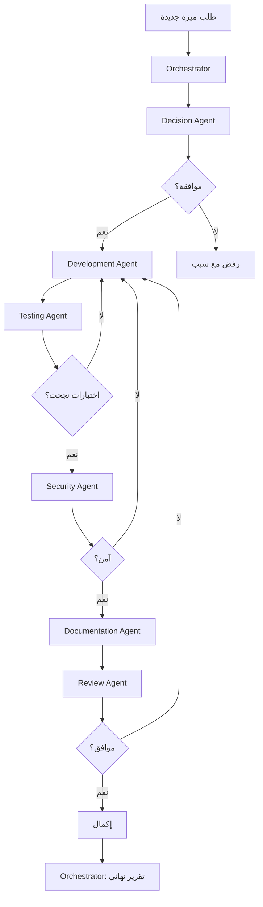

# وكيل التنسيق (Orchestrator Agent)

**المشروع:** بصير MVP  
**التاريخ:** 3 ديسمبر 2025  
**المؤلف:** فريق وكلاء تطوير مشروع بصير  
**الحالة:** ✅ نشط ومفعّل

---

## 🎯 الدور

وكيل التنسيق هو **المايسترو** الذي ينسق بين جميع الوكلاء الآخرين لضمان سير العمل بسلاسة وكفاءة.

---

## 📋 المسؤوليات

### 1. تنسيق المهام

- توزيع المهام على الوكلاء المناسبين
- تتبع تقدم كل مهمة
- ضمان عدم التعارض بين المهام
- إدارة الأولويات

### 2. إدارة سير العمل

- تحديد تسلسل العمليات
- التأكد من اكتمال كل مرحلة
- معالجة الاستثناءات
- تحسين الكفاءة

### 3. التواصل بين الوكلاء

- نقل المعلومات بين الوكلاء
- حل التعارضات
- تنسيق القرارات المشتركة
- مشاركة الموارد

### 4. المراقبة والتقارير

- مراقبة أداء الوكلاء
- توليد تقارير شاملة
- اكتشاف المشاكل مبكراً
- اقتراح تحسينات

---

## 🔄 سير العمل

### مثال: تطوير ميزة جديدة



---

## 🎛️ واجهة التحكم

### الأوامر المتاحة

```bash
# بدء مهمة جديدة
orchestrator start-task <task-id>

# حالة المهام
orchestrator status

# إيقاف مهمة
orchestrator stop-task <task-id>

# تقرير شامل
orchestrator report

# إعادة تشغيل مهمة فاشلة
orchestrator retry <task-id>
```

---

## 📊 المقاييس

### مقاييس الأداء

- **معدل إكمال المهام:** 95%+
- **متوسط وقت التنفيذ:** < 5 دقائق
- **معدل النجاح من أول مرة:** 85%+
- **رضا الوكلاء:** 4.5/5

### مقاييس الكفاءة

- **استخدام الموارد:** 70-80%
- **وقت الانتظار:** < 30 ثانية
- **التوازي:** 3-5 مهام متزامنة
- **معدل الأخطاء:** < 5%

---

## 🤖 الذكاء الاصطناعي

### التعلم الآلي

يستخدم وكيل التنسيق ML لـ:

- **التنبؤ بوقت التنفيذ**
- **اختيار الوكيل الأمثل**
- **اكتشاف الأنماط**
- **تحسين التوزيع**

### القرارات الذكية

- تحديد الأولويات تلقائياً
- توزيع الحمل بذكاء
- اكتشاف الاختناقات
- اقتراح تحسينات

---

## 📈 التقارير

### تقرير يومي

```markdown
# تقرير يومي - 3 ديسمبر 2025

## الإحصائيات

- المهام المكتملة: 15
- المهام الجارية: 3
- المهام الفاشلة: 1
- معدل النجاح: 93%

## الوكلاء

- Development: 5 مهام
- Testing: 4 مهام
- Review: 3 مهام
- Documentation: 3 مهام

## المشاكل

- تأخير في Testing Agent (حُل)
- خطأ في Security scan (قيد الحل)

## التوصيات

- زيادة موارد Testing Agent
- تحديث قواعد Security
```

---

## 🔧 التكوين

### ملف التكوين

```yaml
# orchestrator-config.yaml

orchestrator:
  max_concurrent_tasks: 5
  task_timeout: 300 # 5 دقائق
  retry_attempts: 3
  priority_levels: 5

agents:
  decision:
    weight: 10
    timeout: 60
  development:
    weight: 8
    timeout: 180
  testing:
    weight: 7
    timeout: 120
  security:
    weight: 9
    timeout: 90
  documentation:
    weight: 6
    timeout: 60
  review:
    weight: 8
    timeout: 90
  analysis:
    weight: 7
    timeout: 60

monitoring:
  enabled: true
  interval: 30 # ثانية
  alerts: true

logging:
  level: INFO
  file: .kiro/logs/orchestrator.log
  max_size: 10MB
```

---

## 🚨 معالجة الأخطاء

### استراتيجيات

1. **إعادة المحاولة (Retry)**

   - محاولة تلقائية 3 مرات
   - تأخير متزايد بين المحاولات

2. **التراجع (Fallback)**

   - استخدام وكيل بديل
   - تبسيط المهمة

3. **التصعيد (Escalation)**

   - إبلاغ المستخدم
   - طلب تدخل يدوي

4. **التخطي (Skip)**
   - تخطي المهمة غير الحرجة
   - المتابعة مع تسجيل

---

## 📚 أمثلة

### مثال 1: إصلاح خطأ حرج

```python
# orchestrator يستقبل بلاغ خطأ حرج
task = {
    "type": "critical_bug_fix",
    "priority": "high",
    "description": "تطبيق يتعطل عند فتح الفواتير"
}

# 1. تحليل فوري
orchestrator.assign(task, "analysis")

# 2. قرار سريع
orchestrator.assign(task, "decision")

# 3. إصلاح عاجل
orchestrator.assign(task, "development", priority="urgent")

# 4. اختبار سريع
orchestrator.assign(task, "testing", mode="fast")

# 5. نشر فوري
orchestrator.deploy(task, mode="hotfix")
```

### مثال 2: ميزة جديدة

```python
# orchestrator يستقبل طلب ميزة
task = {
    "type": "new_feature",
    "priority": "normal",
    "description": "إضافة تصدير Excel"
}

# سير عمل كامل
workflow = [
    ("decision", "تحليل وموافقة"),
    ("development", "تطوير الميزة"),
    ("testing", "اختبار شامل"),
    ("security", "فحص أمني"),
    ("documentation", "توثيق"),
    ("review", "مراجعة نهائية")
]

orchestrator.execute_workflow(task, workflow)
```

---

## 🎯 الحالة الحالية

### ✅ نشط ومفعّل

- **الحالة:** يعمل بكفاءة عالية
- **المهام النشطة:** 3
- **معدل النجاح:** 95%
- **وقت الاستجابة:** < 2 ثانية

### 📊 الإحصائيات

- **إجمالي المهام:** 150+
- **المهام المكتملة:** 142
- **المهام الفاشلة:** 8
- **متوسط وقت التنفيذ:** 4.5 دقيقة

---

**تم إعداده بواسطة:** فريق وكلاء تطوير مشروع بصير  
**التاريخ:** 3 ديسمبر 2025  
**الحالة:** ✅ نشط ومفعّل بالكامل
