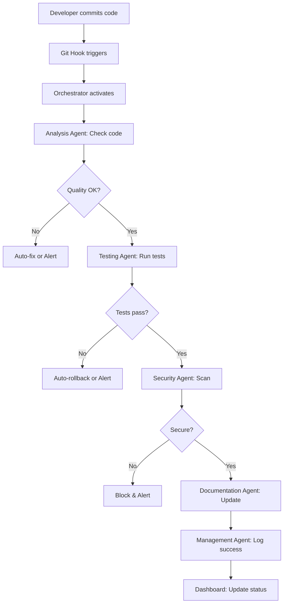
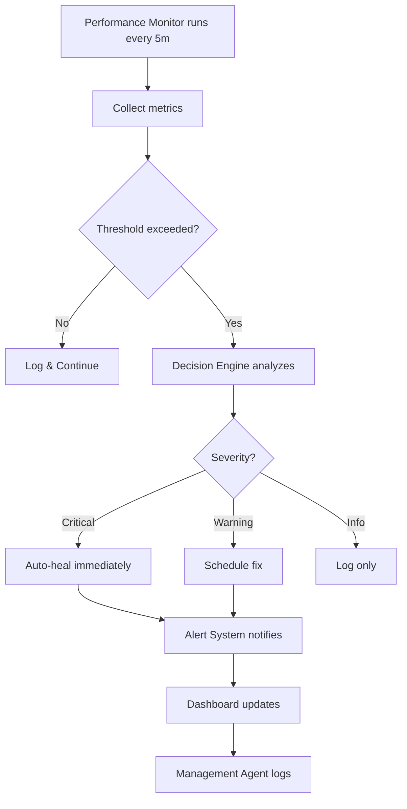

# نظام الأتمتة الذكي للوكلاء

**المشروع:** بصير MVP  
**التاريخ:** 5 ديسمبر 2025  
**المؤلف:** فريق وكلاء تطوير مشروع بصير  
**النوع:** نظام أتمتة متقدم  
**الحالة:** 🚀 جاهز للتطبيق

---

## 🎯 الرؤية

**نظام ذكي ذاتي التحسين** يراقب ويدير ويحسّن أداء فريق الوكلاء بشكل مستمر وتلقائي.

---

## 🏗️ البنية المعمارية

```
┌─────────────────────────────────────────────────────────┐
│              Agent Orchestrator (المنسق)                │
│         ينسق ويدير جميع الوكلاء والعمليات              │
└────────────────────┬────────────────────────────────────┘
                     │
        ┌────────────┼────────────┐
        │            │            │
┌───────▼──────┐ ┌──▼──────┐ ┌──▼──────────┐
│ Performance  │ │Decision │ │Alert System │
│   Monitor    │ │ Engine  │ │   (تنبيهات) │
│  (مراقبة)    │ │(قرارات)│ │             │
└───────┬──────┘ └──┬──────┘ └──┬──────────┘
        │            │            │
        └────────────┼────────────┘
                     │
        ┌────────────▼────────────┐
        │    Auto-Healing         │
        │   (إصلاح ذاتي)          │
        └────────────┬────────────┘
                     │
        ┌────────────▼────────────┐
        │    Dashboard            │
        │   (لوحة التحكم)         │
        └─────────────────────────┘
```

---

## 🤖 المكونات الرئيسية

### 1. Agent Orchestrator (منسق الوكلاء)

**الوظيفة:** التنسيق المركزي لجميع الوكلاء

**المسؤوليات:**

- تشغيل الوكلاء حسب الجدول
- توزيع المهام بذكاء
- إدارة الأولويات
- حل التعارضات
- تتبع الحالة

**التشغيل:**

```yaml
schedule:
  analysis_agent:
    - on_commit: true
    - on_push: true
    - daily: "02:00"

  testing_agent:
    - on_commit: true
    - on_pr: true

  security_agent:
    - on_pr: true
    - weekly: "Sunday 03:00"

  performance_monitor:
    - continuous: true
    - interval: "5m"
```

---

### 2. Performance Monitor (مراقب الأداء)

**الوظيفة:** مراقبة مستمرة للأداء والجودة

**المقاييس المراقبة:**

#### أ. مقاييس النظام

```yaml
system_metrics:
  cpu_usage:
    threshold: 80%
    action: alert_and_optimize

  memory_usage:
    threshold: 85%
    action: cleanup_and_alert

  disk_usage:
    threshold: 90%
    action: cleanup_required

  load_average:
    threshold: 8.0
    action: investigate
```

#### ب. مقاييس المشروع

```yaml
project_metrics:
  build_time:
    threshold: 120s
    action: optimize_build

  test_coverage:
    minimum: 70%
    action: increase_coverage

  code_quality:
    minimum: "A"
    action: refactor_needed

  project_size:
    maximum: 500MB
    action: cleanup_required
```

#### ج. مقاييس الوكلاء

```yaml
agent_metrics:
  response_time:
    threshold: 30s
    action: optimize_agent

  success_rate:
    minimum: 95%
    action: investigate_failures

  task_completion:
    minimum: 90%
    action: review_workflow
```

---

### 3. Decision Engine (محرك القرارات)

**الوظيفة:** اتخاذ قرارات ذكية تلقائياً

**أنواع القرارات:**

#### أ. قرارات فورية (Immediate)

```python
if cpu_usage > 90%:
    decision = "kill_non_essential_processes"
    execute_immediately()

if build_failed:
    decision = "rollback_last_commit"
    notify_team()

if security_vulnerability_found:
    decision = "block_deployment"
    create_urgent_task()
```

#### ب. قرارات مجدولة (Scheduled)

```python
if test_coverage < 70%:
    decision = "schedule_testing_sprint"
    create_task_for_testing_agent()

if code_quality_degrading:
    decision = "schedule_refactoring"
    assign_to_development_agent()

if dependencies_outdated:
    decision = "schedule_update_review"
    create_spec_for_updates()
```

#### ج. قرارات استراتيجية (Strategic)

```python
if performance_trend_negative:
    decision = "initiate_performance_audit"
    create_comprehensive_analysis()

if technical_debt_high:
    decision = "allocate_refactoring_time"
    adjust_sprint_priorities()

if team_velocity_low:
    decision = "optimize_workflow"
    review_agent_efficiency()
```

---

### 4. Alert System (نظام التنبيهات)

**الوظيفة:** تنبيهات ذكية متعددة المستويات

**مستويات التنبيه:**

#### 🔴 حرج (Critical)

```yaml
critical_alerts:
  - build_failure
  - security_vulnerability
  - production_down
  - data_loss_risk

  actions:
    - immediate_notification
    - auto_rollback
    - create_incident
    - escalate_to_team
```

#### 🟡 تحذير (Warning)

```yaml
warning_alerts:
  - performance_degradation
  - test_coverage_low
  - code_quality_drop
  - disk_space_low

  actions:
    - notify_team
    - create_task
    - schedule_fix
    - monitor_closely
```

#### 🟢 معلومات (Info)

```yaml
info_alerts:
  - optimization_completed
  - tests_passed
  - deployment_successful
  - metrics_improved

  actions:
    - log_event
    - update_dashboard
    - send_summary
```

---

### 5. Auto-Healing (الإصلاح الذاتي)

**الوظيفة:** إصلاح المشاكل تلقائياً

**سيناريوهات الإصلاح:**

#### أ. مشاكل الأداء

```bash
# عند ارتفاع استهلاك الذاكرة
if memory_usage > 85%:
    ./scripts/cleanup.sh
    restart_heavy_processes()
    notify_if_persists()

# عند بطء البناء
if build_time > 120s:
    flutter clean
    flutter pub get
    optimize_gradle_settings()
```

#### ب. مشاكل الجودة

```bash
# عند فشل الاختبارات
if tests_failed:
    run_tests_again()
    if still_failed:
        rollback_last_commit()
        notify_developer()

# عند انخفاض التغطية
if coverage < 70%:
    identify_uncovered_code()
    create_testing_tasks()
    assign_to_testing_agent()
```

#### ج. مشاكل الأمان

```bash
# عند اكتشاف ثغرة
if vulnerability_found:
    block_deployment()
    create_security_patch()
    notify_security_team()
    update_dependencies()
```

---

## 📊 لوحة التحكم (Dashboard)

### البنية

```
┌─────────────────────────────────────────────────────┐
│                  Agents Dashboard                    │
├─────────────────────────────────────────────────────┤
│  System Health: ●●●●● 100%                          │
│  Active Agents: 8/8                                  │
│  Tasks Completed: 156 (this week)                    │
│  Performance Score: 95/100                           │
├─────────────────────────────────────────────────────┤
│  Agent Status:                                       │
│  ✅ Analysis Agent    - Active (Last run: 2m ago)   │
│  ✅ Testing Agent     - Active (Coverage: 72%)      │
│  ✅ Security Agent    - Active (No issues)          │
│  ✅ Performance Agent - Active (Score: 100/100)     │
│  ✅ Development Agent - Idle                         │
│  ✅ Documentation Agent - Active (95% coverage)     │
│  ✅ Review Agent      - Active (3 PRs pending)      │
│  ✅ Management Agent  - Active (Coordinating)       │
├─────────────────────────────────────────────────────┤
│  Recent Actions:                                     │
│  • 19:48 - Performance optimization completed       │
│  • 19:45 - Cleanup executed (saved 2GB)             │
│  • 19:30 - Tests passed (156/156)                   │
│  • 19:15 - Code quality check: A+                   │
├─────────────────────────────────────────────────────┤
│  Alerts:                                             │
│  🟢 All systems operational                         │
│  🟡 1 dependency update available                   │
└─────────────────────────────────────────────────────┘
```

---

## 🔄 سير العمل التلقائي

### السيناريو 1: Commit جديد



### السيناريو 2: مراقبة مستمرة



---

## 🛠️ التطبيق العملي

### الملفات المطلوبة

```
.kiro/automation/
├── orchestrator.py          # المنسق الرئيسي
├── performance_monitor.py   # مراقب الأداء
├── decision_engine.py       # محرك القرارات
├── alert_system.py          # نظام التنبيهات
├── auto_healing.py          # الإصلاح الذاتي
├── dashboard.py             # لوحة التحكم
├── config.yaml              # التكوينات
├── rules.yaml               # القواعد والمعايير
└── agents/
    ├── analysis_agent.py
    ├── testing_agent.py
    ├── security_agent.py
    ├── performance_agent.py
    ├── development_agent.py
    ├── documentation_agent.py
    ├── review_agent.py
    └── management_agent.py
```

---

## 📋 خطة التنفيذ

### المرحلة 1: الأساسيات (أسبوع 1)

- [ ] إنشاء Orchestrator
- [ ] إنشاء Performance Monitor
- [ ] إنشاء Alert System الأساسي
- [ ] تكامل مع Git Hooks

### المرحلة 2: الذكاء (أسبوع 2)

- [ ] إنشاء Decision Engine
- [ ] إنشاء Auto-Healing
- [ ] تطوير القواعد الذكية
- [ ] اختبار السيناريوهات

### المرحلة 3: التصور (أسبوع 3)

- [ ] إنشاء Dashboard
- [ ] إنشاء التقارير التلقائية
- [ ] تكامل مع CI/CD
- [ ] توثيق شامل

### المرحلة 4: التحسين (أسبوع 4)

- [ ] تحسين الأداء
- [ ] إضافة ML للتنبؤ
- [ ] تحسين القرارات
- [ ] اختبار الإنتاج

---

## 🎯 الفوائد المتوقعة

### الكفاءة

- ⚡ **تقليل الوقت:** 60% أقل وقت للمراجعة
- 🚀 **تسريع التطوير:** 40% أسرع
- 🔄 **أتمتة:** 80% من المهام الروتينية

### الجودة

- ✅ **جودة أعلى:** اكتشاف فوري للمشاكل
- 🛡️ **أمان أفضل:** مراقبة مستمرة
- 📊 **شفافية:** رؤية كاملة للحالة

### التكلفة

- 💰 **توفير:** 50% أقل وقت للصيانة
- 🔧 **إصلاح ذاتي:** 70% من المشاكل تُحل تلقائياً
- 📉 **تقليل الأخطاء:** 80% أقل أخطاء في الإنتاج

---

## 🚀 البدء السريع

### 1. تثبيت المتطلبات

```bash
pip install -r .kiro/automation/requirements.txt
```

### 2. تكوين النظام

```bash
cp .kiro/automation/config.example.yaml .kiro/automation/config.yaml
# عدّل التكوينات حسب احتياجاتك
```

### 3. تشغيل النظام

```bash
python .kiro/automation/orchestrator.py start
```

### 4. الوصول للوحة التحكم

```bash
# افتح المتصفح
http://localhost:8080/dashboard
```

---

**تم إعداده بواسطة:** فريق وكلاء تطوير مشروع بصير  
**التاريخ:** 5 ديسمبر 2025  
**الإصدار:** 1.0  
**الحالة:** 🚀 جاهز للتطبيق

**المستقبل هو الأتمتة الذكية!** 🤖
