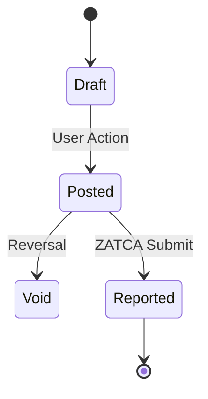
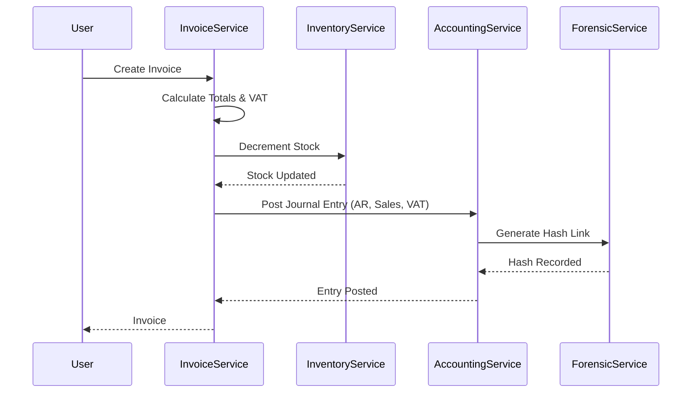

# Functional Architecture Specification

**Version:** 2.0 (Sovereign Edition)
**Basis:** Deep Analysis of Legacy Visuals (001-099) & Live Codebase
**Scope:** Functional Decomposition & Critical Path Analysis

---

## 1. Architectural Overview

The Basir Accounting System is composed of **five core engines**, each a specialized domain with strict boundaries and well-defined contracts.

### 1.1 High-Level Topology

```mermaid
graph LR
    subgraph Presentation Layer (Flutter)
        UI[User Interface]
    end
    subgraph Application Layer (Services)
        AS[AccountingService]
        IS[InvoiceService]
        INV[InventoryService]
        RS[ReportingService]
        ZS[ZatcaService]
    end
    subgraph Domain Layer (Entities)
        JE[JournalEntry]
        INV_E[Invoice]
        ITEM[InventoryItem]
        ACC[Account]
    end
    subgraph Data Layer
        ISAR[(Isar)]
        RUST[(Rust Core)]
    end
    UI --> AS & IS & INV & RS & ZS
    AS --> JE & ACC
    IS --> INV_E
    INV --> ITEM
    JE & INV_E & ITEM & ACC --> ISAR & RUST
```

---

## 2. Core Engines Analysis

### 2.1 Sales & Revenue Engine (Module: `invoices`)

**Purpose:** High-velocity transaction processing for retail and wholesale.

| Feature               | Evidence Screen | Implementation Status    |
| --------------------- | --------------- | ------------------------ |
| Invoice Creation      | 003, 004        | ✅ Complete              |
| Multi-line Items      | 006             | ✅ Complete              |
| Quote/Draft Workflow  | 015             | ✅ Complete              |
| Tax Integration (VAT) | 097             | ✅ Complete              |
| ZATCA Reporting       | 096             | ✅ Complete (Simulation) |

**State Machine:**



### 2.2 Inventory & Material Engine (Module: `inventory`)

**Purpose:** Physical goods tracking, valuation, and replenishment.

| Feature                    | Evidence Screen | Implementation Status       |
| -------------------------- | --------------- | --------------------------- |
| Item Master (SKU/Barcode)  | 009, 024, 098   | ✅ Complete                 |
| Stock Adjustments          | 023             | ✅ Complete                 |
| Multi-UOM Support          | 049, 091        | ✅ Complete                 |
| Costing Methods (FIFO/Avg) | 050             | ⚠️ Planned (Service Exists) |

**Valuation Logic:**

- COGS is calculated at the point of sale based on the selected costing method.
- Inventory adjustments generate GL entries to `Inventory Adjustment Expense`.

### 2.3 The Accounting Core (Module: `accounting`)

**Purpose:** The immutable record of truth—the General Ledger.

| Feature                 | Evidence Screen | Implementation Status  |
| ----------------------- | --------------- | ---------------------- |
| Chart of Accounts (CoA) | 077-082         | ✅ Complete            |
| Journal Entry (Manual)  | 063, 067        | ✅ Complete            |
| Opening Balances        | 068             | ✅ Complete            |
| Cash Reconciliation     | 069, 070        | ✅ Complete            |
| Multi-Currency          | 045, 071        | ✅ Complete            |
| Fiscal Year Management  | 092             | ✅ Complete (Phase 16) |

**Core Rules:**

1. **Balance Rule**: `SUM(Debit) == SUM(Credit)` for every posted entry.
2. **Immutability Rule**: Posted entries are append-only; voids create reversal entries.
3. **Forensic Hash**: Each entry contains `previousHash` for chain verification.

### 2.4 Reporting & Analytics Engine (Module: `reports`)

**Purpose:** Transform raw ledger data into strategic insights.

| Feature                     | Evidence Screen | Implementation Status |
| --------------------------- | --------------- | --------------------- |
| Balance Sheet               | 057             | ✅ Complete (IFRS 18) |
| Income Statement            | 054             | ✅ Complete (IFRS 18) |
| Trial Balance               | Implicit        | ✅ Complete           |
| General Ledger (Drill-Down) | 063             | ✅ Complete           |
| Forensic Export (PDF/Excel) | 044             | ✅ Complete           |

### 2.5 Governance & Configuration Layer (Module: `settings`, `auth`)

**Purpose:** System definition, security, and constraints.

| Feature                      | Evidence Screen | Implementation Status |
| ---------------------------- | --------------- | --------------------- |
| User & Permission Management | 092, 093        | ✅ Complete           |
| Company Branding             | 037, 095        | ✅ Complete           |
| Backup & Restore             | 027, 033        | ✅ Complete           |
| Tax & E-Invoice Config       | 034, 097        | ✅ Complete           |

---

## 3. Data Flow Dynamics: The Invoice Lifecycle



---

## 4. Cross-Cutting Concerns

### 4.1 Localization (i18n)

- All user-facing strings are defined in ARB files (`lib/l10n`).
- Fully bilingual: Arabic (primary) and English.

### 4.2 State Management

- Riverpod is the single source of truth for all application state.
- Providers are scoped to features (`accountingRepositoryProvider`, etc.).

### 4.3 Testing Strategy

- **Unit Tests**: Service logic, entity validation.
- **Widget Tests**: Interactive UI components.
- **Integration Tests**: Full E2E flows (Invoice -> Ledger).

---

_This architecture serves as the blueprint for the Rust/Flutter implementation._
