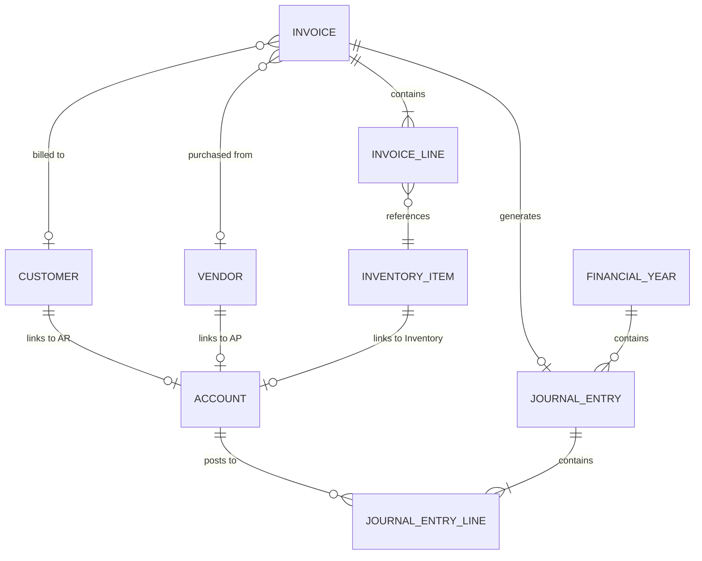

# Data Schema Specification

**Version:** 2.0 (Sovereign Edition)
**Basis:** Inferred Entities from UI Fields (001-099) & Live Isar Schema
**Scope:** Relational Database Model (Isar/PostgreSQL)

---

## 1. Core Backbone (General Ledger)

### 1.1 `Account` (Chart of Accounts)

| Field            | Type              | Constraint       | Notes                                                |
| ---------------- | ----------------- | ---------------- | ---------------------------------------------------- |
| `id`             | `String (UUID)`   | PK               | Unique identifier                                    |
| `code`           | `String`          | Unique, Indexed  | Hierarchical code (e.g., `1-1-01`)                   |
| `name`           | `String`          | Required         | English name                                         |
| `nameAr`         | `String?`         | Optional         | Arabic name                                          |
| `type`           | `AccountType`     | Enum             | `Asset`, `Liability`, `Equity`, `Revenue`, `Expense` |
| `parentId`       | `String?`         | FK to `Account`  | Null for root accounts                               |
| `isGroup`        | `bool`            | Default: false   | If true, cannot receive direct postings              |
| `ifrs18Category` | `Ifrs18Category?` | Enum             | `Operating`, `Investing`, `Financing`                |
| `normalBalance`  | `BalanceType`     | Enum             | `Debit` or `Credit`                                  |
| `isActive`       | `bool`            | Default: true    | Soft delete                                          |
| `userId`         | `String?`         | Tenant isolation | Multi-user support                                   |

### 1.2 `JournalEntry`

| Field                | Type                     | Constraint       | Notes                              |
| -------------------- | ------------------------ | ---------------- | ---------------------------------- |
| `id`                 | `String (UUID)`          | PK               | Unique identifier                  |
| `referenceNumber`    | `String`                 | Unique per user  | Sequential, auto-generated         |
| `date`               | `DateTime`               | Required         | Transaction date                   |
| `description`        | `String`                 | Required         | Auditable memo                     |
| `sourceDocument`     | `String?`                | Optional         | Link to invoice, voucher           |
| `sourceDocumentType` | `SourceDocumentType?`    | Enum             | `Invoice`, `Voucher`, `Adjustment` |
| `status`             | `JournalEntryStatus`     | Enum             | `Draft`, `Posted`                  |
| `lines`              | `List<JournalEntryLine>` | Embedded         | At least 2 lines                   |
| `hash`               | `String`                 | SHA-256          | Forensic integrity                 |
| `previousHash`       | `String?`                | FK (logical)     | Chain link                         |
| `agentId`            | `String?`                | Optional         | Posting agent/service              |
| `userId`             | `String?`                | Tenant isolation |                                    |
| `createdAt`          | `DateTime`               | Auto             |                                    |
| `updatedAt`          | `DateTime`               | Auto             |                                    |

### 1.3 `JournalEntryLine` (Embedded)

| Field          | Type      | Constraint      | Notes             |
| -------------- | --------- | --------------- | ----------------- |
| `accountId`    | `String`  | FK to `Account` | Target account    |
| `debit`        | `Decimal` | >= 0            | Debit amount      |
| `credit`       | `Decimal` | >= 0            | Credit amount     |
| `description`  | `String?` | Optional        | Line-level memo   |
| `costCenterId` | `String?` | Optional        | Segment reporting |

---

## 2. Financial Year & Period Management

### 2.1 `FinancialYear`

| Field             | Type            | Constraint       | Notes               |
| ----------------- | --------------- | ---------------- | ------------------- |
| `id`              | `String (UUID)` | PK               |                     |
| `name`            | `String`        | Required         | e.g., "FY 2026"     |
| `startDate`       | `DateTime`      | Required         |                     |
| `endDate`         | `DateTime`      | Required         |                     |
| `isClosed`        | `bool`          | Default: false   | Hard lock           |
| `closedAt`        | `DateTime?`     | Auto             |                     |
| `closedBy`        | `String?`       | FK to User       |                     |
| `lockedPeriodIds` | `List<String>`  | Default: []      | e.g., `['2026-01']` |
| `userId`          | `String?`       | Tenant isolation |                     |

---

## 3. Sales & Purchasing

### 3.1 `Invoice`

| Field            | Type                | Constraint       | Notes                                                |
| ---------------- | ------------------- | ---------------- | ---------------------------------------------------- |
| `id`             | `String (UUID)`     | PK               |                                                      |
| `invoiceNumber`  | `String`            | Unique per user  | Sequential                                           |
| `date`           | `DateTime`          | Required         |                                                      |
| `type`           | `InvoiceType`       | Enum             | `Sales`, `Purchase`, `SalesReturn`, `PurchaseReturn` |
| `status`         | `InvoiceStatus`     | Enum             | `Draft`, `Posted`, `Void`                            |
| `customerId`     | `String?`           | FK to `Customer` | May be null for cash sales                           |
| `vendorId`       | `String?`           | FK to `Vendor`   | For purchases                                        |
| `lines`          | `List<InvoiceLine>` | Embedded         |                                                      |
| `subtotal`       | `Decimal`           | Calculated       | SUM of line totals                                   |
| `discountAmount` | `Decimal`           | Default: 0       |                                                      |
| `taxAmount`      | `Decimal`           | Calculated       |                                                      |
| `totalAmount`    | `Decimal`           | Calculated       |                                                      |
| `currencyCode`   | `String`            | Default: SAR     | ISO 4217                                             |
| `exchangeRate`   | `Decimal`           | Default: 1       |                                                      |
| `paymentMethod`  | `PaymentMethod`     | Enum             | `Cash`, `Credit`                                     |
| `notes`          | `String?`           | Optional         |                                                      |
| `zatcaStatus`    | `ZatcaStatus?`      | Enum             | `Pending`, `Reported`, `Rejected`                    |
| `zatcaUuid`      | `String?`           | UUID             | ZATCA document ID                                    |
| `journalEntryId` | `String?`           | FK               | Link to GL posting                                   |
| `userId`         | `String?`           | Tenant isolation |                                                      |

### 3.2 `InvoiceLine` (Embedded)

| Field             | Type      | Constraint            | Notes   |
| ----------------- | --------- | --------------------- | ------- |
| `inventoryItemId` | `String`  | FK to `InventoryItem` |         |
| `description`     | `String`  | From item             |         |
| `quantity`        | `Decimal` | Required              |         |
| `unitPrice`       | `Decimal` | Required              |         |
| `discountPercent` | `Decimal` | Default: 0            |         |
| `taxRate`         | `Decimal` | Default: 0.15         | 15% VAT |
| `lineTotal`       | `Decimal` | Calculated            |         |

---

## 4. Inventory Management

### 4.1 `InventoryItem`

| Field                | Type            | Constraint       | Notes   |
| -------------------- | --------------- | ---------------- | ------- |
| `id`                 | `String (UUID)` | PK               |         |
| `barcode`            | `String?`       | Unique, Indexed  |         |
| `sku`                | `String?`       | Unique, Indexed  |         |
| `name`               | `String`        | Required         | English |
| `nameAr`             | `String?`       | Optional         | Arabic  |
| `description`        | `String?`       | Optional         |         |
| `categoryId`         | `String?`       | FK to `Category` |         |
| `costPrice`          | `Decimal`       | Required         |         |
| `sellingPrice`       | `Decimal`       | Required         |         |
| `quantityOnHand`     | `Decimal`       | Default: 0       |         |
| `reorderLevel`       | `Decimal?`      | Optional         |         |
| `unitOfMeasure`      | `String`        | Default: "Unit"  |         |
| `inventoryAccountId` | `String?`       | FK to `Account`  |         |
| `salesAccountId`     | `String?`       | FK to `Account`  |         |
| `cogsAccountId`      | `String?`       | FK to `Account`  |         |
| `isActive`           | `bool`          | Default: true    |         |
| `userId`             | `String?`       | Tenant isolation |         |

---

## 5. Partners (Customers & Vendors)

### 5.1 `Customer`

| Field                 | Type            | Constraint       | Notes              |
| --------------------- | --------------- | ---------------- | ------------------ |
| `id`                  | `String (UUID)` | PK               |                    |
| `name`                | `String`        | Required         |                    |
| `phone`               | `String?`       | Optional         |                    |
| `email`               | `String?`       | Optional         |                    |
| `address`             | `String?`       | Optional         |                    |
| `vatNumber`           | `String?`       | Optional         | For B2B invoices   |
| `receivableAccountId` | `String?`       | FK to `Account`  | Sub-ledger control |
| `creditLimit`         | `Decimal?`      | Optional         |                    |
| `isActive`            | `bool`          | Default: true    |                    |
| `userId`              | `String?`       | Tenant isolation |                    |

### 5.2 `Vendor` (Mirror of Customer)

Same structure as `Customer`, with `payableAccountId` instead of `receivableAccountId`.

---

## 6. Administration & Meta

### 6.1 `User`

| Field          | Type            | Constraint    | Notes                         |
| -------------- | --------------- | ------------- | ----------------------------- |
| `id`           | `String (UUID)` | PK            |                               |
| `username`     | `String`        | Unique        |                               |
| `passwordHash` | `String`        | Secured       |                               |
| `fullName`     | `String`        | Required      |                               |
| `role`         | `UserRole`      | Enum          | `Admin`, `Manager`, `Cashier` |
| `permissions`  | `List<String>`  | Default: []   | Granular RBAC                 |
| `isActive`     | `bool`          | Default: true |                               |

### 6.2 `AppSettings` (Key-Value Store)

| Field    | Type      | Constraint       | Notes                             |
| -------- | --------- | ---------------- | --------------------------------- |
| `key`    | `String`  | PK               | e.g., `company_name`, `logo_path` |
| `value`  | `String`  | JSON-encoded     | Flexible storage                  |
| `userId` | `String?` | Tenant isolation |                                   |

---

## 7. Entity Relationships Diagram

---

_This schema aligns with the Isar collections in `lib/features/*/data/models` and the future PostgreSQL sync target._
