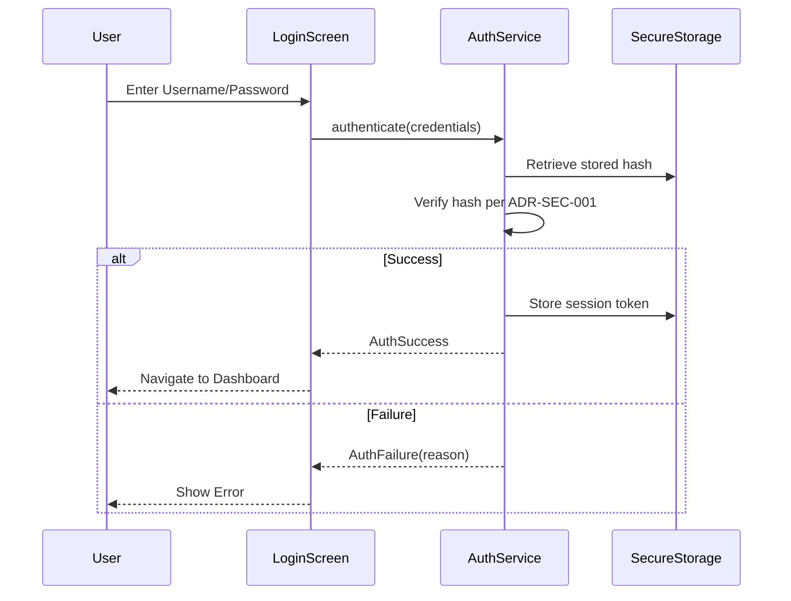

# Security & Governance Specification

**Version:** 2.0 (Sovereign Edition)
**Basis:** Screens 027, 029, 052, 092-094 & Security Best Practices
**Scope:** Authentication, Authorization, Audit, Data Protection

---

## 1. Authentication

### 1.1 Login Flow

Based on **Screen 052 (Login Credentials Request):**



### 1.2 Session Management

| Property   | Value                               | Notes                       |
| ---------- | ----------------------------------- | --------------------------- |
| Token Type | JWT (future) / Session ID (current) | For stateless API sync      |
| Storage    | `flutter_secure_storage`            | Encrypted keychain/keystore |
| Timeout    | 24 hours (idle)                     | Configurable                |
| Refresh    | On app resume                       | Silent refresh              |

### 1.3 Manager PIN (Screen 029)

A secondary PIN is required for privileged operations:

- Deleting records
- Accessing admin settings
- Overriding fiscal locks

---

## 2. Authorization (RBAC)

### 2.1 User Roles

Based on **Screens 092-093 (Users & Permissions):**

| Role         | Description           | Default Permissions      |
| ------------ | --------------------- | ------------------------ |
| `Admin`      | Full system control   | All                      |
| `Manager`    | Operational oversight | All except system config |
| `Accountant` | Financial data access | GL, Reports, Vouchers    |
| `Cashier`    | Point-of-sale         | Invoices, Payments       |
| `Viewer`     | Read-only             | Reports only             |

### 2.2 Permission Matrix

| Permission       | Description            | Roles                       |
| ---------------- | ---------------------- | --------------------------- |
| `invoice:create` | Create new invoices    | Admin, Manager, Cashier     |
| `invoice:void`   | Void posted invoices   | Admin, Manager              |
| `journal:post`   | Post journal entries   | Admin, Manager, Accountant  |
| `journal:view`   | View journal entries   | All except Viewer (limited) |
| `period:lock`    | Lock fiscal periods    | Admin                       |
| `period:unlock`  | Unlock fiscal periods  | Admin (with PIN)            |
| `user:manage`    | Create/edit users      | Admin                       |
| `settings:edit`  | Modify system settings | Admin                       |
| `backup:execute` | Trigger backups        | Admin, Manager              |
| `report:export`  | Export reports         | Admin, Manager, Accountant  |

### 2.3 Permission Enforcement

```dart
// Example: Guard for posting a journal entry
if (!currentUser.hasPermission('journal:post')) {
  throw UnauthorizedException('You are not authorized to post journal entries.');
}
```

---

## 3. Audit Logging

### 3.1 Audit Event Structure

Every significant action creates an immutable audit record.

| Field               | Type     | Notes                                   |
| ------------------- | -------- | --------------------------------------- |
| `id`                | UUID     | Unique                                  |
| `timestamp`         | DateTime | Server-synced if online                 |
| `userId`            | String   | Acting user                             |
| `action`            | String   | e.g., `JOURNAL_POSTED`, `PERIOD_LOCKED` |
| `targetType`        | String   | e.g., `JournalEntry`, `FinancialYear`   |
| `targetId`          | String   | UUID of affected record                 |
| `details`           | JSON     | Contextual data (before/after values)   |
| `ipAddress`         | String?  | If from web/sync                        |
| `deviceFingerprint` | String?  | Device identifier                       |

### 3.2 Audited Actions

| Action Code         | Trigger                               |
| ------------------- | ------------------------------------- |
| `USER_LOGIN`        | Successful authentication             |
| `USER_LOGOUT`       | Manual logout                         |
| `USER_LOGIN_FAILED` | Failed login attempt                  |
| `INVOICE_CREATED`   | Invoice saved (draft or posted)       |
| `INVOICE_VOIDED`    | Invoice voided                        |
| `JOURNAL_POSTED`    | Journal entry posted                  |
| `JOURNAL_REVERSED`  | Reversal entry created                |
| `PERIOD_LOCKED`     | Monthly period locked                 |
| `PERIOD_UNLOCKED`   | Monthly period unlocked               |
| `YEAR_CLOSED`       | Fiscal year closed, rollover executed |
| `BACKUP_CREATED`    | Manual or scheduled backup            |
| `SETTING_CHANGED`   | System setting modified               |

### 3.3 Audit Log API

```dart
Future<void> logAudit({
  required String action,
  required String targetType,
  required String targetId,
  Map<String, dynamic>? details,
});
```

---

## 4. Data Protection

### 4.1 Encryption at Rest

| Data Type        | Encryption            | Storage                   |
| ---------------- | --------------------- | ------------------------- |
| User Credentials | ADR-SEC-001 bcrypt target (cost 12) | Isar + secure storage; CI evidence required |
| Session Tokens   | AES-256               | `flutter_secure_storage`  |
| Database Backup  | AES-256 (user key)    | Local / Cloud             |
| Sensitive Fields | N/A (local-first)     | Future: Column encryption |

### 4.2 Encryption in Transit

For future cloud sync:

- **Protocol:** TLS 1.3
- **Cert Pinning:** For production API endpoints
- **API Auth:** Bearer tokens (JWT)

### 4.3 Backup Security (Screens 027, 033)

| Feature      | Implementation                          |
| ------------ | --------------------------------------- |
| Local Backup | Encrypted ZIP to user-specified path    |
| Cloud Backup | Sync to user's Google Drive (encrypted) |
| Restore      | Requires Manager PIN                    |

---

## 5. Compliance Controls

### 5.1 ZATCA Compliance

- Device onboarding with OTP (simulated).
- Invoice signing with cryptographic keys.
- Submission status tracking (`Pending`, `Reported`, `Rejected`).

### 5.2 SOCPA/Auditor Requirements

- Immutable ledger (append-only with reversals).
- Full audit trail for all financial mutations.
- Forensic hash chain for GL integrity verification.

---

## 6. حالة الضوابط الأمنية

| الضبط | الحالة الحالية | مصدر الحقيقة أو الدليل المطلوب |
| --- | --- | --- |
| تجزئة كلمة المرور | `DRAFT / IMPLEMENTATION PENDING CI` | [ADR-SEC-001](../../../../docs/03-architecture/adrs/ADR-SEC-001-password-hashing-and-local-authentication.md)، و`REQ-SEC-001`. |
| تخزين كلمة المرور النصية | لا يمثل النظام تخزين كلمة مرور نصية كتصميم مقصود؛ يلزم دليل اختبار وCI لكل مسار. | `REQ-SEC-001` واختبارات المصادقة. |
| إدارة مفاتيح وبيانات حساسة | `PARTIAL` | يلزم secret scan وevidence وفق `REQ-SEC-004`. |
| إبطال الجلسة عند logout | منفذ محليًا؛ يحتاج ربط اختبار ودليل إصدار قبل ادعاء أوسع. | `AuthService.logout`. |
| rate limiting لمحاولات الدخول | `PLANNED` | ADR/threat model/اختبار رفض وفق `REQ-SEC-005`؛ ليس منفذًا حاليًا. |
| تدقيق اعتماديات الأمن | منفذ كفحص CI، لا يمثل شهادة خلو من الثغرات. | `security-quality-gate`. |

---

> لا تشكل هذه المواصفة شهادة جاهزية إنتاج أو امتثال تنظيمي. يجب ربط كل ادعاء بنطاقه وSHA وتشغيل CI المناسب.
