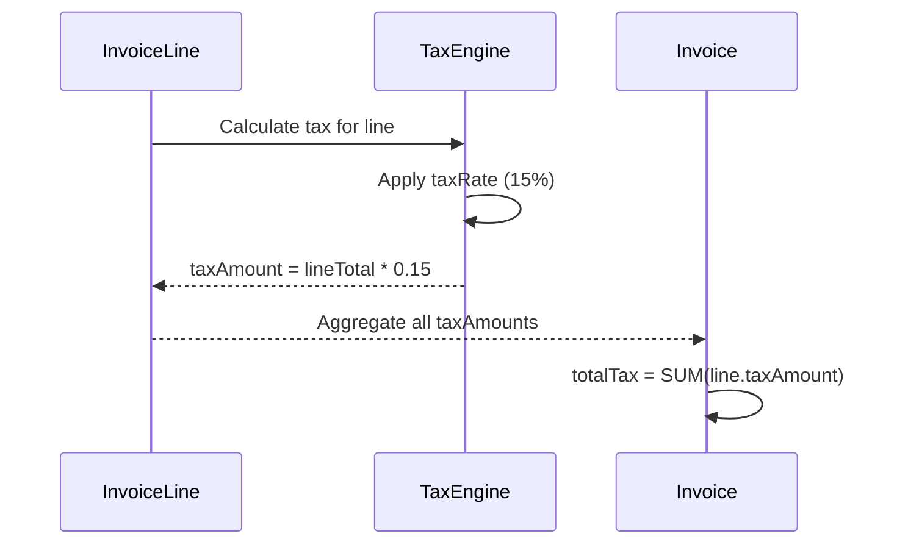
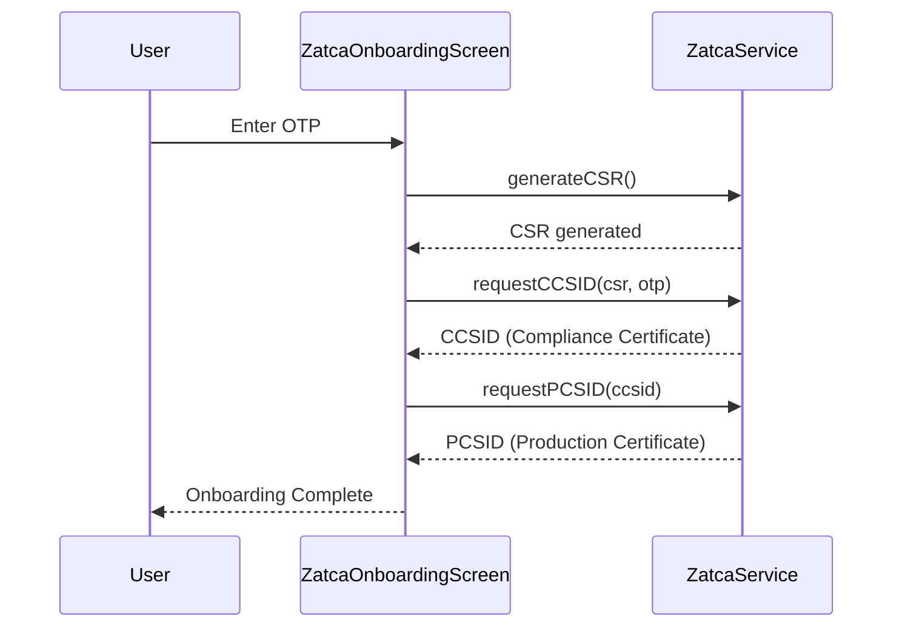
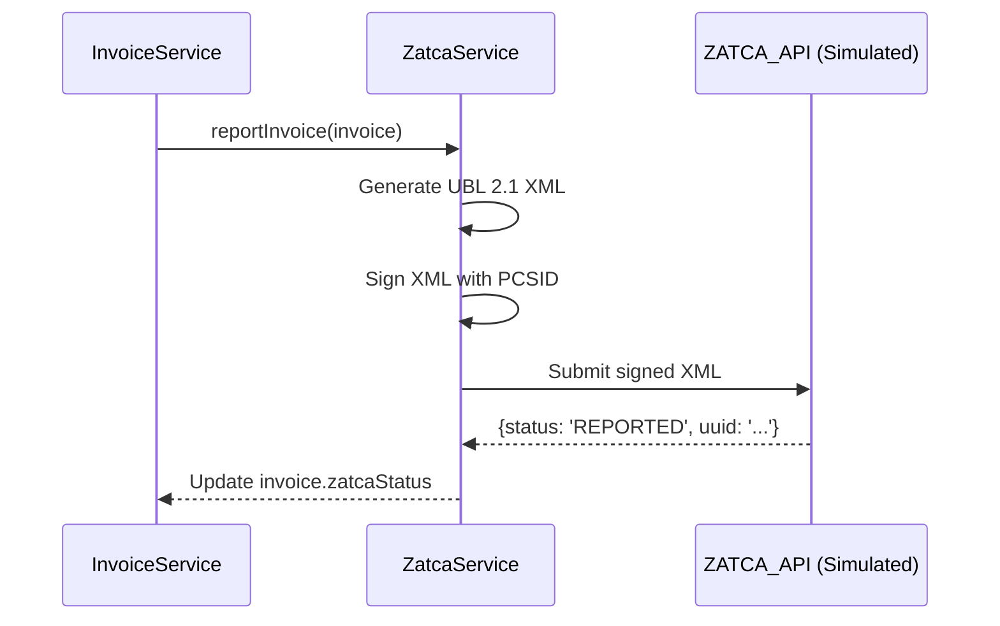

# Compliance Engines Specification

> **document_id:** SPEC-COM-001
> **status:** ACTIVE — technical and product specification; not an independent regulatory certificate
> **authority_level:** 1
> **owner:** Compliance Owner
> **approved_by:** Pending formal repository owner approval
> **effective_from:** 2026-08-13
> **last_verified_sha:** `ce825c55c6e9959645f6eef330a78e2bbd844c7c`
> **review_due:** 2026-10-13
> **related_requirements:** REQ-COM-001 through REQ-COM-005

**Version:** 2.1 (Evidence-Bounded Edition)
**Basis:** Screens 034, 097, 099, implementation evidence, and regulatory requirements requiring separate validation
**Scope:** Tax calculation, e-invoicing, Zakat, IFRS 18, and the boundaries of technical evidence

> **Evidence boundary:** a capability may be technically implemented or simulated without being production-integrated or regulatorily verified. The terms `SIMULATION`, `SANDBOX-VERIFIED`, `PRODUCTION-INTEGRATED`, and `REGULATORY-EVIDENCED` are distinct states. Only the Compliance Owner may move a requirement to the latter state after attaching evidence.

---

## 1. VAT Engine (Value Added Tax)

### 1.1 Overview

The VAT engine calculates, applies, and reports tax on invoices according to KSA ZATCA guidelines.

| Parameter     | Default Value | Source                  |
| ------------- | ------------- | ----------------------- |
| Standard Rate | 15%           | KSA VAT Law             |
| Zero Rate     | 0%            | Exports, specific goods |
| Exempt        | N/A           | Healthcare, education   |

### 1.2 Tax Calculation Flow



### 1.3 Tax Configuration (Screen 097)

| Setting          | Type    | Notes                        |
| ---------------- | ------- | ---------------------------- |
| `isVatEnabled`   | bool    | Global toggle                |
| `defaultVatRate` | Decimal | Default for all items        |
| `vatNumber`      | String  | Company VAT registration     |
| `vatAccountId`   | String  | GL account for VAT Liability |

---

## 2. ZATCA E-Invoicing (Phase 2 - Integration)

### 2.1 Overview

ZATCA (Zakat, Tax and Customs Authority) mandates electronic invoicing for all businesses in Saudi Arabia, progressing through:

| Phase   | Name        | Requirement                                |
| ------- | ----------- | ------------------------------------------ |
| Phase 1 | Generation  | Generate technical XML artifacts; conformance evidence required before any compliance claim. |
| Phase 2 | Integration | Target production reporting; not verified by this specification. |

### 2.2 Onboarding Flow (Screen 034)

> **Current evidence classification:** `SIMULATION`. The flow below is a target workflow. It is not proof that a production CSR/CCSID/PCSID exchange is available or approved.



### 2.3 Invoice Reporting Flow

> **Current evidence classification:** `SIMULATION`. The diagram intentionally labels the API as simulated; it must not be used to claim live submission.



### 2.4 ZATCA Status Badge (Screen 096)

| Status     | Color  | Meaning                 |
| ---------- | ------ | ----------------------- |
| `Pending`  | Yellow | Awaiting submission     |
| `Reported` | Green  | Successfully submitted  |
| `Rejected` | Red    | ZATCA validation failed |
| `Warn`     | Orange | Submitted with warnings |

---

## 3. Zakat Engine (Sharia Compliance)

### 3.1 Overview

Zakat is the Islamic wealth tax, calculated annually at 2.5% on net assets.

### 3.2 Zakat Base Calculation (Net Working Capital Method)

| Component           | Formula                              |
| ------------------- | ------------------------------------ |
| Current Assets      | Cash + Receivables + Inventory       |
| Current Liabilities | Payables + Short-term Debt           |
| **Zakatable Base**  | Current Assets - Current Liabilities |
| **Zakat Payable**   | Zakatable Base \* 0.025              |

### 3.3 Implementation (`ZakatIntelligenceService`)

```dart
Future<ZakatCalculation> calculateZakat(DateTime asOfDate) async {
  final bs = await financialStatementService.generateBalanceSheet(asOfDate);
  final currentAssets = bs.currentAssets; // From 1XXX accounts
  final currentLiabilities = bs.currentLiabilities; // From 2XXX accounts
  final zakatableBase = currentAssets - currentLiabilities;
  final zakatPayable = zakatableBase * Decimal.parse('0.025');
  return ZakatCalculation(base: zakatableBase, payable: zakatPayable);
}
```

### 3.4 Sharia Guard (Riba Detection)

The `ForensicAuditService` includes a Sharia checkpoint that flags transactions containing prohibited terms in their descriptions:

| Flagged Terms (Case-Insensitive) |
| -------------------------------- |
| Interest                         |
| Riba                             |
| Usury                            |
| Commission (context-dependent)   |

---

## 4. IFRS 18 Compliance (Financial Reporting)

### 4.1 Overview

IFRS 18 (Presentation and Disclosure in Financial Statements) requires classification of cash flows into three categories.

### 4.2 Account Classification

Every `Account` must have an `ifrs18Category`:

| Category    | Description                    | Example Accounts      |
| ----------- | ------------------------------ | --------------------- |
| `Operating` | Day-to-day business activities | Sales, COGS, Salaries |
| `Investing` | Long-term asset transactions   | Fixed Asset Purchases |
| `Financing` | Capital and debt transactions  | Loans, Owner's Equity |

### 4.3 Statement of Cash Flows

The `FinancialStatementService.generateCashFlowStatement(...)` automatically groups transactions by their `ifrs18Category`, enabling compliant cash flow reporting.

---

## 5. GOSI (Social Insurance) Integration

### 5.1 Overview

For businesses with employees, GOSI contributions are calculated based on tiers.

| Tier            | Contribution Rate (Employer) |
| --------------- | ---------------------------- |
| Saudi Nationals | 12% of basic salary          |
| Non-Saudis      | 2% of basic salary           |

_(Note: Employee contribution also applies but is deducted from salary.)_

### 5.2 Future Implementation

A payroll module will integrate GOSI calculations, generating journal entries:

- **Debit:** `6201 Salary Expense`
- **Credit:** `2301 GOSI Payable`
- **Credit:** `1101 Cash` (Net salary)

---

## 6. Evidence Register and Verification Boundaries

| Requirement area | Current classification | Evidence boundary | Required before `REGULATORY-EVIDENCED` |
| --- | --- | --- | --- |
| VAT calculation | PARTIAL | Source and tests may demonstrate arithmetic behavior; this document does not validate a legal interpretation or every tax category. | Versioned regulatory basis, acceptance tests by category, and Compliance Owner review. |
| XML/UBL/QR generation | PARTIAL | Technical artifacts and tests may exist; format conformance is not certification. | Signed conformance results for the required profile and version. |
| Invoice hashing/signing | SIMULATION / PARTIAL | Mock or local cryptographic behavior is not production credential evidence. | Key lifecycle, certificate evidence, and verified production/sandbox transaction evidence. |
| ZATCA onboarding/reporting | SIMULATION | The repository contains simulated flow evidence, not a live integration certificate. | Environment, endpoint, credential governance, response artifacts, and regulator-required evidence. |
| Zakat / Sharia guard | PARTIAL | Calculation/keyword logic is technical behavior, not a jurisprudential opinion. | Approved policy, assumptions, tests, and Domain/Compliance Owner sign-off. |
| IFRS 18 classification | PARTIAL | Account categorization may be implemented; this is not an accounting opinion. | Approved accounting policy and report acceptance evidence. |
| GOSI | PLANNED / MISSING | No implementation evidence is asserted here. | Dedicated requirement, design, implementation, and tests. |

### 6.1 Prohibited Status Language

This document must not use `compliant`, `certified`, `complete`, or equivalent language for a live regulatory claim unless it links to a dated evidence package with environment, SHA, test result, owner, and approval. Product UI and README must use the same boundary.

---

_This specification defines technical and product requirements. It does not by itself establish KSA taxation, e-invoicing, Sharia, IFRS, or other regulatory compliance._
