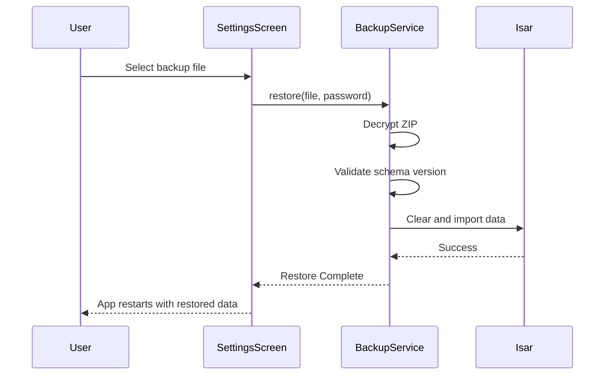
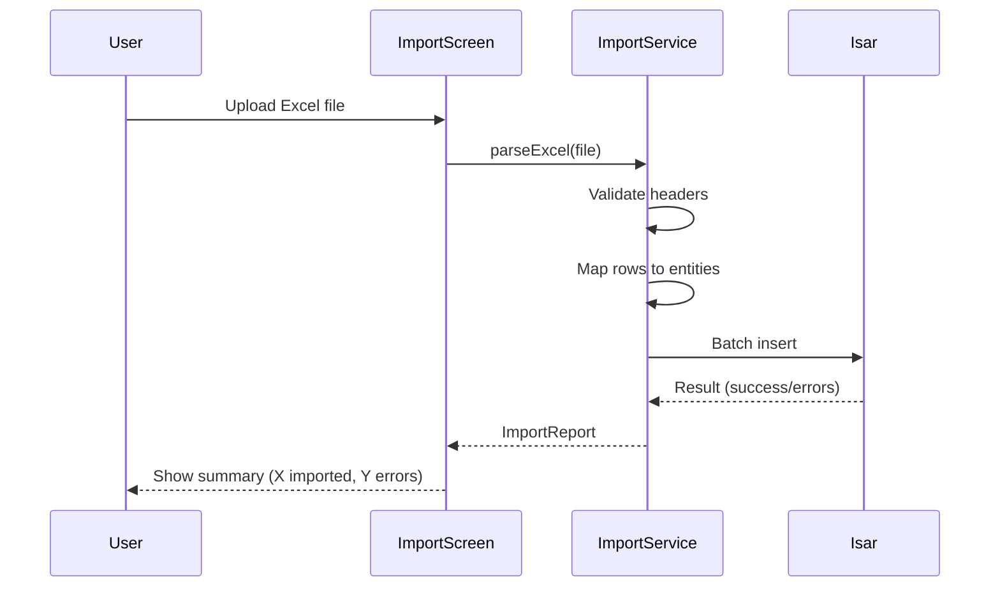

# Integration & Protocols Specification

**Version:** 2.0 (Sovereign Edition)
**Basis:** Screens 027, 033, 083, 088 & System Architecture
**Scope:** API Contracts, Data Sync, Backup, Import/Export

---

## 1. API Architecture (Future Cloud Sync)

### 1.1 API Design Principles

| Principle      | Implementation                                 |
| -------------- | ---------------------------------------------- |
| **RESTful**    | Standard HTTP methods (GET, POST, PUT, DELETE) |
| **JSON-First** | All payloads in JSON format                    |
| **Versioned**  | Prefix `/api/v1/` for all endpoints            |
| **Idempotent** | PUT and DELETE operations are safe to retry    |
| **Paginated**  | List endpoints support `?page=1&limit=50`      |

### 1.2 Core Endpoints (Planned)

| Endpoint                     | Method   | Description                |
| ---------------------------- | -------- | -------------------------- |
| `/api/v1/invoices`           | GET      | List invoices with filters |
| `/api/v1/invoices/{id}`      | GET      | Get single invoice         |
| `/api/v1/invoices`           | POST     | Create new invoice         |
| `/api/v1/invoices/{id}`      | PUT      | Update draft invoice       |
| `/api/v1/invoices/{id}/void` | POST     | Void posted invoice        |
| `/api/v1/journal-entries`    | GET/POST | Journal entry CRUD         |
| `/api/v1/accounts`           | GET      | List chart of accounts     |
| `/api/v1/sync`               | POST     | Bulk sync endpoint         |

### 1.3 Authentication

| Method       | Header          | Format         |
| ------------ | --------------- | -------------- |
| Bearer Token | `Authorization` | `Bearer <JWT>` |

### 1.4 Error Response Format

```json
{
  "error": {
    "code": "VALIDATION_ERROR",
    "message": "Invoice total does not balance.",
    "details": [
      { "field": "lines", "message": "Debit and Credit must be equal." }
    ]
  }
}
```

---

## 2. Data Synchronization

### 2.1 Sync Architecture

```mermaid
graph LR
    subgraph Local (Isar)
        L_INV[Invoices]
        L_JE[Journal Entries]
        L_ACC[Accounts]
    end
    subgraph Cloud (PostgreSQL)
        C_INV[Invoices]
        C_JE[Journal Entries]
        C_ACC[Accounts]
    end
    L_INV <-->|SyncService| C_INV
    L_JE <-->|SyncService| C_JE
    L_ACC <-->|SyncService| C_ACC
```

### 2.2 Sync Entity Fields

Every syncable entity includes:

| Field             | Type      | Purpose                                                  |
| ----------------- | --------- | -------------------------------------------------------- |
| `syncStatus`      | Enum      | `Synced`, `PendingUpload`, `PendingDownload`, `Conflict` |
| `serverUpdatedAt` | DateTime? | Last server modification timestamp                       |
| `localUpdatedAt`  | DateTime  | Last local modification timestamp                        |
| `isDeleted`       | bool      | Soft delete flag for sync                                |

### 2.3 Conflict Resolution

| Scenario                      | Resolution                      |
| ----------------------------- | ------------------------------- |
| Server newer, Local unchanged | Overwrite local                 |
| Local newer, Server unchanged | Upload local                    |
| Both changed                  | Mark as `Conflict`, prompt user |

---

## 3. Backup & Restore (Screens 027, 033)

### 3.1 Local Backup

| Feature    | Specification                                        |
| ---------- | ---------------------------------------------------- |
| Format     | Encrypted ZIP containing Isar DB export              |
| Location   | User-specified path (default: Documents/BasirBackup) |
| Trigger    | Manual or scheduled (daily/weekly)                   |
| Encryption | AES-256 with user-provided password                  |

### 3.2 Cloud Backup (Google Drive)

| Feature    | Specification                             |
| ---------- | ----------------------------------------- |
| Provider   | Google Drive API                          |
| Auth       | OAuth 2.0 (PKCE flow)                     |
| Storage    | User's Google Drive (app-specific folder) |
| Encryption | Client-side encryption before upload      |

### 3.3 Restore Flow



---

## 4. Data Import (Screen 083)

### 4.1 Excel Import Gateway

| Entity              | Supported Columns                                 |
| ------------------- | ------------------------------------------------- |
| **Inventory Items** | Barcode, Name, Category, Cost, Selling Price, Qty |
| **Customers**       | Name, Phone, Email, VAT Number                    |
| **Accounts**        | Code, Name, Type, Parent Code                     |

### 4.2 Import Flow



### 4.3 Validation Rules

- Required fields must be present.
- Codes must be unique.
- Foreign keys (e.g., `categoryId`) must exist.
- Decimal values must be parseable.

---

## 5. Data Export

### 5.1 Report Export (PDF)

| Feature   | Specification                           |
| --------- | --------------------------------------- |
| Library   | `pdf` package                           |
| Content   | Financial statements, transaction lists |
| Signature | SHA-256 "Forensic Seal" + QR code       |
| Metadata  | User, Timestamp, Hash embedded          |

### 5.2 Report Export (Excel)

| Feature     | Specification                          |
| ----------- | -------------------------------------- |
| Library     | `excel` package                        |
| Content     | Raw data tables with formatting        |
| Audit Sheet | Extra sheet with User, Timestamp, Hash |

### 5.3 Data Export (Database Dump)

For migration or analysis, users can export raw JSON or CSV of specific tables.

---

## 6. External Integrations (Future Roadmap)

| Integration      | Purpose                              | Status              |
| ---------------- | ------------------------------------ | ------------------- |
| **ZATCA API**    | Live invoice reporting               | Simulation Complete |
| **Google Drive** | Cloud backup                         | Planned             |
| **WhatsApp API** | Invoice sharing                      | Planned             |
| **POS Hardware** | Bluetooth printers, barcode scanners | Partial             |

---

## 7. Protocol Standards

### 7.1 Date/Time Handling

- All dates stored as UTC in database.
- Displayed in user's local timezone.
- Format: ISO 8601 for API (`2026-01-16T14:30:00Z`).

### 7.2 Currency Handling

- All monetary values stored as `Decimal` (not float).
- Currency codes follow ISO 4217 (e.g., `SAR`, `USD`).
- Exchange rates stored with 6 decimal precision.

### 7.3 Internationalization

- User-facing strings fetched from ARB files.
- Number and date formatting respects locale.

---

_This specification ensures Basir can integrate with external systems while maintaining data integrity and security._
