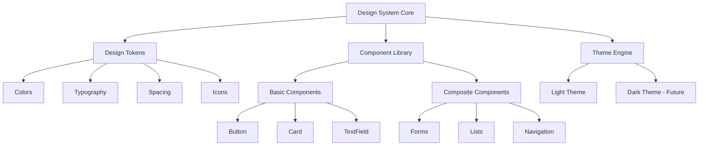

# تصميم نظام الهوية البصرية الموحدة - المرحلة الأولى

**المشروع:** بصير MVP - Progressive Excellence Approach  
**التاريخ:** 25 ديسمبر 2025  
**المؤلف:** فريق وكلاء تطوير مشروع بصير  
**الإصدار:** 4.0 - MVP Excellence Design  
**الحالة:** جاهز للتطبيق

---

## نظرة عامة (Overview)

### الرؤية

تصميم وتطبيق نظام هوية بصرية موحد لمشروع بصير يحقق:

- **🎯 الاتساق المطلق:** كل عنصر يتبع نفس المعايير والقواعد
- **♿ إمكانية الوصول الكاملة:** امتثال 100% لمعايير WCAG 2.1 AA
- **⚡ الأداء الممتاز:** 60+ FPS مع استجابة سريعة
- **🔧 سهولة الصيانة:** نظام منظم وقابل للتوسع
- **📱 دعم RTL كامل:** تجربة مثالية للمستخدمين العرب

### الفلسفة التصميمية

#### المبادئ الأساسية

**1. البساطة الذكية (Smart Simplicity)**

```
البساطة ≠ التبسيط المفرط
البساطة = وضوح + فعالية + جمال
```

**2. الاتساق المرن (Flexible Consistency)**

```
الاتساق = قواعد ثابتة + تطبيق مرن
المرونة = تكيف مع السياق دون كسر القواعد
```

**3. الوضوح أولاً (Clarity First)**

```
الوضوح = فهم فوري + تنقل سهل + هدف واضح
كل عنصر يجب أن يكون واضح الغرض والوظيفة
```

**4. الأداء كجودة (Performance as Quality)**

```
الأداء = جزء من التجربة البصرية
السرعة = جودة يشعر بها المستخدم
```

---

## الهندسة المعمارية (Architecture)

### البنية العامة



### طبقات النظام

**1. طبقة Design Tokens (الأساس)**

- `AppColors`: جميع الألوان المستخدمة في التطبيق
- `AppTypography`: جميع أنماط النصوص
- `AppSpacing`: جميع المسافات والأبعاد
- `AppIconSize`: أحجام الأيقونات المعيارية

**2. طبقة Theme Engine (المحرك)**

- `AppTheme`: إدارة الثيم الحالي
- `ThemeData`: تكوين Flutter theme
- `ColorScheme`: نظام الألوان المتكامل

**3. طبقة Components (المكونات)**

- `AppButton`: أزرار موحدة
- `AppCard`: بطاقات متسقة
- `AppTextField`: حقول إدخال معيارية

---

## المكونات والواجهات (Components and Interfaces)

### Design Tokens

#### نظام الألوان

```dart
class AppColors {
  // Primary Colors
  static const Color primary = Color(0xFF0056B3);
  static const Color primaryLight = Color(0xFF3D7BC6);
  static const Color primaryDark = Color(0xFF003D82);

  // Semantic Colors
  static const Color success = Color(0xFF2E7D32);
  static const Color error = Color(0xFFD32F2F);
  static const Color warning = Color(0xFFED6C02);
  static const Color info = Color(0xFF0288D1);

  // Neutral Colors
  static const Color background = Color(0xFFFAFAFA);
  static const Color surface = Color(0xFFFFFFFF);
  static const Color border = Color(0xFFE0E0E0);

  // Text Colors
  static const Color textPrimary = Color(0xFF212121);
  static const Color textSecondary = Color(0xFF757575);
  static const Color textHint = Color(0xFF9E9E9E);
}
```

#### نظام الطباعة

```dart
class AppTypography {
  static const String fontFamily = 'Cairo';

  // Display Styles
  static const TextStyle displayLarge = TextStyle(
    fontFamily: fontFamily,
    fontSize: 34,
    fontWeight: FontWeight.bold,
    height: 1.2,
    letterSpacing: -0.5,
  );

  // Headline Styles
  static const TextStyle headlineLarge = TextStyle(
    fontFamily: fontFamily,
    fontSize: 22,
    fontWeight: FontWeight.w600,
    height: 1.2,
  );

  // Body Styles
  static const TextStyle bodyMedium = TextStyle(
    fontFamily: fontFamily,
    fontSize: 15,
    fontWeight: FontWeight.normal,
    height: 1.5,
    letterSpacing: 0.25,
  );

  // Label Styles
  static const TextStyle labelLarge = TextStyle(
    fontFamily: fontFamily,
    fontSize: 15,
    fontWeight: FontWeight.w500,
    height: 1.3,
    letterSpacing: 0.1,
  );
}
```

#### نظام المسافات

```dart
class AppSpacing {
  static const double xs = 4.0;   // Extra Small
  static const double sm = 8.0;   // Small
  static const double md = 16.0;  // Medium (Default)
  static const double lg = 24.0;  // Large
  static const double xl = 32.0;  // Extra Large
  static const double xxl = 48.0; // Extra Extra Large
}
```

#### نظام الأيقونات

```dart
class AppIconSize {
  static const double small = 18.0;
  static const double medium = 22.0;
  static const double large = 26.0;
  static const double extraLarge = 32.0;
}

class AppIcons {
  // Navigation
  static const IconData home = Icons.home_outlined;
  static const IconData search = Icons.search_outlined;
  static const IconData profile = Icons.person_outlined;

  // Actions
  static const IconData add = Icons.add_outlined;
  static const IconData edit = Icons.edit_outlined;
  static const IconData delete = Icons.delete_outlined;

  // Status
  static const IconData success = Icons.check_circle_outline;
  static const IconData error = Icons.error_outline;
  static const IconData warning = Icons.warning_outlined;
  static const IconData info = Icons.info_outlined;
}
```

---

## نماذج البيانات (Data Models)

### Theme Configuration

```dart
class AppThemeConfig {
  final ColorScheme colorScheme;
  final TextTheme textTheme;
  final double borderRadius;
  final EdgeInsets defaultPadding;

  const AppThemeConfig({
    required this.colorScheme,
    required this.textTheme,
    this.borderRadius = 12.0,
    this.defaultPadding = const EdgeInsets.all(AppSpacing.md),
  });
}
```

### Component Specifications

```dart
class ComponentSpec {
  final String name;
  final Map<String, dynamic> properties;
  final List<String> variants;
  final AccessibilitySpec accessibility;

  const ComponentSpec({
    required this.name,
    required this.properties,
    required this.variants,
    required this.accessibility,
  });
}

class AccessibilitySpec {
  final double minTouchTarget;
  final double minContrastRatio;
  final String semanticLabel;

  const AccessibilitySpec({
    this.minTouchTarget = 44.0,
    this.minContrastRatio = 4.5,
    required this.semanticLabel,
  });
}
```

---

## خصائص الصحة (Correctness Properties)

_خاصية هي سمة أو سلوك يجب أن يكون صحيحاً عبر جميع التنفيذات الصالحة للنظام - في الأساس، بيان رسمي حول ما يجب أن يفعله النظام. الخصائص تعمل كجسر بين المواصفات المقروءة بواسطة الإنسان وضمانات الصحة القابلة للتحقق آلياً._

### خصائص الألوان

**Property 1: Color Contrast Compliance**
_لأي_ زوج من الألوان المستخدمة للنص والخلفية، يجب أن يكون التباين ≥ 4.5:1 للنص العادي و ≥ 3:1 للنص الكبير
**يتحقق من: المتطلبات 1.2**

**Property 2: Semantic Color Consistency**
_لأي_ حالة دلالية (نجاح، خطأ، تحذير)، يجب استخدام نفس اللون عبر جميع المكونات
**يتحقق من: المتطلبات 1.4**

**Property 3: No Hardcoded Colors**
_لأي_ ملف كود، يجب ألا يحتوي على ألوان مباشرة (Color(0xFF...)) خارج AppColors
**يتحقق من: المتطلبات 1.3**

### خصائص الطباعة

**Property 4: Typography Consistency**
_لأي_ نص في التطبيق، يجب استخدام أنماط من AppTypography فقط
**يتحقق من: المتطلبات 2.1**

**Property 5: Font Family Uniformity**
_لأي_ نص معروض، يجب استخدام خط Cairo حصرياً
**يتحقق من: المتطلبات 2.2**

**Property 6: RTL Text Direction**
_لأي_ نص عربي، يجب تطبيق TextDirection.rtl تلقائياً
**يتحقق من: المتطلبات 2.4**

### خصائص المسافات

**Property 7: Spacing Grid Compliance**
_لأي_ مسافة مطبقة، يجب أن تكون مضاعف 4px من AppSpacing
**يتحقق من: المتطلبات 3.1**

**Property 8: Border Radius Consistency**
_لأي_ مكون، يجب استخدام borderRadius محدد مسبقاً (12px أو 16px)
**يتحقق من: المتطلبات 3.2**

### خصائص إمكانية الوصول

**Property 9: Touch Target Size**
_لأي_ عنصر تفاعلي، يجب أن يكون حجم المنطقة التفاعلية ≥ 44x44px
**يتحقق من: المتطلبات 5.2**

**Property 10: Text Scaling Support**
_لأي_ نص، يجب دعم scaling حتى 200% بدون overflow
**يتحقق من: المتطلبات 5.2**

**Property 11: Multi-Modal Feedback**
_لأي_ معلومة مهمة، يجب توفير 3 مؤشرات: لون + أيقونة + نص
**يتحقق من: المتطلبات 5.3**

---

## معالجة الأخطاء (Error Handling)

### استراتيجية معالجة الأخطاء

**1. التحقق المبكر (Early Validation)**

```dart
class ColorValidator {
  static bool isValidContrast(Color foreground, Color background) {
    final ratio = calculateContrastRatio(foreground, background);
    return ratio >= 4.5; // WCAG AA standard
  }

  static void validateColor(Color color, String context) {
    assert(color != null, 'Color cannot be null in $context');
    assert(!_isHardcoded(color), 'Use AppColors instead of hardcoded colors in $context');
  }
}
```

**2. التراجع الآمن (Safe Fallbacks)**

```dart
class SafeTheme {
  static TextStyle getSafeTextStyle(TextStyle? style) {
    return style ?? AppTypography.bodyMedium;
  }

  static Color getSafeColor(Color? color, Color fallback) {
    return color ?? fallback;
  }
}
```

**3. التسجيل والمراقبة (Logging and Monitoring)**

```dart
class DesignSystemLogger {
  static void logViolation(String violation, String component) {
    // Log design system violations for monitoring
    print('DESIGN_VIOLATION: $violation in $component');
  }

  static void logPerformance(String metric, double value) {
    // Log performance metrics
    print('PERFORMANCE: $metric = $value');
  }
}
```

---

## استراتيجية الاختبار (Testing Strategy)

### نهج الاختبار المزدوج

**Unit Tests + Property-Based Tests = تغطية شاملة**

#### Unit Tests

- اختبار أمثلة محددة وحالات حدية
- التحقق من التكامل بين المكونات
- اختبار سيناريوهات الاستخدام الشائعة

#### Property-Based Tests

- التحقق من الخصائص العامة عبر مدخلات متعددة
- اختبار 100+ تكرار لكل خاصية
- استخدام مكتبة `test` المدمجة في Flutter

### مكتبة الاختبار

**Property-Based Testing Library:** `test` package (مدمج في Flutter)

### متطلبات الاختبار

- **تشغيل 100+ تكرار** لكل اختبار خاصية
- **تعليق كل اختبار** بمرجع الخاصية من التصميم
- **تنسيق التعليق:** `// Feature: brand-visual-identity, Property X: [نص الخاصية]`
- **اختبار واحد لكل خاصية** - لا تجمع خصائص متعددة في اختبار واحد

### أمثلة الاختبارات

```dart
// Feature: brand-visual-identity, Property 1: Color Contrast Compliance
test('all text-background color pairs meet WCAG contrast requirements', () {
  final textColors = [AppColors.textPrimary, AppColors.textSecondary];
  final backgrounds = [AppColors.background, AppColors.surface];

  for (final textColor in textColors) {
    for (final background in backgrounds) {
      final ratio = calculateContrastRatio(textColor, background);
      expect(ratio, greaterThanOrEqualTo(4.5));
    }
  }
});

// Feature: brand-visual-identity, Property 7: Spacing Grid Compliance
test('all spacing values are multiples of 4px', () {
  final spacingValues = [
    AppSpacing.xs, AppSpacing.sm, AppSpacing.md,
    AppSpacing.lg, AppSpacing.xl, AppSpacing.xxl
  ];

  for (final spacing in spacingValues) {
    expect(spacing % 4, equals(0));
  }
});
```

---

**تم إعداده بواسطة:** فريق وكلاء تطوير مشروع بصير  
**التاريخ:** 25 ديسمبر 2025  
**الإصدار:** 4.0 - MVP Excellence Design  
**الحالة:** ✅ جاهز للتطبيق
