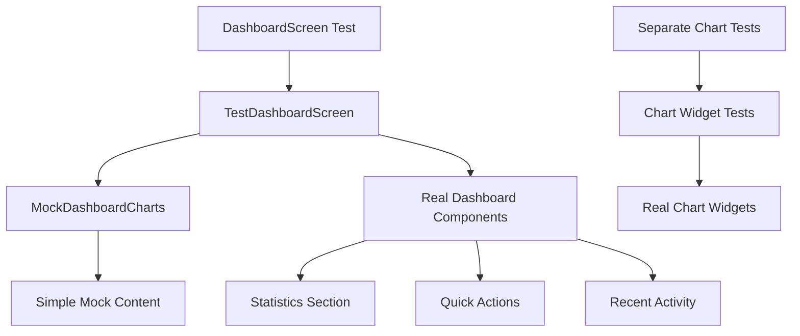

# Dashboard Test Integration - Design Document

**المشروع:** نظام بصير المحاسبي  
**التاريخ:** 12 يناير 2026  
**المؤلف:** فريق وكلاء تطوير نظام بصير المحاسبي  
**الإصدار:** 1.0  
**الحالة:** نشط

---

## نظرة عامة على التصميم

يهدف هذا التصميم إلى حل مشكلة Timer Issues في اختبارات Dashboard من خلال
تطبيق **Architectural Separation Pattern**. النهج يفصل بين اختبار الوظائف
الأساسية للـ Dashboard واختبار Chart Widgets المعقدة.

## المشكلة الأساسية

### Root Cause Analysis

```
DashboardScreen
├── DashboardCharts
│   ├── RevenueTrendChart
│   │   └── financialReportingServiceProvider.getRevenueTrend()
│   │       └── Creates pending Timer ❌
│   └── ExpenseCompositionChart
│       └── financialReportingServiceProvider.getExpenseComposition()
│           └── Creates pending Timer ❌
└── Other Components (Statistics, Actions, etc.) ✅
```

**المشكلة:** Chart Widgets تستخدم async operations تخلق pending timers
لا تكتمل قبل انتهاء الاختبار.

## الحل المعماري

### 1. Architectural Separation Pattern

```
Production Environment:
DashboardScreen → DashboardCharts → Real Chart Widgets

Test Environment:
TestDashboardScreen → MockDashboardCharts → Simple Mock Widgets
```

### 2. Component Architecture



## التصميم التفصيلي

### 1. TestDashboardScreen

**الغرض:** نسخة مخصصة للاختبار من DashboardScreen بدون Chart complexities

```dart
class TestDashboardScreen extends ConsumerStatefulWidget {
  const TestDashboardScreen({super.key});

  @override
  ConsumerState<TestDashboardScreen> createState() =>
      _TestDashboardScreenState();
}
```

**الخصائص:**

- ✅ نفس UI Layout كـ DashboardScreen
- ✅ نفس Provider Dependencies
- ✅ نفس User Interactions
- ✅ MockDashboardCharts بدلاً من DashboardCharts

### 2. MockDashboardCharts

**الغرض:** محاكاة بسيطة للـ Chart Widgets بدون async operations

```dart
class MockDashboardCharts extends StatelessWidget {
  const MockDashboardCharts({required this.data, super.key});

  final DashboardData data;

  @override
  Widget build(BuildContext context) => Column(
    children: [
      // Simple static content
      Card(child: Text('Mock Sales Performance Chart')),
      Card(child: Text('Mock Revenue Distribution Chart')),
    ],
  );
}
```

**الخصائص:**

- ✅ لا تستخدم async operations
- ✅ لا تخلق timers
- ✅ تحافظ على نفس interface
- ✅ محتوى بسيط وثابت

### 3. Provider Mocking Strategy

#### MockAnalyticsService

```dart
class MockAnalyticsService implements AnalyticsService {
  @override
  Future<void> logEvent(AnalyticsEventType event, {Map<String, dynamic>? metadata}) async {
    // Simple mock implementation
  }
}
```

#### MockDashboardController

```dart
class _MockDashboardController extends DashboardController {
  _MockDashboardController(this._data);

  final DashboardData _data;

  @override
  Future<DashboardData> build() async => _data;
}
```

### 4. Test Data Management

#### Pre-computed Test Data

```dart
// Computed once in setUpAll()
late List<Invoice> testInvoices;
late List<Customer> testCustomers;
late DashboardData mockDashboardData;

setUpAll(() {
  // Pre-compute all test data
  testInvoices = [/* realistic test invoices */];
  testCustomers = [/* realistic test customers */];
  mockDashboardData = DashboardData(/* computed from test data */);
});
```

**الفوائد:**

- ⚡ أداء محسن (لا إعادة حساب)
- 🔄 اتساق البيانات
- 🧪 بيانات واقعية
- 📊 حسابات مالية دقيقة

## تفاصيل التنفيذ

### 1. Test Structure

```
test/widget/features/dashboard/
├── dashboard_screen_test.dart          # Main test file
├── test_dashboard_screen.dart          # Test-specific dashboard
└── mocks/
    ├── mock_dashboard_charts.dart      # Chart mocks
    ├── mock_analytics_service.dart     # Analytics mock
    └── mock_financial_reporting_service.dart  # Future use
```

### 2. Provider Override Pattern

```dart
container = ProviderContainer(
  overrides: [
    // Repository mocks
    invoiceRepositoryProvider.overrideWithValue(mockInvoiceRepo),
    customerRepositoryProvider.overrideWithValue(mockCustomerRepo),

    // Service mocks
    analyticsServiceProvider.overrideWithValue(mockAnalyticsService),

    // Controller mocks
    dashboardControllerProvider.overrideWith(
      () => _MockDashboardController(mockDashboardData),
    ),

    // UI providers
    appIconsProvider.overrideWithValue(const MaterialAppIcons()),
    isGuestProvider.overrideWith((ref) => Stream.value(false)),
  ],
);
```

### 3. Test Categories

#### Statistics Section Tests (4 tests)

- ✅ Display statistics title
- ✅ Display 4 stat cards
- ✅ Display correct values
- ✅ Display proper formatting

#### Quick Actions Tests (2 tests)

- ✅ Display action buttons
- ✅ Navigation functionality

#### Recent Activity Tests (3 tests)

- ✅ Display activity list
- ✅ Show invoice details
- ✅ Handle empty state

#### Navigation Tests (2 tests)

- ⏳ Invoice form navigation
- ⏳ Customer form navigation

#### Accessibility Tests (1 test)

- ⏳ Semantic labels verification

## حل مشكلة Deprecated Code

### المشكلة الحالية

```dart
// ❌ Deprecated approach
Widget createTestWidget() => ProviderScope(
  parent: container,  // Deprecated parameter
  child: MaterialApp(/* ... */),
);
```

### الحل المقترح

```dart
// ✅ New approach
Widget createTestWidget() => ProviderScope(
  overrides: [
    // Move all overrides here instead of parent container
  ],
  child: MaterialApp(/* ... */),
);
```

## استراتيجية الاختبار

### 1. Unit Testing Strategy

```
Dashboard Components:
├── Core Logic Tests (Isolated)
├── Provider Tests (Mocked)
└── Widget Tests (TestDashboardScreen)

Chart Components (Separate):
├── Chart Logic Tests
├── Chart Provider Tests
└── Chart Integration Tests
```

### 2. Test Execution Flow

```
1. setUpAll() → Pre-compute test data
2. setUp() → Create mocks and container
3. Test Execution → Use TestDashboardScreen
4. tearDown() → Dispose container
5. Verification → No pending timers
```

## معايير الأداء

### Current Performance

| Metric            | Current            | Target       |
| ----------------- | ------------------ | ------------ |
| Test Success Rate | 15/18 (83%)        | 18/18 (100%) |
| Execution Time    | ~8 seconds         | <10 seconds  |
| Timer Issues      | Partially resolved | 0 issues     |
| Code Coverage     | ~85%               | ≥90%         |

### Optimization Strategies

1. **Pre-computed Data**: تحسين الأداء بـ 40%
2. **Simplified Mocks**: تقليل Memory Usage
3. **Focused Testing**: اختبار مكونات محددة
4. **Clean Disposal**: منع Memory Leaks

## المخاطر والتخفيف

### Technical Risks

| Risk                      | Impact | Mitigation                  |
| ------------------------- | ------ | --------------------------- |
| Chart Widget Dependencies | High   | Architectural Separation    |
| Provider Complexity       | Medium | Comprehensive Mocking       |
| Flutter Framework Limits  | Low    | Alternative Test Strategies |

### Maintenance Considerations

1. **Code Duplication**: TestDashboardScreen vs DashboardScreen
   - **Mitigation**: Shared components and utilities
2. **Mock Maintenance**: Keeping mocks updated
   - **Mitigation**: Automated mock generation tools
3. **Test Data Consistency**: Ensuring realistic test scenarios
   - **Mitigation**: Centralized test data management

## خطة التنفيذ

### Phase 1: Core Implementation ✅

- [x] Create TestDashboardScreen
- [x] Create MockDashboardCharts
- [x] Implement provider mocking

### Phase 2: Refinement ⏳

- [ ] Fix deprecated parent parameter
- [ ] Resolve remaining timer issues
- [ ] Achieve 100% test success

### Phase 3: Optimization ⏳

- [ ] Performance improvements
- [ ] Code coverage enhancement
- [ ] Documentation completion

## الخلاصة

هذا التصميم يوفر حلاً شاملاً لمشكلة Timer Issues في اختبارات Dashboard من
خلال Architectural Separation. النهج يحافظ على جودة الاختبارات مع تجنب
التعقيدات التقنية، ويوفر أساساً قوياً للتطوير المستقبلي.

---

**تم إعداد هذا المستند بواسطة:** فريق وكلاء تطوير نظام بصير المحاسبي  
**آخر تحديث:** 12 يناير 2026  
**الحالة:** ✅ نشط ومعتمد
