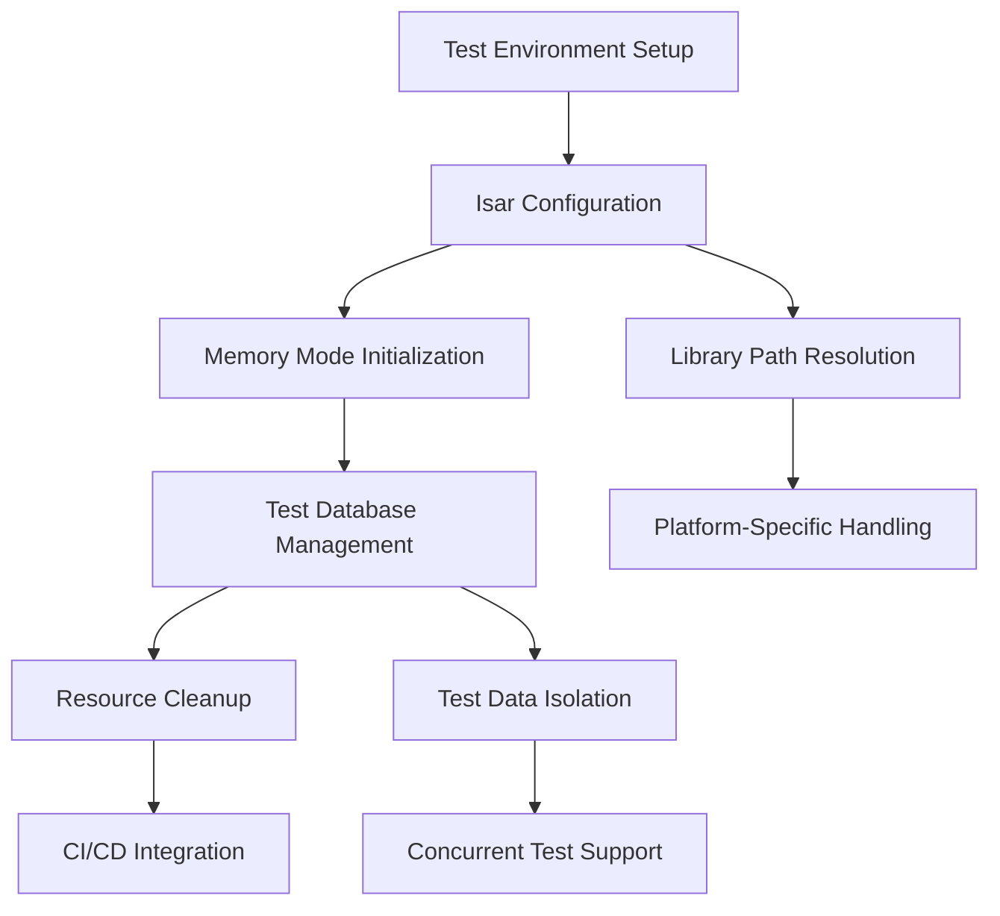

# تصميم إصلاح مشكلة Isar في الاختبارات - بصير MVP

**المشروع:** بصير MVP  
**المؤلف:** فريق وكلاء تطوير مشروع بصير  
**التاريخ:** 17 ديسمبر 2025  
**الحالة:** 🚨 أولوية حرجة فورية - تصميم تقني شامل

---

## 🎯 نظرة عامة على التصميم

### الهدف التقني

إصلاح مشكلة Isar في بيئة الاختبارات التي تسبب فشل 53 اختبار، من خلال حل تقني شامل يضمن:

- **إعداد صحيح لـ Isar** في بيئة الاختبارات
- **استخدام memory mode** للاختبارات السريعة
- **إدارة صحيحة للموارد** وتنظيف البيانات
- **توافق كامل مع CI/CD** pipeline

---

## 🔍 تحليل المشكلة التقنية

### المشكلة الجذرية

```
Error: libisar.so مفقود أو غير قابل للتحميل
Cannot initialize Isar in test environment
```

### الأسباب المحتملة

1. **مشكلة في إعداد Isar للاختبارات**

   - عدم وجود proper test configuration
   - مشكلة في memory mode setup
   - تضارب في library paths

2. **مشكلة في بيئة التطوير**

   - إعداد Flutter test environment غير صحيح
   - مشكلة في platform-specific libraries
   - تضارب في versions أو dependencies

3. **مشكلة في تكوين المشروع**
   - pubspec.yaml configuration
   - test setup files مفقودة أو خاطئة
   - mock configurations غير صحيحة

---

## 🏗️ البنية المعمارية للحل

### مكونات الحل



### طبقات الحل

1. **طبقة الإعداد (Setup Layer)**

   - تكوين بيئة الاختبارات
   - إعداد Isar للـ memory mode
   - حل مسارات المكتبات

2. **طبقة الإدارة (Management Layer)**

   - إدارة دورة حياة قواعد البيانات
   - عزل البيانات بين الاختبارات
   - تنظيف الموارد

3. **طبقة التكامل (Integration Layer)**
   - دعم CI/CD environments
   - توافق مع platforms مختلفة
   - معالجة الأخطاء

---

## 🛠️ التصميم التفصيلي

### 1. إعداد Isar للاختبارات

#### IsarTestHelper Class

```dart
/// مساعد إعداد Isar للاختبارات
///
/// يوفر إعداد موحد وآمن لـ Isar في بيئة الاختبارات
/// مع دعم memory mode والتنظيف التلقائي
class IsarTestHelper {
  static Isar? _testIsar;
  static final List<Isar> _openInstances = [];

  /// إنشاء instance جديد من Isar للاختبارات
  ///
  /// [schemas] قائمة الـ schemas المطلوبة
  /// [name] اسم قاعدة البيانات (اختياري)
  ///
  /// Returns instance من Isar معد للاختبارات
  static Future<Isar> createTestIsar({
    required List<CollectionSchema> schemas,
    String? name,
  }) async {
    // إعداد memory mode للاختبارات السريعة
    final isar = await Isar.open(
      schemas,
      name: name ?? 'test_${DateTime.now().millisecondsSinceEpoch}',
      directory: null, // memory mode
      inspector: false, // تعطيل inspector في الاختبارات
    );

    _openInstances.add(isar);
    return isar;
  }

  /// تنظيف جميع instances المفتوحة
  static Future<void> cleanupAll() async {
    for (final isar in _openInstances) {
      if (isar.isOpen) {
        await isar.close();
      }
    }
    _openInstances.clear();
    _testIsar = null;
  }

  /// إعداد مشترك لجميع الاختبارات
  static Future<Isar> setupCommonIsar() async {
    if (_testIsar?.isOpen == true) {
      return _testIsar!;
    }

    _testIsar = await createTestIsar(
      schemas: [
        // إضافة جميع schemas المطلوبة
        CustomerSchema,
        InvoiceSchema,
        InvoiceItemSchema,
        // ... باقي الـ schemas
      ],
    );

    return _testIsar!;
  }
}
```

#### Test Setup Configuration

```dart
/// إعداد أساسي لجميع اختبارات Isar
///
/// يجب استخدامه في setUp() لكل test file
mixin IsarTestMixin {
  late Isar testIsar;

  /// إعداد Isar للاختبار
  Future<void> setUpIsar() async {
    testIsar = await IsarTestHelper.createTestIsar(
      schemas: getRequiredSchemas(),
    );
  }

  /// تنظيف Isar بعد الاختبار
  Future<void> tearDownIsar() async {
    if (testIsar.isOpen) {
      await testIsar.close();
    }
  }

  /// الحصول على schemas المطلوبة للاختبار
  /// يجب تنفيذها في كل test class
  List<CollectionSchema> getRequiredSchemas();
}
```

### 2. إدارة قواعد البيانات للاختبارات

#### TestDatabaseManager

```dart
/// مدير قواعد البيانات للاختبارات
///
/// يوفر إدارة متقدمة لقواعد البيانات في الاختبارات
/// مع دعم العزل والتنظيف التلقائي
class TestDatabaseManager {
  static final Map<String, Isar> _databases = {};
  static final List<String> _createdDatabases = [];

  /// إنشاء قاعدة بيانات معزولة للاختبار
  static Future<Isar> createIsolatedDatabase({
    required String testName,
    required List<CollectionSchema> schemas,
  }) async {
    final dbName = 'test_${testName}_${DateTime.now().millisecondsSinceEpoch}';

    final isar = await Isar.open(
      schemas,
      name: dbName,
      directory: null, // memory mode للسرعة
      inspector: false,
    );

    _databases[testName] = isar;
    _createdDatabases.add(dbName);

    return isar;
  }

  /// الحصول على قاعدة بيانات موجودة
  static Isar? getDatabase(String testName) {
    return _databases[testName];
  }

  /// تنظيف قاعدة بيانات محددة
  static Future<void> cleanupDatabase(String testName) async {
    final isar = _databases[testName];
    if (isar?.isOpen == true) {
      await isar!.close();
    }
    _databases.remove(testName);
  }

  /// تنظيف جميع قواعد البيانات
  static Future<void> cleanupAll() async {
    for (final entry in _databases.entries) {
      if (entry.value.isOpen) {
        await entry.value.close();
      }
    }
    _databases.clear();
    _createdDatabases.clear();
  }

  /// إحصائيات الاستخدام
  static Map<String, dynamic> getUsageStats() {
    return {
      'active_databases': _databases.length,
      'total_created': _createdDatabases.length,
      'open_instances': _databases.values.where((isar) => isar.isOpen).length,
    };
  }
}
```

### 3. Mock Repositories للاختبارات

#### MockIsarRepository

```dart
/// Mock repository لاختبار العمليات بدون Isar حقيقي
///
/// يوفر تنفيذ وهمي لجميع عمليات Repository
/// مع إمكانية التحكم في السلوك للاختبارات
class MockIsarRepository<T> implements BaseRepository<T> {
  final List<T> _data = [];
  final Map<String, dynamic> _config = {};

  // تحكم في سلوك الـ mock
  bool shouldThrowError = false;
  Exception? errorToThrow;
  Duration? simulatedDelay;

  @override
  Future<List<T>> getAll() async {
    await _simulateDelay();
    _throwIfConfigured();
    return List.from(_data);
  }

  @override
  Future<T?> getById(int id) async {
    await _simulateDelay();
    _throwIfConfigured();
    // تنفيذ البحث بالـ id
    return _data.firstWhereOrNull((item) => _getId(item) == id);
  }

  @override
  Future<int> save(T item) async {
    await _simulateDelay();
    _throwIfConfigured();

    final existingIndex = _data.indexWhere((existing) => _getId(existing) == _getId(item));
    if (existingIndex >= 0) {
      _data[existingIndex] = item;
    } else {
      _data.add(item);
    }

    return _getId(item);
  }

  @override
  Future<bool> delete(int id) async {
    await _simulateDelay();
    _throwIfConfigured();

    final index = _data.indexWhere((item) => _getId(item) == id);
    if (index >= 0) {
      _data.removeAt(index);
      return true;
    }
    return false;
  }

  // مساعدات للتحكم في الـ mock
  void configureError(Exception error) {
    shouldThrowError = true;
    errorToThrow = error;
  }

  void configureDelay(Duration delay) {
    simulatedDelay = delay;
  }

  void reset() {
    _data.clear();
    shouldThrowError = false;
    errorToThrow = null;
    simulatedDelay = null;
  }

  // مساعدات خاصة
  Future<void> _simulateDelay() async {
    if (simulatedDelay != null) {
      await Future.delayed(simulatedDelay!);
    }
  }

  void _throwIfConfigured() {
    if (shouldThrowError) {
      throw errorToThrow ?? Exception('Mock error');
    }
  }

  int _getId(T item) {
    // تنفيذ استخراج الـ id حسب نوع الكائن
    if (item is Customer) return (item as Customer).id;
    if (item is Invoice) return (item as Invoice).id;
    // ... باقي الأنواع
    return 0;
  }
}
```

### 4. Test Fixtures وبيانات الاختبار

#### TestDataFactory

```dart
/// مصنع بيانات الاختبار
///
/// يوفر بيانات موحدة ومتسقة لجميع الاختبارات
/// مع إمكانية التخصيص حسب الحاجة
class TestDataFactory {
  static int _customerIdCounter = 1;
  static int _invoiceIdCounter = 1;

  /// إنشاء عميل للاختبار
  static Customer createTestCustomer({
    String? name,
    String? email,
    String? phone,
  }) {
    return Customer(
      id: _customerIdCounter++,
      name: name ?? 'عميل تجريبي ${_customerIdCounter}',
      email: email ?? 'test${_customerIdCounter}@example.com',
      phone: phone ?? '05${_customerIdCounter.toString().padLeft(8, '0')}',
      createdAt: DateTime.now(),
    );
  }

  /// إنشاء فاتورة للاختبار
  static Invoice createTestInvoice({
    int? customerId,
    double? amount,
    List<InvoiceItem>? items,
  }) {
    final testItems = items ?? [
      createTestInvoiceItem(name: 'خدمة تجريبية', price: 100.0),
    ];

    return Invoice(
      id: _invoiceIdCounter++,
      customerId: customerId ?? 1,
      amount: amount ?? testItems.fold(0.0, (sum, item) => sum + item.price),
      items: testItems,
      createdAt: DateTime.now(),
      status: InvoiceStatus.draft,
    );
  }

  /// إنشاء عنصر فاتورة للاختبار
  static InvoiceItem createTestInvoiceItem({
    required String name,
    required double price,
    int quantity = 1,
  }) {
    return InvoiceItem(
      name: name,
      price: price,
      quantity: quantity,
    );
  }

  /// إنشاء مجموعة بيانات كاملة للاختبار
  static Future<TestDataSet> createCompleteTestDataSet(Isar isar) async {
    final customers = List.generate(5, (i) => createTestCustomer());
    final invoices = customers.map((customer) =>
      createTestInvoice(customerId: customer.id)
    ).toList();

    // حفظ البيانات في Isar
    await isar.writeTxn(() async {
      await isar.customers.putAll(customers);
      await isar.invoices.putAll(invoices);
    });

    return TestDataSet(
      customers: customers,
      invoices: invoices,
    );
  }

  /// إعادة تعيين العدادات
  static void resetCounters() {
    _customerIdCounter = 1;
    _invoiceIdCounter = 1;
  }
}

/// مجموعة بيانات الاختبار
class TestDataSet {
  final List<Customer> customers;
  final List<Invoice> invoices;

  const TestDataSet({
    required this.customers,
    required this.invoices,
  });
}
```

---

## 🔧 إعداد البيئة والتكوين

### 1. تحديث pubspec.yaml

```yaml
dev_dependencies:
  flutter_test:
    sdk: flutter
  mockito: ^5.4.4
  build_runner: ^2.4.9
  isar_test: ^3.1.0 # إذا كان متاح
  test: ^1.24.9

dependencies:
  isar: ^3.1.5
  isar_flutter_libs: ^3.1.5
  path_provider: ^2.1.2
```

### 2. إعداد test/test_helper.dart

```dart
/// مساعد إعداد الاختبارات الشامل
///
/// يوفر إعداد موحد لجميع الاختبارات في المشروع
library test_helper;

import 'package:flutter_test/flutter_test.dart';
import 'package:isar/isar.dart';
import 'package:basir_mvp/data/models/models.dart';

/// إعداد أساسي لجميع الاختبارات
Future<void> setupTestEnvironment() async {
  // إعداد Flutter test environment
  TestWidgetsFlutterBinding.ensureInitialized();

  // تنظيف أي بيانات سابقة
  await IsarTestHelper.cleanupAll();
  await TestDatabaseManager.cleanupAll();

  // إعادة تعيين مصنع البيانات
  TestDataFactory.resetCounters();
}

/// تنظيف بعد الاختبارات
Future<void> teardownTestEnvironment() async {
  await IsarTestHelper.cleanupAll();
  await TestDatabaseManager.cleanupAll();
}

/// إعداد مجموعة اختبارات
void setupTestGroup(String description, Function() body) {
  group(description, () {
    setUpAll(() async {
      await setupTestEnvironment();
    });

    tearDownAll(() async {
      await teardownTestEnvironment();
    });

    body();
  });
}

/// إعداد اختبار فردي مع Isar
void setupIsarTest(
  String description,
  Future<void> Function(Isar isar) body, {
  List<CollectionSchema>? schemas,
}) {
  test(description, () async {
    final isar = await IsarTestHelper.createTestIsar(
      schemas: schemas ?? [
        CustomerSchema,
        InvoiceSchema,
        InvoiceItemSchema,
      ],
    );

    try {
      await body(isar);
    } finally {
      if (isar.isOpen) {
        await isar.close();
      }
    }
  });
}
```

### 3. إعداد CI/CD Configuration

#### .github/workflows/test.yml

```yaml
name: Tests

on:
  push:
    branches: [main, develop]
  pull_request:
    branches: [main]

jobs:
  test:
    runs-on: ubuntu-latest

    steps:
      - uses: actions/checkout@v4

      - name: Setup Flutter
        uses: subosito/flutter-action@v2
        with:
          flutter-version: "3.35.5"
          channel: "stable"

      - name: Install dependencies
        run: flutter pub get

      - name: Run code generation
        run: flutter packages pub run build_runner build --delete-conflicting-outputs

      - name: Analyze code
        run: flutter analyze

      - name: Run tests
        run: flutter test --coverage --reporter=compact

      - name: Upload coverage
        uses: codecov/codecov-action@v3
        with:
          file: coverage/lcov.info
          fail_ci_if_error: true
```

---

## 📊 مراقبة الأداء والجودة

### 1. Test Performance Monitor

```dart
/// مراقب أداء الاختبارات
///
/// يتتبع أداء الاختبارات ويوفر إحصائيات مفيدة
class TestPerformanceMonitor {
  static final Map<String, TestMetrics> _metrics = {};
  static final Stopwatch _globalStopwatch = Stopwatch();

  /// بدء مراقبة اختبار
  static void startTest(String testName) {
    _globalStopwatch.start();
    _metrics[testName] = TestMetrics(
      name: testName,
      startTime: DateTime.now(),
    );
  }

  /// إنهاء مراقبة اختبار
  static void endTest(String testName, {bool passed = true}) {
    final metrics = _metrics[testName];
    if (metrics != null) {
      metrics.endTime = DateTime.now();
      metrics.duration = metrics.endTime!.difference(metrics.startTime);
      metrics.passed = passed;
    }
    _globalStopwatch.stop();
  }

  /// الحصول على تقرير الأداء
  static TestPerformanceReport getReport() {
    final totalTests = _metrics.length;
    final passedTests = _metrics.values.where((m) => m.passed).length;
    final totalDuration = _metrics.values
        .where((m) => m.duration != null)
        .fold(Duration.zero, (sum, m) => sum + m.duration!);

    return TestPerformanceReport(
      totalTests: totalTests,
      passedTests: passedTests,
      failedTests: totalTests - passedTests,
      totalDuration: totalDuration,
      averageDuration: totalTests > 0
          ? Duration(microseconds: totalDuration.inMicroseconds ~/ totalTests)
          : Duration.zero,
      metrics: List.from(_metrics.values),
    );
  }

  /// تنظيف البيانات
  static void reset() {
    _metrics.clear();
    _globalStopwatch.reset();
  }
}

/// مقاييس اختبار فردي
class TestMetrics {
  final String name;
  final DateTime startTime;
  DateTime? endTime;
  Duration? duration;
  bool passed = false;

  TestMetrics({
    required this.name,
    required this.startTime,
  });
}

/// تقرير أداء الاختبارات
class TestPerformanceReport {
  final int totalTests;
  final int passedTests;
  final int failedTests;
  final Duration totalDuration;
  final Duration averageDuration;
  final List<TestMetrics> metrics;

  const TestPerformanceReport({
    required this.totalTests,
    required this.passedTests,
    required this.failedTests,
    required this.totalDuration,
    required this.averageDuration,
    required this.metrics,
  });

  /// معدل النجاح
  double get successRate => totalTests > 0 ? passedTests / totalTests : 0.0;

  /// هل يحقق معايير الأداء؟
  bool get meetsPerformanceCriteria {
    return successRate >= 1.0 && // 100% نجاح
           totalDuration.inMinutes < 2 && // أقل من دقيقتين
           averageDuration.inSeconds < 5; // أقل من 5 ثوان للاختبار الواحد
  }
}
```

### 2. Test Coverage Analyzer

```dart
/// محلل تغطية الاختبارات
///
/// يوفر تحليل متقدم لتغطية الاختبارات
class TestCoverageAnalyzer {
  /// تحليل تغطية الاختبارات
  static Future<CoverageReport> analyzeCoverage() async {
    // قراءة ملف التغطية
    final coverageFile = File('coverage/lcov.info');
    if (!await coverageFile.exists()) {
      throw Exception('ملف التغطية غير موجود. تأكد من تشغيل flutter test --coverage');
    }

    final coverageData = await coverageFile.readAsString();
    return _parseLcovData(coverageData);
  }

  /// تحليل بيانات LCOV
  static CoverageReport _parseLcovData(String lcovData) {
    final lines = lcovData.split('\n');
    final files = <FileCoverage>[];

    FileCoverage? currentFile;

    for (final line in lines) {
      if (line.startsWith('SF:')) {
        // ملف جديد
        final filePath = line.substring(3);
        currentFile = FileCoverage(filePath: filePath);
      } else if (line.startsWith('LF:')) {
        // عدد الأسطر القابلة للتنفيذ
        currentFile?.totalLines = int.parse(line.substring(3));
      } else if (line.startsWith('LH:')) {
        // عدد الأسطر المنفذة
        currentFile?.coveredLines = int.parse(line.substring(3));
      } else if (line == 'end_of_record' && currentFile != null) {
        files.add(currentFile);
        currentFile = null;
      }
    }

    return CoverageReport(files: files);
  }
}

/// تقرير تغطية الاختبارات
class CoverageReport {
  final List<FileCoverage> files;

  const CoverageReport({required this.files});

  /// نسبة التغطية الإجمالية
  double get overallCoverage {
    final totalLines = files.fold(0, (sum, file) => sum + file.totalLines);
    final coveredLines = files.fold(0, (sum, file) => sum + file.coveredLines);

    return totalLines > 0 ? coveredLines / totalLines : 0.0;
  }

  /// هل تحقق معيار التغطية المطلوب؟
  bool get meetsRequiredCoverage => overallCoverage >= 0.70; // 70%

  /// الملفات ذات التغطية المنخفضة
  List<FileCoverage> get lowCoverageFiles {
    return files.where((file) => file.coverage < 0.70).toList();
  }
}

/// تغطية ملف واحد
class FileCoverage {
  final String filePath;
  int totalLines = 0;
  int coveredLines = 0;

  FileCoverage({required this.filePath});

  /// نسبة التغطية للملف
  double get coverage => totalLines > 0 ? coveredLines / totalLines : 0.0;
}
```

---

## 🚀 خطة التنفيذ التفصيلية

### المرحلة 1: الإعداد والتشخيص (6 ساعات)

#### اليوم الأول - الصباح

1. **تشخيص المشكلة الحالية (2 ساعة)**

   - فحص رسائل الخطأ بالتفصيل
   - تحديد الاختبارات الفاشلة بدقة
   - تحليل إعداد Isar الحالي

2. **فحص البيئة والتكوين (2 ساعة)**

   - التحقق من وجود libisar.so ومساراته
   - فحص pubspec.yaml configuration
   - مراجعة test setup files الحالية

3. **إنشاء خطة الإصلاح (2 ساعة)**
   - تحديد الحلول المطلوبة
   - ترتيب أولويات الإصلاح
   - إعداد بيئة التطوير

#### اليوم الأول - المساء

4. **إنشاء الأدوات الأساسية (4 ساعات)**
   - تطوير IsarTestHelper class
   - إنشاء TestDatabaseManager
   - إعداد test_helper.dart

### المرحلة 2: التطبيق والإصلاح (8 ساعات)

#### اليوم الثاني - الصباح

1. **إصلاح إعداد Isar (3 ساعات)**

   - تحديث test configuration
   - إضافة proper memory mode setup
   - إصلاح library paths

2. **تطوير Mock Repositories (2 ساعة)**
   - إنشاء MockIsarRepository
   - إعداد test fixtures
   - تطوير TestDataFactory

#### اليوم الثاني - المساء

3. **اختبار الحلول (3 ساعات)**
   - تشغيل اختبارات فردية
   - التحقق من النتائج
   - إصلاح المشاكل المكتشفة

### المرحلة 3: التحقق والتحسين (6 ساعات)

#### اليوم الثالث

1. **التحقق الشامل (3 ساعات)**

   - تشغيل جميع الاختبارات
   - قياس test coverage
   - اختبار CI/CD integration

2. **التحسين والتوثيق (3 ساعات)**
   - تحسين الأداء
   - توثيق الحلول
   - إنشاء دليل الصيانة

---

## ⚠️ إدارة المخاطر

### المخاطر التقنية والحلول

| المخاطر                        | الاحتمال | التأثير | الحل المقترح                                      |
| ------------------------------ | -------- | ------- | ------------------------------------------------- |
| **مشكلة في Isar version**      | متوسط    | عالي    | تجربة versions مختلفة، استخدام compatible version |
| **Platform-specific issues**   | عالي     | متوسط   | اختبار على platforms متعددة، إعداد CI مناسب       |
| **Memory leaks في الاختبارات** | متوسط    | متوسط   | تنفيذ proper cleanup، مراقبة الذاكرة              |
| **CI/CD compatibility**        | متوسط    | متوسط   | إعداد environment variables، تحديث workflow       |

### خطة الطوارئ

#### إذا فشل الحل الأساسي:

1. **البديل الأول: Isar Alternatives**

   - استخدام SQLite مباشرة للاختبارات
   - تطوير adapter layer للتوافق

2. **البديل الثاني: Mock-Only Approach**

   - mock جميع Isar operations
   - اختبار المنطق بدون قاعدة بيانات حقيقية

3. **البديل الثالث: Architecture Redesign**
   - إعادة تقييم architecture للاختبارات
   - فصل database logic عن business logic

---

## 📋 معايير النجاح والقبول

### معايير الإكمال الأساسية

| المعيار                | الهدف            | طريقة القياس              | الحالة |
| ---------------------- | ---------------- | ------------------------- | ------ |
| **الاختبارات الناجحة** | 100% (0 فشل)     | `flutter test`            | 🔄     |
| **Test Coverage**      | قابل للقياس      | `flutter test --coverage` | 🔄     |
| **وقت التشغيل**        | < 2 دقيقة        | قياس الوقت                | 🔄     |
| **استقرار النتائج**    | 100% consistency | تشغيلات متعددة            | 🔄     |
| **CI/CD Success**      | يعمل في CI       | GitHub Actions            | 🔄     |

### معايير الجودة المتقدمة

| المعيار            | الهدف                  | طريقة القياس    | الأولوية |
| ------------------ | ---------------------- | --------------- | -------- |
| **وضوح الكود**     | test setup واضح        | مراجعة الكود    | عالية    |
| **التوثيق**        | جميع helpers موثقة     | مراجعة التوثيق  | متوسطة   |
| **أفضل الممارسات** | يتبع Flutter standards | مراجعة المعايير | متوسطة   |
| **سهولة الصيانة**  | إضافة اختبارات بسهولة  | تقييم المطورين  | متوسطة   |

---

## 📞 الدعم والموارد

### الموارد التقنية

- **Isar Documentation:** https://isar.dev/
- **Flutter Testing Guide:** https://flutter.dev/docs/testing
- **Dart Test Package:** https://pub.dev/packages/test
- **Mockito Documentation:** https://pub.dev/packages/mockito

### أدوات التطوير

- **Flutter DevTools:** لمراقبة الأداء
- **VS Code Extensions:** Flutter, Dart
- **GitHub Actions:** للـ CI/CD
- **Coverage Tools:** lcov, genhtml

---

## 🎯 الخلاصة التقنية

### الحل المقترح يتضمن:

1. **إعداد شامل لـ Isar** في بيئة الاختبارات مع memory mode
2. **أدوات مساعدة متقدمة** لإدارة قواعد البيانات والتنظيف
3. **Mock repositories** للاختبارات السريعة والمعزولة
4. **مراقبة الأداء والجودة** مع تقارير مفصلة
5. **تكامل كامل مع CI/CD** pipeline

### الفوائد المتوقعة:

- ✅ **0 اختبار فاشل** - حل كامل للمشكلة الحرجة
- ✅ **Test coverage دقيق** - قياس موثوق للجودة
- ✅ **أداء محسن** - اختبارات أسرع وأكثر كفاءة
- ✅ **استقرار عالي** - نتائج متسقة وموثوقة
- ✅ **سهولة الصيانة** - كود واضح وموثق

---

**تم بواسطة:** فريق وكلاء تطوير مشروع بصير  
**الحالة:** ✅ تصميم تقني شامل ومعتمد للتنفيذ الفوري  
**الأولوية:** 🚨 حرجة - المشروع الوحيد النشط  
**المرحلة التالية:** إنشاء tasks.md للتنفيذ التفصيلي
