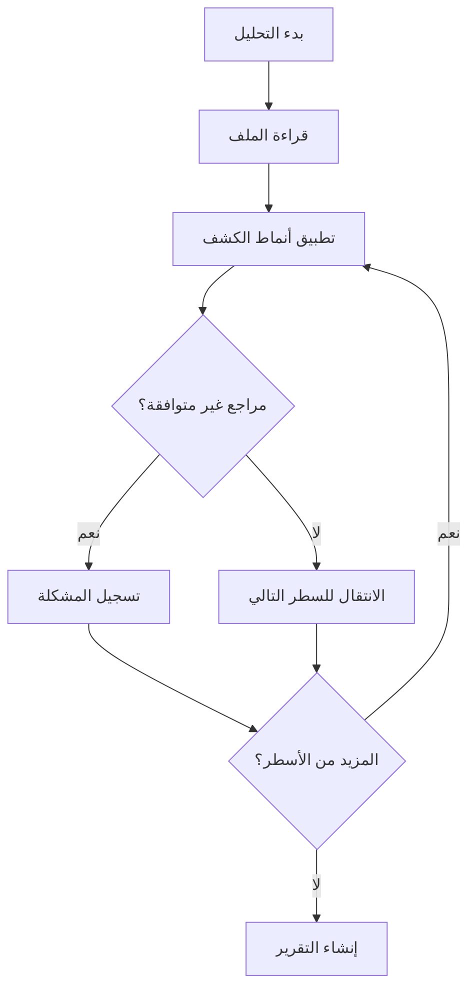
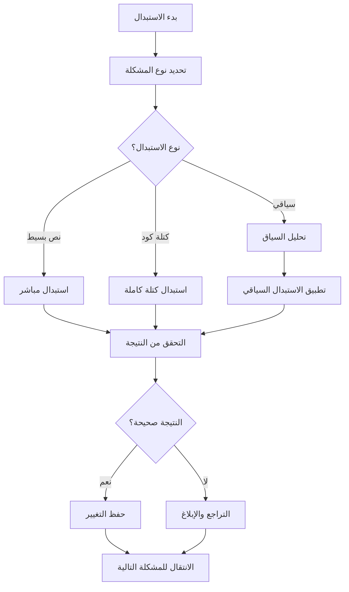

# تصميم نظام تنظيف ملفات التوجيه

**المشروع:** بصير MVP  
**المؤلف:** فريق وكلاء تطوير مشروع بصير  
**التاريخ:** 16 ديسمبر 2025  
**الحالة:** مسودة التصميم

---

## نظرة عامة

يهدف هذا التصميم إلى إنشاء نظام شامل لتنظيف ملفات التوجيه من التقنيات غير المتوافقة مع مكدس Flutter/Dart، مع ضمان التماسك والوضوح في جميع الإرشادات.

---

## معمارية النظام

### المكونات الأساسية

#### 1. محلل التوافق (Compatibility Analyzer)

- **الغرض**: فحص الملفات للبحث عن مراجع غير متوافقة
- **المدخلات**: ملفات التوجيه (.md)
- **المخرجات**: تقرير التوافق مع قائمة المشاكل

#### 2. محرك الاستبدال (Replacement Engine)

- **الغرض**: استبدال المراجع غير المتوافقة بالبدائل المناسبة
- **المدخلات**: ملف + قواعد الاستبدال
- **المخرجات**: ملف محدث

#### 3. مدقق الجودة (Quality Validator)

- **الغرض**: التحقق من جودة التحديثات
- **المدخلات**: ملفات محدثة
- **المخرجات**: تقرير الجودة

---

## نماذج البيانات

### نموذج التقنية غير المتوافقة

```dart
class IncompatibleTechnology {
  final String name;
  final TechnologyType type;
  final String reason;
  final String? replacement;
  final List<String> patterns;

  const IncompatibleTechnology({
    required this.name,
    required this.type,
    required this.reason,
    this.replacement,
    required this.patterns,
  });
}

enum TechnologyType {
  webFramework,    // React, Vue, Angular
  runtime,         // Node.js, Python
  buildTool,       // webpack, npm
  language,        // TypeScript, JavaScript
  infrastructure,  // Docker, Kubernetes
}
```

### نموذج قاعدة الاستبدال

```dart
class ReplacementRule {
  final String pattern;
  final String replacement;
  final RuleType type;
  final bool preserveContext;

  const ReplacementRule({
    required this.pattern,
    required this.replacement,
    required this.type,
    this.preserveContext = true,
  });
}

enum RuleType {
  exactMatch,      // استبدال دقيق
  regexMatch,      // استبدال بالتعبيرات النمطية
  contextual,      // استبدال حسب السياق
  codeBlock,       // استبدال كتل الكود
}
```

### نموذج تقرير التنظيف

```dart
class CleanupReport {
  final String filePath;
  final List<DetectedIssue> issues;
  final List<AppliedFix> fixes;
  final CleanupStatus status;
  final DateTime timestamp;

  const CleanupReport({
    required this.filePath,
    required this.issues,
    required this.fixes,
    required this.status,
    required this.timestamp,
  });
}

enum CleanupStatus { clean, needsReview, hasErrors, completed }
```

---

## واجهات النظام

### واجهة محلل التوافق

```dart
abstract class CompatibilityAnalyzer {
  Future<AnalysisResult> analyzeFile(String filePath);
  Future<List<DetectedIssue>> detectIncompatibilities(String content);
  Future<CompatibilityScore> calculateScore(String content);
}
```

### واجهة محرك الاستبدال

```dart
abstract class ReplacementEngine {
  Future<String> applyReplacements(String content, List<ReplacementRule> rules);
  Future<bool> validateReplacement(String original, String replaced);
  Future<List<AppliedFix>> getAppliedFixes();
}
```

### واجهة مدقق الجودة

```dart
abstract class QualityValidator {
  Future<QualityReport> validateContent(String content);
  Future<bool> checkFlutterCompliance(String content);
  Future<List<QualityIssue>> findQualityIssues(String content);
}
```

---

## خوارزميات التنظيف

### خوارزمية الكشف



### خوارزمية الاستبدال



---

## قواعد الاستبدال

### استبدال التقنيات الأساسية

```dart
final Map<String, ReplacementRule> coreReplacements = {
  'nodejs': ReplacementRule(
    pattern: r'Node\.js|nodejs|npm|yarn',
    replacement: 'Flutter SDK',
    type: RuleType.regexMatch,
  ),

  'typescript': ReplacementRule(
    pattern: r'TypeScript|\.ts|\.tsx',
    replacement: 'Dart',
    type: RuleType.regexMatch,
  ),

  'react': ReplacementRule(
    pattern: r'React|Vue|Angular',
    replacement: 'Flutter',
    type: RuleType.regexMatch,
  ),

  'docker': ReplacementRule(
    pattern: r'Docker|Kubernetes|containerization',
    replacement: 'Local development',
    type: RuleType.contextual,
  ),
};
```

### استبدال كتل الكود

````dart
final Map<String, String> codeBlockReplacements = {
  'typescript-interface': '''
```dart
class ExampleClass {
  final String property;

  const ExampleClass({required this.property});
}
''',

  'npm-commands': '''
```bash
# Flutter commands
flutter pub get
flutter analyze
flutter test
````

''',

'docker-setup': '''

```bash
# Flutter development setup
flutter doctor
flutter create my_app
cd my_app
flutter run
```

''',
};

````

---

## معالجة الأخطاء

### استراتيجية التعامل مع الأخطاء

```dart
class CleanupErrorHandler {
  Future<void> handleError(CleanupError error) async {
    switch (error.type) {
      case ErrorType.fileNotFound:
        await _logError('File not found: ${error.filePath}');
        break;

      case ErrorType.invalidReplacement:
        await _revertChanges(error.filePath);
        await _logError('Invalid replacement in: ${error.filePath}');
        break;

      case ErrorType.syntaxError:
        await _createBackup(error.filePath);
        await _requestManualReview(error.filePath);
        break;

      case ErrorType.permissionDenied:
        await _requestPermissions(error.filePath);
        break;
    }
  }
}
````

---

## اختبار النظام

### استراتيجية الاختبار

#### اختبارات الوحدة

- اختبار محلل التوافق مع ملفات تجريبية
- اختبار محرك الاستبدال مع أنماط مختلفة
- اختبار مدقق الجودة مع محتوى متنوع

#### اختبارات التكامل

- اختبار العملية الكاملة من التحليل إلى التنظيف
- اختبار التعامل مع ملفات حقيقية
- اختبار استعادة النسخ الاحتياطية

#### اختبارات الأداء

- قياس سرعة معالجة الملفات الكبيرة
- اختبار استهلاك الذاكرة
- قياس دقة الكشف والاستبدال

---

## الأمان والموثوقية

### النسخ الاحتياطية

```dart
class BackupManager {
  Future<String> createBackup(String filePath) async {
    final timestamp = DateTime.now().millisecondsSinceEpoch;
    final backupPath = '$filePath.backup.$timestamp';

    await File(filePath).copy(backupPath);
    return backupPath;
  }

  Future<void> restoreBackup(String originalPath, String backupPath) async {
    await File(backupPath).copy(originalPath);
  }
}
```

### التحقق من التكامل

```dart
class IntegrityChecker {
  Future<bool> verifyFileIntegrity(String filePath) async {
    // التحقق من صحة بناء الجملة
    final syntaxValid = await _checkSyntax(filePath);

    // التحقق من اكتمال المحتوى
    final contentComplete = await _checkCompleteness(filePath);

    // التحقق من التوافق مع Flutter
    final flutterCompatible = await _checkFlutterCompatibility(filePath);

    return syntaxValid && contentComplete && flutterCompatible;
  }
}
```

---

## مراقبة الأداء

### مؤشرات الأداء الرئيسية

```dart
class PerformanceMetrics {
  final int filesProcessed;
  final int issuesDetected;
  final int issuesFixed;
  final Duration processingTime;
  final double accuracyRate;

  const PerformanceMetrics({
    required this.filesProcessed,
    required this.issuesDetected,
    required this.issuesFixed,
    required this.processingTime,
    required this.accuracyRate,
  });

  double get successRate => issuesFixed / issuesDetected;
  double get efficiency => filesProcessed / processingTime.inSeconds;
}
```

---

## التوثيق والتقارير

### تقرير التنظيف الشامل

```dart
class ComprehensiveCleanupReport {
  final DateTime startTime;
  final DateTime endTime;
  final List<FileCleanupResult> results;
  final PerformanceMetrics metrics;
  final List<String> recommendations;

  String generateMarkdownReport() {
    return '''
# تقرير التنظيف الشامل

## الملخص
- الملفات المعالجة: ${metrics.filesProcessed}
- المشاكل المكتشفة: ${metrics.issuesDetected}
- المشاكل المحلولة: ${metrics.issuesFixed}
- معدل النجاح: ${(metrics.successRate * 100).toStringAsFixed(1)}%

## التفاصيل
${_generateDetailedResults()}

## التوصيات
${_generateRecommendations()}
''';
  }
}
```

---

## الخلاصة

يوفر هذا التصميم إطار عمل شامل لتنظيف ملفات التوجيه من التقنيات غير المتوافقة، مع ضمان الجودة والموثوقية والأداء. النظام قابل للتوسع ويمكن تطبيقه على أي مشروع يحتاج لتوحيد مكدس التقنيات المستخدمة.
