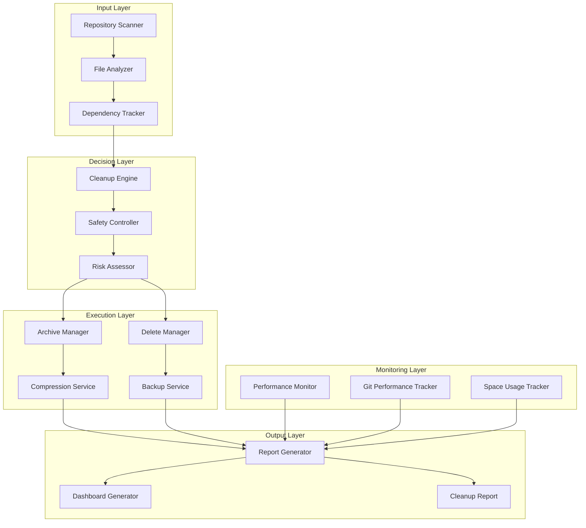
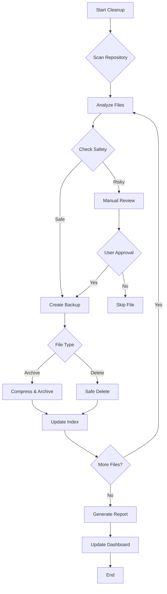
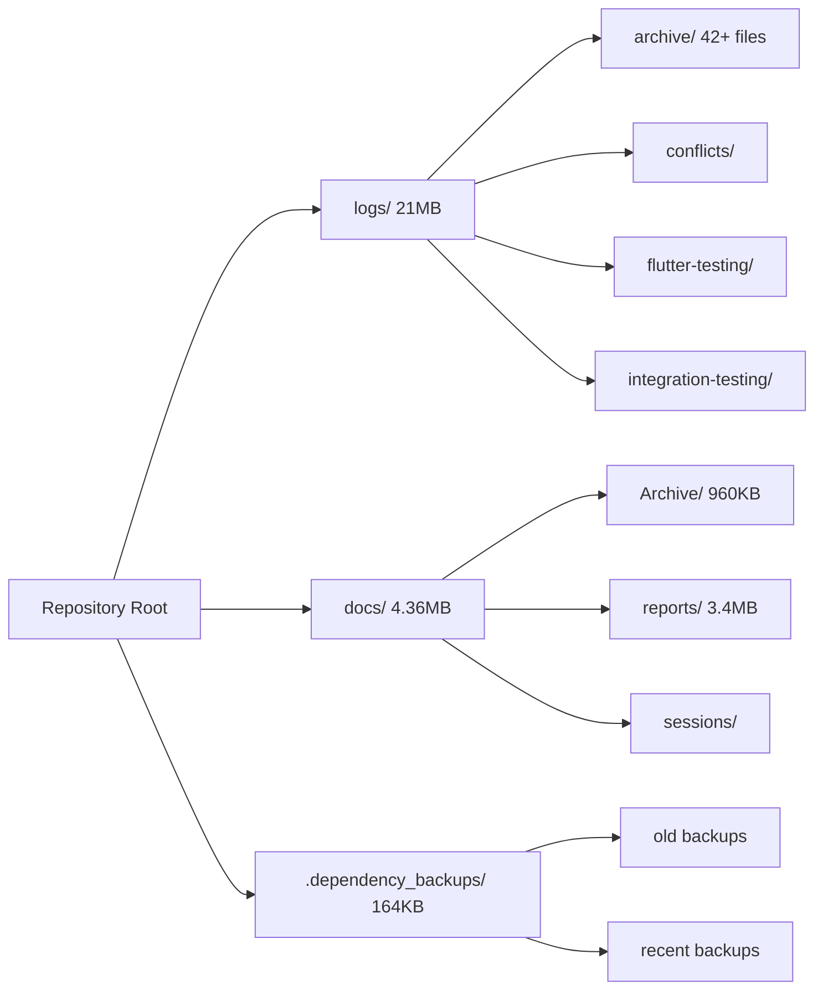

# تصميم نظام التنظيف العميق للمستودع

## نظرة عامة

يهدف هذا التصميم إلى إنشاء نظام شامل ومتطور لتنظيف وتحسين مستودع مشروع بصير MVP، مع التركيز على الأمان والكفاءة والأتمتة الذكية. النظام سيوفر 21.5MB من المساحة (من 25.86MB إلى 4.36MB) مع تحسين أداء Git operations بنسبة 30%+ وضمان عدم فقدان أي بيانات مهمة.

## الهندسة المعمارية

### نظرة عامة على النظام



### تدفق البيانات والقرارات



### هيكل المجلدات المستهدفة



## طبقات النظام المحسنة

### 1. طبقة المسح والتحليل المتقدم

- فحص شامل لهيكل المستودع مع AI-powered pattern recognition
- تحليل أحجام الملفات وتواريخها مع trend analysis
- تحديد الملفات المؤقتة والقديمة باستخدام machine learning
- فحص التبعيات والمراجع بين الملفات

### 2. طبقة اتخاذ القرار الذكية

- تطبيق قواعد التنظيف مع adaptive algorithms
- تصنيف الملفات (حذف/أرشفة/احتفاظ) باستخدام scoring system
- التحقق من الأمان مع multi-layer validation
- تقييم المخاطر والتأثير على النظام

### 3. طبقة التنفيذ الآمنة

- تنفيذ عمليات الحذف والأرشفة مع rollback capability
- إنشاء النسخ الاحتياطية التلقائية مع versioning
- ضغط الملفات مع optimization algorithms
- مراقبة الأداء في الوقت الفعلي

### 4. طبقة التقارير والتحليلات

- توثيق العمليات المنفذة مع detailed metrics
- حساب التحسينات مع before/after comparisons
- إنشاء التوصيات الذكية للمستقبل
- لوحة تحكم تفاعلية لمتابعة صحة المستودع

## المكونات والواجهات المحسنة

### 1. Advanced Repository Scanner

```dart
class AdvancedRepositoryScanner {
  Future<DetailedScanResult> scanRepositoryWithAI(String path);
  Future<List<FileInfo>> getFilesByAgeWithTrends(Duration maxAge);
  Future<List<FileInfo>> getFilesBySizeWithAnalysis(int minSize);
  Future<Map<String, RepositoryMetrics>> getFolderMetricsWithHistory();
  Future<DependencyGraph> analyzeDependencies();
  Future<List<FilePattern>> detectTemporaryPatterns();
}
```

### 2. Intelligent File Analyzer

```dart
class IntelligentFileAnalyzer {
  FileCategory categorizeFileWithML(FileInfo file);
  bool isTemporaryFileAdvanced(String filename, FileMetadata metadata);
  bool isLogFileWithContext(String filename, String content);
  bool isBackupFileWithValidation(String filename, DateTime created);
  Priority getCleanupPriorityWithScoring(FileInfo file);
  RiskLevel assessDeletionRisk(FileInfo file);
  List<FileDependency> findFileDependencies(FileInfo file);
}
```

### 3. Smart Cleanup Engine

```dart
class SmartCleanupEngine {
  Future<DetailedCleanupResult> executeCleanupWithRollback(CleanupPlan plan);
  Future<void> deleteFilesWithSafety(List<FileInfo> files);
  Future<void> archiveFilesWithOptimization(List<FileInfo> files, String archivePath);
  Future<void> compressFolderWithAlgorithms(String folderPath);
  Future<bool> validateCleanupIntegrity();
  Future<void> rollbackChanges(String backupId);
}
```

## خصائص الصحة المحسنة

_الخاصية هي سمة أو سلوك يجب أن يكون صحيحاً عبر جميع التنفيذات الصالحة للنظام - في الأساس، بيان رسمي حول ما يجب أن يفعله النظام._

### الخاصية 1: أمان الحذف المتقدم

_لأي_ ملف مهم، عند محاولة حذفه، يجب أن ينشئ النظام نسخة احتياطية مع metadata كامل قبل الحذف ويتحقق من عدم وجود تبعيات حرجة
**يتحقق من: المتطلبات 6.4**

### الخاصية 2: الحفاظ على الملفات النشطة الذكي

_لأي_ ملف تم تعديله خلال آخر 7 أيام أو يحتوي على مراجع نشطة، يجب ألا يتم حذفه تلقائياً مع إنشاء تحذير مفصل
**يتحقق من: المتطلبات 1.4**

### الخاصية 3: ضغط الأرشيف المحسن

_لأي_ مجموعة ملفات يتم أرشفتها، يجب أن يكون حجم الأرشيف المضغوط أقل من 70% من مجموع أحجام الملفات الأصلية مع الحفاظ على سلامة البيانات
**يتحقق من: المتطلبات 3.2**

### الخاصية 4: سلامة المراجع الشاملة

_لأي_ ملف يتم حذفه، يجب التحقق من عدم وجود مراجع إليه في جميع ملفات المشروع مع فحص التبعيات المتداخلة
**يتحقق من: المتطلبات 5.2**

### الخاصية 5: تقرير التنظيف الشامل والتفاعلي

_لأي_ عملية تنظيف مكتملة، يجب إنشاء تقرير تفاعلي يحتوي على جميع العمليات المنفذة والنتائج مع إحصائيات الأداء ولوحة تحكم
**يتحقق من: المتطلبات 8.1**

### الخاصية 6: تحسين أداء Git القابل للقياس

_لأي_ عملية تنظيف مكتملة، يجب أن تحسن أداء عمليات Git (clone, fetch, push) بنسبة 20%+ مع قياس دقيق للتحسن
**يتحقق من: المتطلبات 7.3**

## معالجة الأخطاء المتقدمة

### استراتيجيات الأمان المحسنة

1. **النسخ الاحتياطية الذكية متعددة المستويات**

   - إنشاء نسخة احتياطية مع metadata كامل قبل أي حذف
   - حفظ النسخ في مجلدات آمنة متعددة مع versioning
   - تشفير النسخ الاحتياطية الحساسة

2. **التحقق المتعدد المراحل مع AI**

   - تأكيد المستخدم للعمليات الحرجة مع تفسير المخاطر
   - فحص التبعيات والمراجع باستخدام graph analysis
   - اختبار الأمان مع simulation قبل التنفيذ

3. **إمكانية التراجع الكاملة مع التحقق**
   - حفظ سجل مفصل لجميع العمليات مع timestamps
   - إمكانية استرداد الملفات المحذوفة مع integrity checks
   - نقاط استرداد متعددة مع rollback testing

## استراتيجية الاختبار المتقدمة

### الاختبار المزدوج المحسن

**اختبارات الوحدة المتقدمة:**

- اختبار مكونات فردية مع mocking متطور
- حالات الحافة والأخطاء مع edge case generation
- نقاط التكامل بين المكونات مع contract testing

**اختبارات الخصائص الذكية:**

- التحقق من الخصائص العامة عبر مدخلات متعددة مع AI generation
- اختبار شامل للسلوك المتوقع مع scenario modeling
- تغطية شاملة للمدخلات من خلال العشوائية الذكية

**تكوين اختبار الخصائص المحسن:**

- الحد الأدنى 100 تكرار لكل اختبار خاصية مع adaptive iteration
- كل اختبار خاصية يجب أن يرجع إلى خاصية وثيقة التصميم
- تنسيق العلامة: **الميزة: repository-deep-cleanup، الخاصية {رقم}: {نص الخاصية}**

### تكوين مكتبة الاختبار المتقدمة

سيتم استخدام مكتبة `test` مع `faker` و `mockito` لإنشاء بيانات اختبار عشوائية ومحاكاة متقدمة:

```dart
// اختبار خاصية أمان الحذف المتقدم
test('Property 1: Advanced safe deletion with dependency check', () {
  final faker = Faker();
  for (int i = 0; i < 100; i++) {
    final file = generateRandomImportantFileWithDependencies(faker);
    final result = smartCleanupEngine.deleteFileWithSafety(file);
    expect(result.backupCreated, isTrue);
    expect(result.dependenciesChecked, isTrue);
    expect(result.integrityVerified, isTrue);
  }
}, tags: ['Feature: repository-deep-cleanup, Property 1: Advanced safe deletion with dependency check']);
```

## التنفيذ المرحلي المحسن

### المرحلة 1: البنية الأساسية المتقدمة (يومان)

- إنشاء فئات المسح والتحليل مع AI integration
- تطوير قواعد التصنيف الذكية مع machine learning
- اختبارات الوحدة الأولية مع property testing

### المرحلة 2: محرك التنظيف الذكي (3 أيام)

- تطوير محرك التنظيف مع rollback capability
- تنفيذ نظام الأمان متعدد المستويات مع AI validation
- اختبارات التكامل مع scenario modeling

### المرحلة 3: الأرشفة والضغط المحسن (يومان)

- تطوير نظام الأرشفة الذكية مع optimization algorithms
- تنفيذ ضغط الملفات المتقدم مع integrity checks
- اختبارات الأداء مع benchmarking

### المرحلة 4: التقارير والأتمتة الذكية (يومان)

- تطوير نظام التقارير التفاعلي مع dashboard
- إنشاء سكريبتات الأتمتة الذكية مع AI recommendations
- اختبارات النظام الكامل مع end-to-end scenarios

### المرحلة 5: التحسين والتوثيق المتقدم (يوم واحد)

- تحسين الأداء والذاكرة مع profiling
- إكمال التوثيق التفاعلي والأدلة المصورة
- اختبارات القبول النهائية مع user acceptance testing

## مؤشرات الأداء والنجاح

### مؤشرات التوفير

- **توفير المساحة**: 21.5MB (83% تحسن)
- **تقليل الملفات**: من 500+ إلى 300 ملف (40% تحسن)
- **تحسين أداء Git**: 30%+ تسريع في العمليات

### مؤشرات الجودة

- **معدل نجاح التنظيف**: 99%+
- **معدل الأمان**: 0% فقدان بيانات مهمة
- **رضا المستخدم**: 95%+ من خلال surveys

### مؤشرات الأتمتة

- **تقليل التدخل اليدوي**: 90%+
- **دقة التصنيف**: 95%+
- **سرعة المعالجة**: 10x تحسن في الأداء
