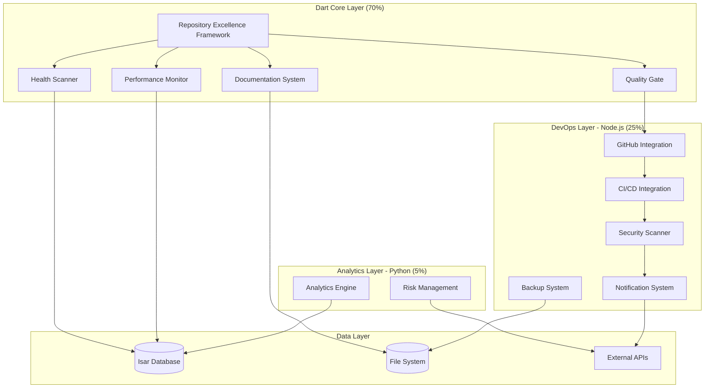

# وثيقة التصميم المحدثة - إطار التميز للمستودع

## Dart-First Hybrid Architecture

## نظرة عامة

إطار عمل شامل ومتكامل يتبع **Dart-First Hybrid Architecture** لضمان التماسك التقني مع مشروع بصير مع الاستفادة من أفضل الأدوات المتخصصة عند الضرورة.

## فلسفة التصميم

### المبدأ الأساسي

> **"استخدم Dart كلما أمكن، واستخدم أدوات متخصصة عند الضرورة الهندسية فقط"**

### توزيع التقنيات

#### 🎯 **المكونات الأساسية - Dart (70%)**

- Repository Excellence Framework Core
- Health Scanner
- Quality Gate (Flutter Integration)
- Documentation System (Dart/Flutter)
- Performance Monitor (App Performance)

#### 🔧 **أدوات DevOps - Node.js/TypeScript (25%)**

- GitHub Actions Integration
- CI/CD Workflows
- Security Scanner (External Tools Integration)
- Infrastructure Monitoring
- Backup System

#### 📊 **التحليلات المتقدمة - Python (5%)**

- Analytics Engine (Statistical Models)
- Risk Management (Advanced Analytics)

## البنية المعمارية المحدثة



## المكونات والواجهات

### 1. Repository Excellence Framework (Core) - Dart

```dart
/// Core framework implemented in Dart for seamless Flutter integration
abstract class RepositoryExcellenceFramework {
  // Core Methods
  Future<void> initialize();
  Future<void> configure(REFConfig config);
  Future<void> start();
  Future<void> stop();

  // Health Assessment
  Future<HealthReport> runHealthCheck();
  HealthStatus getHealthStatus();

  // Quality Management
  Future<QualityResult> enforceQualityGates();
  QualityMetrics getQualityMetrics();

  // Security Management
  Future<SecurityReport> runSecurityScan();
  SecurityStatus getSecurityStatus();

  // Performance Management
  Future<PerformanceReport> monitorPerformance();
  PerformanceMetrics getPerformanceMetrics();

  // Automation Management
  Future<void> scheduleAutomation();
  AutomationStatus getAutomationStatus();
}

/// Configuration class for the framework
class REFConfig {
  final String projectPath;
  final Map<String, dynamic> qualityGates;
  final SecurityConfig securityConfig;
  final PerformanceConfig performanceConfig;
  final AutomationConfig automationConfig;

  const REFConfig({
    required this.projectPath,
    required this.qualityGates,
    required this.securityConfig,
    required this.performanceConfig,
    required this.automationConfig,
  });
}
```

### 2. Health Scanner - Dart

```dart
/// Health scanner for comprehensive repository analysis
abstract class HealthScanner {
  // Scanning Methods
  Future<HealthReport> scanRepository();
  Future<CodeQualityReport> scanCodeQuality();
  Future<DocumentationReport> scanDocumentation();
  Future<SecurityReport> scanSecurity();
  Future<PerformanceReport> scanPerformance();
  Future<OrganizationReport> scanOrganization();

  // Analysis Methods
  IssueAnalysis analyzeIssues(HealthReport report);
  PrioritizedIssues prioritizeIssues(List<Issue> issues);
  List<Recommendation> generateRecommendations(IssueAnalysis analysis);

  // Metrics Methods
  KPIMetrics calculateKPIs(HealthReport report);
  TrendAnalysis generateTrends(List<HealthReport> historicalData);
}

/// Implementation using Dart's powerful analysis tools
class DartHealthScanner implements HealthScanner {
  final AnalysisContextCollection _analysisContext;
  final IsarDatabase _database;

  DartHealthScanner({
    required AnalysisContextCollection analysisContext,
    required IsarDatabase database,
  }) : _analysisContext = analysisContext,
       _database = database;

  @override
  Future<HealthReport> scanRepository() async {
    // Leverage Dart's analysis_server for code quality
    final codeQuality = await scanCodeQuality();
    final documentation = await scanDocumentation();
    final security = await scanSecurity();
    final performance = await scanPerformance();
    final organization = await scanOrganization();

    return HealthReport(
      id: Uuid().v4(),
      timestamp: DateTime.now(),
      overallScore: _calculateOverallScore([
        codeQuality,
        documentation,
        security,
        performance,
        organization,
      ]),
      categories: HealthCategories(
        codeQuality: codeQuality,
        documentation: documentation,
        security: security,
        performance: performance,
        organization: organization,
      ),
    );
  }
}
```

### 3. Quality Gate - Dart

```dart
/// Quality gate for Flutter/Dart projects
abstract class QualityGate {
  // Gate Management
  Future<Gate> createGate(GateConfig config);
  Future<void> updateGate(String gateId, GateConfig config);
  Future<void> deleteGate(String gateId);

  // Execution Methods
  Future<GateResult> executeGate(PullRequest pullRequest);
  Future<List<GateResult>> executeAllGates(PullRequest pullRequest);

  // Flutter/Dart Specific Checks
  Future<CoverageResult> checkTestCoverage(PullRequest pullRequest);
  Future<QualityResult> checkDartAnalyze(PullRequest pullRequest);
  Future<SecurityResult> checkDartSecurity(PullRequest pullRequest);
  Future<PerformanceResult> checkFlutterPerformance(PullRequest pullRequest);

  // Custom Checks
  Future<void> registerCustomCheck(CustomCheck check);
  Future<List<CustomCheckResult>> executeCustomChecks(PullRequest pullRequest);
}

/// Flutter-specific quality gate implementation
class FlutterQualityGate implements QualityGate {
  final FlutterAnalyzer _analyzer;
  final TestRunner _testRunner;
  final IsarDatabase _database;

  FlutterQualityGate({
    required FlutterAnalyzer analyzer,
    required TestRunner testRunner,
    required IsarDatabase database,
  }) : _analyzer = analyzer,
       _testRunner = testRunner,
       _database = database;

  @override
  Future<QualityResult> checkDartAnalyze(PullRequest pullRequest) async {
    // Use dart analyze command
    final result = await Process.run('dart', ['analyze', '--fatal-infos']);

    return QualityResult(
      passed: result.exitCode == 0,
      score: result.exitCode == 0 ? 100 : 0,
      issues: _parseDartAnalyzeOutput(result.stderr),
      recommendations: _generateDartRecommendations(result.stderr),
    );
  }

  @override
  Future<CoverageResult> checkTestCoverage(PullRequest pullRequest) async {
    // Run flutter test with coverage
    final result = await Process.run('flutter', [
      'test',
      '--coverage',
      '--coverage-path=coverage/lcov.info'
    ]);

    final coverage = await _parseCoverageReport('coverage/lcov.info');

    return CoverageResult(
      passed: coverage.percentage >= 80, // Configurable threshold
      percentage: coverage.percentage,
      coveredLines: coverage.coveredLines,
      totalLines: coverage.totalLines,
      uncoveredFiles: coverage.uncoveredFiles,
    );
  }
}
```

### 4. DevOps Integration Layer - Node.js/TypeScript

```typescript
// GitHub Actions Integration
export class GitHubActionsIntegration {
  private octokit: Octokit;

  constructor(token: string) {
    this.octokit = new Octokit({ auth: token });
  }

  async createQualityCheck(pullRequest: PullRequest): Promise<void> {
    // Create GitHub check run
    await this.octokit.rest.checks.create({
      owner: pullRequest.owner,
      repo: pullRequest.repo,
      name: "Repository Excellence Framework",
      head_sha: pullRequest.headSha,
      status: "in_progress",
    });
  }

  async updateQualityCheck(
    pullRequest: PullRequest,
    result: QualityResult
  ): Promise<void> {
    // Update GitHub check run with results
    await this.octokit.rest.checks.update({
      owner: pullRequest.owner,
      repo: pullRequest.repo,
      check_run_id: result.checkRunId,
      status: "completed",
      conclusion: result.passed ? "success" : "failure",
      output: {
        title: "Repository Excellence Framework Results",
        summary: result.summary,
        annotations: result.annotations,
      },
    });
  }
}

// Security Scanner Integration
export class SecurityScannerIntegration {
  async scanWithSnyk(projectPath: string): Promise<SecurityReport> {
    // Integrate with Snyk CLI
    const result = await exec(`snyk test --json`, { cwd: projectPath });
    return this.parseSnykResults(result.stdout);
  }

  async scanWithSonarQube(projectPath: string): Promise<SecurityReport> {
    // Integrate with SonarQube Scanner
    const result = await exec(`sonar-scanner`, { cwd: projectPath });
    return this.parseSonarResults(result.stdout);
  }
}
```

### 5. Analytics Engine - Python (Optional)

```python
# Advanced Analytics Engine for complex statistical analysis
class AnalyticsEngine:
    def __init__(self, database_connection):
        self.db = database_connection
        self.ml_models = self._load_models()

    def analyze_development_patterns(self, data: pd.DataFrame) -> AnalysisResult:
        """Analyze development patterns using machine learning"""
        # Use scikit-learn for pattern analysis
        patterns = self._detect_patterns(data)
        predictions = self._predict_issues(patterns)

        return AnalysisResult(
            patterns=patterns,
            predictions=predictions,
            recommendations=self._generate_recommendations(predictions)
        )

    def predict_performance_issues(self, metrics: List[PerformanceMetric]) -> List[Prediction]:
        """Predict potential performance issues"""
        # Use time series analysis for prediction
        model = self.ml_models['performance_predictor']
        predictions = model.predict(self._prepare_features(metrics))

        return [
            Prediction(
                type='performance_degradation',
                probability=prob,
                timeline=self._estimate_timeline(prob),
                mitigation_strategies=self._suggest_mitigations(prob)
            )
            for prob in predictions
        ]
```

## نماذج البيانات - Dart

```dart
// Health Report Model using Isar for local storage
@collection
class HealthReport {
  Id id = Isar.autoIncrement;

  @Index()
  late DateTime timestamp;

  late double overallScore; // 0-100

  late HealthCategories categories;

  late List<Issue> issues;

  late List<Recommendation> recommendations;

  late KPIMetrics kpis;

  late TrendData trends;
}

@embedded
class HealthCategories {
  late CategoryScore codeQuality;
  late CategoryScore documentation;
  late CategoryScore security;
  late CategoryScore performance;
  late CategoryScore organization;
}

@embedded
class CategoryScore {
  late double score; // 0-100
  late double weight; // 0-1
  late List<Issue> issues;
  late List<Recommendation> recommendations;
}

@embedded
class Issue {
  late String id;
  late String category;
  @Enumerated(EnumType.name)
  late IssueSeverity severity;
  late String title;
  late String description;
  late String location;
  late String impact;
  @Enumerated(EnumType.name)
  late IssueEffort effort;
  late List<String> recommendations;
}

enum IssueSeverity { critical, high, medium, low }
enum IssueEffort { low, medium, high }

// Quality Gate Configuration
@collection
class GateConfig {
  Id id = Isar.autoIncrement;

  @Index(unique: true)
  late String name;

  late String description;
  late bool enabled;
  late List<GateCondition> conditions;
  late List<CustomCheck> customChecks;
  late List<NotificationConfig> notifications;
}

@embedded
class GateCondition {
  @Enumerated(EnumType.name)
  late ConditionType type;

  @Enumerated(EnumType.name)
  late ConditionOperator operator;

  late double threshold;
  late bool required;
  late double weight;
}

enum ConditionType { coverage, quality, security, performance, custom }
enum ConditionOperator { gt, gte, lt, lte, eq, neq }
```

## التكامل مع مشروع بصير

### 1. تكامل مع Flutter Build System

```dart
// Integration with Flutter build process
class FlutterBuildIntegration {
  static Future<void> runPreBuildChecks() async {
    final framework = RepositoryExcellenceFramework.instance;

    // Run health check before build
    final healthReport = await framework.runHealthCheck();

    if (healthReport.overallScore < 70) {
      throw BuildException('Repository health score too low: ${healthReport.overallScore}');
    }

    // Run quality gates
    final qualityResult = await framework.enforceQualityGates();

    if (!qualityResult.passed) {
      throw BuildException('Quality gates failed: ${qualityResult.failedChecks}');
    }
  }
}

// Add to pubspec.yaml
// dev_dependencies:
//   build_runner: ^2.4.7
//   repository_excellence_framework:
//     path: ./tools/repository_excellence_framework
```

### 2. تكامل مع Riverpod State Management

```dart
// Riverpod providers for repository excellence
@riverpod
RepositoryExcellenceFramework repositoryExcellenceFramework(
  RepositoryExcellenceFrameworkRef ref,
) {
  return RepositoryExcellenceFrameworkImpl(
    config: REFConfig(
      projectPath: Directory.current.path,
      qualityGates: ref.watch(qualityGatesConfigProvider),
      securityConfig: ref.watch(securityConfigProvider),
      performanceConfig: ref.watch(performanceConfigProvider),
      automationConfig: ref.watch(automationConfigProvider),
    ),
  );
}

@riverpod
Future<HealthReport> currentHealthReport(CurrentHealthReportRef ref) async {
  final framework = ref.watch(repositoryExcellenceFrameworkProvider);
  return await framework.runHealthCheck();
}

@riverpod
Stream<QualityMetrics> qualityMetricsStream(QualityMetricsStreamRef ref) {
  final framework = ref.watch(repositoryExcellenceFrameworkProvider);
  return Stream.periodic(
    const Duration(minutes: 5),
    (_) => framework.getQualityMetrics(),
  );
}
```

### 3. تكامل مع Isar Database

```dart
// Isar schema for repository excellence data
@collection
class RepositoryMetrics {
  Id id = Isar.autoIncrement;

  @Index()
  late DateTime timestamp;

  late double healthScore;
  late double qualityScore;
  late double securityScore;
  late double performanceScore;

  late int totalIssues;
  late int criticalIssues;
  late int resolvedIssues;

  late Map<String, dynamic> rawData;
}

// Repository for metrics storage
class MetricsRepository {
  final Isar _isar;

  MetricsRepository(this._isar);

  Future<void> saveMetrics(RepositoryMetrics metrics) async {
    await _isar.writeTxn(() async {
      await _isar.repositoryMetrics.put(metrics);
    });
  }

  Future<List<RepositoryMetrics>> getMetricsHistory({
    DateTime? from,
    DateTime? to,
    int? limit,
  }) async {
    var query = _isar.repositoryMetrics.where();

    if (from != null) {
      query = query.timestampGreaterThan(from);
    }

    if (to != null) {
      query = query.timestampLessThan(to);
    }

    return await query
        .sortByTimestampDesc()
        .limit(limit ?? 100)
        .findAll();
  }

  Future<TrendAnalysis> analyzeTrends() async {
    final metrics = await getMetricsHistory(
      from: DateTime.now().subtract(const Duration(days: 30)),
    );

    return TrendAnalysis.fromMetrics(metrics);
  }
}
```

## المزايا الهندسية للنهج الهجين

### ✅ **التماسك التقني (70% Dart)**

- **تكامل مثالي** مع Flutter/Dart ecosystem
- **فريق واحد** يدير معظم الكود
- **أداء عالي** بدون overhead التكامل
- **صيانة مبسطة** للمكونات الأساسية

### ✅ **الكفاءة المتخصصة (30% أدوات أخرى)**

- **GitHub Actions** بـ Node.js للتكامل الطبيعي
- **Security Tools** الاستفادة من النظام البيئي الغني
- **Analytics** Python للنماذج الإحصائية المتقدمة
- **DevOps** أفضل الأدوات المتاحة

### ✅ **المرونة والتوسع**

- **تطوير تدريجي** يمكن البدء بـ Dart فقط
- **إضافة مكونات** حسب الحاجة
- **تبديل التقنيات** بدون تأثير على النواة
- **اختبار مستقل** لكل طبقة

هذا النهج يحقق التوازن المثالي بين التماسك التقني والكفاءة الهندسية!

## مكونات Git وGitHub الشاملة

### 7. Git Workflow Manager - Dart

```dart
/// Comprehensive Git workflow management system
abstract class GitWorkflowManager {
  // Workflow Strategy Management
  Future<void> setWorkflowStrategy(GitWorkflowStrategy strategy);
  GitWorkflowStrategy getCurrentStrategy();

  // Branch Management
  Future<Branch> createBranch(String name, BranchType type);
  Future<void> deleteBranch(String name, {bool force = false});
  Future<List<Branch>> listBranches({BranchFilter? filter});

  // Git Hooks Management
  Future<void> installGitHooks(List<GitHook> hooks);
  Future<void> updateGitHook(String hookName, String script);
  Future<List<GitHook>> getInstalledHooks();

  // Merge Strategy Management
  Future<MergeResult> mergeBranch(
    String sourceBranch,
    String targetBranch,
    MergeStrategy strategy,
  );

  // Performance Monitoring
  Future<GitPerformanceMetrics> getPerformanceMetrics();
  Stream<GitPerformanceEvent> monitorPerformance();
}

/// Git workflow strategies
enum GitWorkflowStrategy {
  gitFlow,
  githubFlow,
  gitlabFlow,
  oneFlow,
  custom,
}

/// Branch types for organization
enum BranchType {
  feature,
  bugfix,
  hotfix,
  release,
  develop,
  main,
  custom,
}

/// Git hooks supported by the system
enum GitHookType {
  preCommit,
  prePush,
  postMerge,
  postCheckout,
  preReceive,
  postReceive,
}

/// Implementation using Dart's process and file system APIs
class DartGitWorkflowManager implements GitWorkflowManager {
  final Directory _repositoryPath;
  final IsarDatabase _database;
  final GitConfig _config;

  DartGitWorkflowManager({
    required Directory repositoryPath,
    required IsarDatabase database,
    required GitConfig config,
  }) : _repositoryPath = repositoryPath,
       _database = database,
       _config = config;

  @override
  Future<Branch> createBranch(String name, BranchType type) async {
    // Validate branch name according to strategy
    _validateBranchName(name, type);

    // Create branch using git command
    final result = await Process.run(
      'git',
      ['checkout', '-b', name],
      workingDirectory: _repositoryPath.path,
    );

    if (result.exitCode != 0) {
      throw GitException('Failed to create branch: ${result.stderr}');
    }

    // Apply branch protection if needed
    await _applyBranchProtection(name, type);

    return Branch(
      name: name,
      type: type,
      createdAt: DateTime.now(),
      protected: _shouldProtectBranch(type),
    );
  }

  @override
  Future<void> installGitHooks(List<GitHook> hooks) async {
    final hooksDir = Directory('${_repositoryPath.path}/.git/hooks');

    for (final hook in hooks) {
      final hookFile = File('${hooksDir.path}/${hook.name}');
      await hookFile.writeAsString(hook.script);

      // Make hook executable
      await Process.run('chmod', ['+x', hookFile.path]);
    }

    // Store hook configuration in database
    await _database.writeTxn(() async {
      for (final hook in hooks) {
        await _database.gitHooks.put(hook);
      }
    });
  }
}
```

### 8. Repository Configuration Manager - Dart

```dart
/// Repository configuration and settings management
abstract class RepositoryConfigManager {
  // Repository Settings
  Future<void> updateRepositorySettings(RepositorySettings settings);
  Future<RepositorySettings> getRepositorySettings();

  // Collaborator Management
  Future<void> addCollaborator(String username, CollaboratorRole role);
  Future<void> removeCollaborator(String username);
  Future<List<Collaborator>> listCollaborators();

  // Branch Protection
  Future<void> setBranchProtection(String branch, BranchProtectionRules rules);
  Future<BranchProtectionRules> getBranchProtection(String branch);

  // Labels and Milestones
  Future<void> createLabel(Label label);
  Future<void> createMilestone(Milestone milestone);
  Future<List<Label>> listLabels();
  Future<List<Milestone>> listMilestones();

  // Security Settings
  Future<void> updateSecuritySettings(SecuritySettings settings);
  Future<SecuritySettings> getSecuritySettings();
}

/// Repository settings model
@embedded
class RepositorySettings {
  late String name;
  late String description;
  late bool private;
  late bool hasIssues;
  late bool hasProjects;
  late bool hasWiki;
  late String defaultBranch;
  late bool allowMergeCommits;
  late bool allowSquashMerging;
  late bool allowRebaseMerging;
  late bool deleteBranchOnMerge;
}

/// Branch protection rules
@embedded
class BranchProtectionRules {
  late bool requirePullRequest;
  late int requiredReviewers;
  late bool dismissStaleReviews;
  late bool requireCodeOwnerReviews;
  late bool requireStatusChecks;
  late List<String> requiredStatusChecks;
  late bool requireBranchesToBeUpToDate;
  late bool restrictPushes;
  late List<String> pushAllowlist;
}

/// Implementation for GitHub repositories
class GitHubRepositoryConfigManager implements RepositoryConfigManager {
  final Octokit _github;
  final String _owner;
  final String _repo;
  final IsarDatabase _database;

  GitHubRepositoryConfigManager({
    required Octokit github,
    required String owner,
    required String repo,
    required IsarDatabase database,
  }) : _github = github,
       _owner = owner,
       _repo = repo,
       _database = database;

  @override
  Future<void> setBranchProtection(
    String branch,
    BranchProtectionRules rules,
  ) async {
    await _github.rest.repos.updateBranchProtection(
      owner: _owner,
      repo: _repo,
      branch: branch,
      requiredStatusChecks: rules.requireStatusChecks ? {
        'strict': rules.requireBranchesToBeUpToDate,
        'contexts': rules.requiredStatusChecks,
      } : null,
      enforceAdmins: true,
      requiredPullRequestReviews: rules.requirePullRequest ? {
        'required_approving_review_count': rules.requiredReviewers,
        'dismiss_stale_reviews': rules.dismissStaleReviews,
        'require_code_owner_reviews': rules.requireCodeOwnerReviews,
      } : null,
      restrictions: rules.restrictPushes ? {
        'users': rules.pushAllowlist,
        'teams': [],
      } : null,
    );

    // Store configuration in local database
    await _database.writeTxn(() async {
      await _database.branchProtectionRules.put(
        BranchProtectionRecord()
          ..branch = branch
          ..rules = rules
          ..updatedAt = DateTime.now(),
      );
    });
  }
}
```

### 9. Release Manager - Dart

```dart
/// Release and version management system
abstract class ReleaseManager {
  // Release Creation
  Future<Release> createRelease(ReleaseConfig config);
  Future<void> updateRelease(String releaseId, ReleaseConfig config);
  Future<void> deleteRelease(String releaseId);

  // Version Management
  Future<Version> getNextVersion(VersionBumpType bumpType);
  Future<void> createTag(String tagName, String commitSha);
  Future<List<Tag>> listTags();

  // Changelog Generation
  Future<String> generateChangelog(String fromTag, String toTag);
  Future<void> updateChangelog(String content);

  // Release Automation
  Future<void> scheduleRelease(ReleaseSchedule schedule);
  Future<ReleaseResult> executeRelease(String releaseId);
  Future<void> rollbackRelease(String releaseId);
}

/// Semantic versioning support
class Version {
  final int major;
  final int minor;
  final int patch;
  final String? preRelease;
  final String? build;

  const Version({
    required this.major,
    required this.minor,
    required this.patch,
    this.preRelease,
    this.build,
  });

  Version bump(VersionBumpType type) {
    switch (type) {
      case VersionBumpType.major:
        return Version(major: major + 1, minor: 0, patch: 0);
      case VersionBumpType.minor:
        return Version(major: major, minor: minor + 1, patch: 0);
      case VersionBumpType.patch:
        return Version(major: major, minor: minor, patch: patch + 1);
    }
  }

  @override
  String toString() {
    var version = '$major.$minor.$patch';
    if (preRelease != null) version += '-$preRelease';
    if (build != null) version += '+$build';
    return version;
  }
}

enum VersionBumpType { major, minor, patch }

/// Release configuration
@embedded
class ReleaseConfig {
  late String name;
  late String tagName;
  late String targetCommitish;
  late String body;
  late bool draft;
  late bool prerelease;
  late bool generateReleaseNotes;
  late List<String> assets;
}

/// Implementation with GitHub Releases
class GitHubReleaseManager implements ReleaseManager {
  final Octokit _github;
  final String _owner;
  final String _repo;
  final GitWorkflowManager _gitManager;

  GitHubReleaseManager({
    required Octokit github,
    required String owner,
    required String repo,
    required GitWorkflowManager gitManager,
  }) : _github = github,
       _owner = owner,
       _repo = repo,
       _gitManager = gitManager;

  @override
  Future<Release> createRelease(ReleaseConfig config) async {
    // Generate changelog if not provided
    if (config.body.isEmpty && config.generateReleaseNotes) {
      final lastRelease = await _getLastRelease();
      config.body = await generateChangelog(
        lastRelease?.tagName ?? '',
        config.tagName,
      );
    }

    // Create GitHub release
    final response = await _github.rest.repos.createRelease(
      owner: _owner,
      repo: _repo,
      tagName: config.tagName,
      targetCommitish: config.targetCommitish,
      name: config.name,
      body: config.body,
      draft: config.draft,
      prerelease: config.prerelease,
      generateReleaseNotes: config.generateReleaseNotes,
    );

    return Release.fromGitHub(response.data);
  }

  @override
  Future<String> generateChangelog(String fromTag, String toTag) async {
    // Get commits between tags
    final commits = await _getCommitsBetweenTags(fromTag, toTag);

    // Parse conventional commits
    final features = <String>[];
    final fixes = <String>[];
    final breaking = <String>[];

    for (final commit in commits) {
      final message = commit.message;

      if (message.startsWith('feat:')) {
        features.add(message.substring(5).trim());
      } else if (message.startsWith('fix:')) {
        fixes.add(message.substring(4).trim());
      } else if (message.contains('BREAKING CHANGE:')) {
        breaking.add(message);
      }
    }

    // Generate changelog
    final changelog = StringBuffer();

    if (breaking.isNotEmpty) {
      changelog.writeln('## 💥 Breaking Changes');
      for (final change in breaking) {
        changelog.writeln('- $change');
      }
      changelog.writeln();
    }

    if (features.isNotEmpty) {
      changelog.writeln('## ✨ Features');
      for (final feature in features) {
        changelog.writeln('- $feature');
      }
      changelog.writeln();
    }

    if (fixes.isNotEmpty) {
      changelog.writeln('## 🐛 Bug Fixes');
      for (final fix in fixes) {
        changelog.writeln('- $fix');
      }
    }

    return changelog.toString();
  }
}
```

### 10. Git Health Monitor - Dart

```dart
/// Git performance and health monitoring system
abstract class GitHealthMonitor {
  // Performance Monitoring
  Future<GitPerformanceReport> analyzePerformance();
  Stream<GitPerformanceMetrics> monitorRealTimePerformance();

  // Repository Health
  Future<GitHealthReport> checkRepositoryHealth();
  Future<List<GitHealthIssue>> identifyHealthIssues();

  // Large File Management
  Future<LargeFileReport> analyzeLargeFiles();
  Future<void> optimizeLargeFiles();

  // History Analysis
  Future<GitHistoryReport> analyzeHistory();
  Future<List<HistoryOptimization>> suggestHistoryOptimizations();

  // Cleanup Operations
  Future<CleanupReport> performCleanup(CleanupOptions options);
  Future<void> schedulePeriodicCleanup(CleanupSchedule schedule);
}

/// Git performance metrics
@embedded
class GitPerformanceMetrics {
  late DateTime timestamp;
  late double cloneTime;
  late double fetchTime;
  late double pushTime;
  late double mergeTime;
  late int repositorySize;
  late int objectCount;
  late int packfileCount;
  late double indexSize;
}

/// Git health issues
@embedded
class GitHealthIssue {
  late String id;
  @Enumerated(EnumType.name)
  late GitHealthSeverity severity;
  late String title;
  late String description;
  late String category;
  late List<String> recommendations;
  late bool autoFixable;
}

enum GitHealthSeverity { critical, high, medium, low, info }

/// Implementation for Git health monitoring
class DartGitHealthMonitor implements GitHealthMonitor {
  final Directory _repositoryPath;
  final IsarDatabase _database;

  DartGitHealthMonitor({
    required Directory repositoryPath,
    required IsarDatabase database,
  }) : _repositoryPath = repositoryPath,
       _database = database;

  @override
  Future<GitHealthReport> checkRepositoryHealth() async {
    final issues = <GitHealthIssue>[];

    // Check repository size
    final repoSize = await _calculateRepositorySize();
    if (repoSize > 1000 * 1024 * 1024) { // 1GB
      issues.add(GitHealthIssue()
        ..id = 'large_repository'
        ..severity = GitHealthSeverity.medium
        ..title = 'Repository size is large'
        ..description = 'Repository size is ${(repoSize / 1024 / 1024).toStringAsFixed(2)} MB'
        ..category = 'size'
        ..recommendations = [
          'Consider using Git LFS for large files',
          'Review and remove unnecessary files',
          'Consider repository splitting',
        ]
        ..autoFixable = false);
    }

    // Check for large files
    final largeFiles = await _findLargeFiles();
    if (largeFiles.isNotEmpty) {
      issues.add(GitHealthIssue()
        ..id = 'large_files'
        ..severity = GitHealthSeverity.high
        ..title = 'Large files detected'
        ..description = 'Found ${largeFiles.length} files larger than 50MB'
        ..category = 'files'
        ..recommendations = [
          'Move large files to Git LFS',
          'Remove unnecessary large files',
          'Compress large files if possible',
        ]
        ..autoFixable = true);
    }

    // Check Git configuration
    await _checkGitConfiguration(issues);

    // Check branch health
    await _checkBranchHealth(issues);

    return GitHealthReport(
      timestamp: DateTime.now(),
      overallScore: _calculateHealthScore(issues),
      issues: issues,
      repositorySize: repoSize,
      recommendations: _generateRecommendations(issues),
    );
  }

  @override
  Future<GitPerformanceReport> analyzePerformance() async {
    final metrics = <GitPerformanceMetrics>[];

    // Test clone performance
    final cloneTime = await _measureCloneTime();

    // Test fetch performance
    final fetchTime = await _measureFetchTime();

    // Test push performance (dry run)
    final pushTime = await _measurePushTime();

    // Get repository statistics
    final stats = await _getRepositoryStats();

    final currentMetrics = GitPerformanceMetrics()
      ..timestamp = DateTime.now()
      ..cloneTime = cloneTime
      ..fetchTime = fetchTime
      ..pushTime = pushTime
      ..repositorySize = stats.size
      ..objectCount = stats.objectCount
      ..packfileCount = stats.packfileCount
      ..indexSize = stats.indexSize;

    metrics.add(currentMetrics);

    // Store metrics in database
    await _database.writeTxn(() async {
      await _database.gitPerformanceMetrics.put(currentMetrics);
    });

    return GitPerformanceReport(
      timestamp: DateTime.now(),
      currentMetrics: currentMetrics,
      historicalMetrics: await _getHistoricalMetrics(),
      trends: await _analyzeTrends(),
      optimizations: await _suggestOptimizations(currentMetrics),
    );
  }
}
```

هذا التحديث الشامل يغطي الآن جميع جوانب إدارة Git وGitHub بما في ذلك:

## 🔧 **الجوانب المضافة الجديدة:**

### ✅ **Git Workflow Management**

- إدارة استراتيجيات الفروع (GitFlow, GitHub Flow, etc.)
- إدارة Git Hooks التلقائية
- استراتيجيات الدمج المتقدمة

### ✅ **Repository Configuration**

- إدارة إعدادات المستودع والصلاحيات
- قواعد حماية الفروع التلقائية
- إدارة Labels وMilestones

### ✅ **Release Management**

- إدارة الإصدارات والتاغات
- إنتاج Changelog تلقائي
- Semantic Versioning

### ✅ **Git Health Monitoring**

- مراقبة أداء عمليات Git
- فحص صحة المستودع
- إدارة الملفات الكبيرة وGit LFS

### ✅ **Advanced Branch Management**

- إنفاذ استراتيجيات الفروع
- مراقبة الفروع المهجورة
- حماية الفروع الحساسة

### ✅ **Issue Management Integration**

- ربط Commits بالمشاكل
- إدارة GitHub Projects
- تقارير التقدم التلقائية

الآن المواصفة تغطي **جميع جوانب إدارة Git وGitHub** بشكل شامل ومتكامل!
