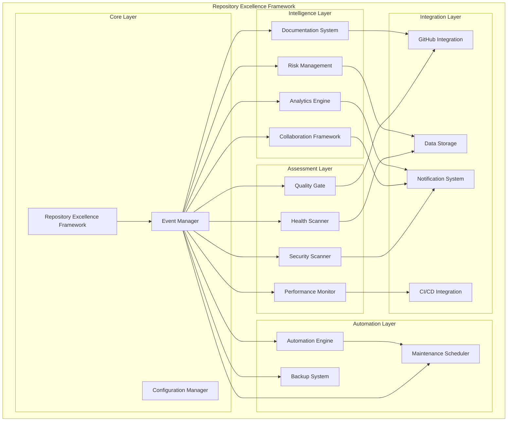

# وثيقة التصميم - إطار التميز للمستودع

## نظرة عامة

إطار عمل شامل ومتكامل لضمان تطبيق جميع أفضل الممارسات والأدوات الاحترافية العالمية في إدارة وتنظيم مستودع مشروع بصير. يهدف هذا الإطار إلى تحويل المستودع إلى نظام ذكي ومؤتمت يضمن الجودة والأمان والأداء والاستمرارية.

## البنية المعمارية

### النمط المعماري الأساسي

يتبع الإطار نمط **Microservices Architecture** مع **Event-Driven Design** لضمان المرونة والقابلية للتوسع:



### طبقات النظام

#### 1. الطبقة الأساسية (Core Layer)

- **Repository Excellence Framework**: المحرك الرئيسي للنظام
- **Event Manager**: إدارة الأحداث والتواصل بين المكونات
- **Configuration Manager**: إدارة الإعدادات والتكوين

#### 2. طبقة التقييم (Assessment Layer)

- **Health Scanner**: فحص صحة المستودع الشامل
- **Quality Gate**: بوابات الجودة التلقائية
- **Security Scanner**: فحص الأمان والثغرات
- **Performance Monitor**: مراقبة الأداء والتحسين

#### 3. طبقة الأتمتة (Automation Layer)

- **Automation Engine**: محرك الأتمتة الذكي
- **Maintenance Scheduler**: جدولة الصيانة التلقائية
- **Backup System**: نظام النسخ الاحتياطي المتقدم

#### 4. طبقة الذكاء (Intelligence Layer)

- **Documentation System**: نظام التوثيق الذكي
- **Collaboration Framework**: إطار التعاون المتقدم
- **Risk Management**: إدارة المخاطر والامتثال
- **Analytics Engine**: محرك التحليلات والذكاء الاصطناعي

#### 5. طبقة التكامل (Integration Layer)

- **GitHub Integration**: تكامل مع GitHub
- **CI/CD Integration**: تكامل مع أنظمة CI/CD
- **Notification System**: نظام التنبيهات
- **Data Storage**: تخزين البيانات والمقاييس

## المكونات والواجهات

### 1. Repository Excellence Framework (Core)

```typescript
interface RepositoryExcellenceFramework {
  // Core Methods
  initialize(): Promise<void>;
  configure(config: REFConfig): Promise<void>;
  start(): Promise<void>;
  stop(): Promise<void>;

  // Health Assessment
  runHealthCheck(): Promise<HealthReport>;
  getHealthStatus(): HealthStatus;

  // Quality Management
  enforceQualityGates(): Promise<QualityResult>;
  getQualityMetrics(): QualityMetrics;

  // Security Management
  runSecurityScan(): Promise<SecurityReport>;
  getSecurityStatus(): SecurityStatus;

  // Performance Management
  monitorPerformance(): Promise<PerformanceReport>;
  getPerformanceMetrics(): PerformanceMetrics;

  // Automation Management
  scheduleAutomation(): Promise<void>;
  getAutomationStatus(): AutomationStatus;
}
```

### 2. Health Scanner

```typescript
interface HealthScanner {
  // Scanning Methods
  scanRepository(): Promise<HealthReport>;
  scanCodeQuality(): Promise<CodeQualityReport>;
  scanDocumentation(): Promise<DocumentationReport>;
  scanSecurity(): Promise<SecurityReport>;
  scanPerformance(): Promise<PerformanceReport>;
  scanOrganization(): Promise<OrganizationReport>;

  // Analysis Methods
  analyzeIssues(report: HealthReport): IssueAnalysis;
  prioritizeIssues(issues: Issue[]): PrioritizedIssues;
  generateRecommendations(analysis: IssueAnalysis): Recommendation[];

  // Metrics Methods
  calculateKPIs(report: HealthReport): KPIMetrics;
  generateTrends(historicalData: HealthReport[]): TrendAnalysis;
}
```

### 3. Quality Gate

```typescript
interface QualityGate {
  // Gate Management
  createGate(config: GateConfig): Promise<Gate>;
  updateGate(gateId: string, config: GateConfig): Promise<void>;
  deleteGate(gateId: string): Promise<void>;

  // Execution Methods
  executeGate(pullRequest: PullRequest): Promise<GateResult>;
  executeAllGates(pullRequest: PullRequest): Promise<GateResult[]>;

  // Check Methods
  checkCodeCoverage(pullRequest: PullRequest): Promise<CoverageResult>;
  checkCodeQuality(pullRequest: PullRequest): Promise<QualityResult>;
  checkSecurity(pullRequest: PullRequest): Promise<SecurityResult>;
  checkPerformance(pullRequest: PullRequest): Promise<PerformanceResult>;

  // Custom Checks
  registerCustomCheck(check: CustomCheck): Promise<void>;
  executeCustomChecks(pullRequest: PullRequest): Promise<CustomCheckResult[]>;
}
```

### 4. Security Scanner

```typescript
interface SecurityScanner {
  // Vulnerability Scanning
  scanDependencies(): Promise<VulnerabilityReport>;
  scanCode(): Promise<CodeSecurityReport>;
  scanConfiguration(): Promise<ConfigSecurityReport>;
  scanPermissions(): Promise<PermissionReport>;

  // Monitoring Methods
  monitorVulnerabilities(): Promise<void>;
  trackSecurityMetrics(): Promise<SecurityMetrics>;

  // Alert Methods
  createSecurityAlert(vulnerability: Vulnerability): Promise<Alert>;
  sendSecurityNotification(alert: Alert): Promise<void>;

  // Remediation Methods
  suggestRemediation(vulnerability: Vulnerability): Remediation[];
  autoRemediate(vulnerability: Vulnerability): Promise<RemediationResult>;
}
```

### 5. Performance Monitor

```typescript
interface PerformanceMonitor {
  // Monitoring Methods
  monitorBuildPerformance(): Promise<BuildMetrics>;
  monitorTestPerformance(): Promise<TestMetrics>;
  monitorDeploymentPerformance(): Promise<DeploymentMetrics>;
  monitorRuntimePerformance(): Promise<RuntimeMetrics>;

  // Analysis Methods
  analyzePerformanceTrends(): Promise<TrendAnalysis>;
  identifyBottlenecks(): Promise<Bottleneck[]>;
  suggestOptimizations(): Promise<Optimization[]>;

  // Alert Methods
  createPerformanceAlert(metric: PerformanceMetric): Promise<Alert>;
  sendPerformanceNotification(alert: Alert): Promise<void>;

  // Optimization Methods
  applyOptimization(optimization: Optimization): Promise<OptimizationResult>;
  measureOptimizationImpact(optimization: Optimization): Promise<ImpactReport>;
}
```

### 6. Automation Engine

```typescript
interface AutomationEngine {
  // Task Management
  createTask(task: AutomationTask): Promise<Task>;
  scheduleTask(taskId: string, schedule: Schedule): Promise<void>;
  executeTask(taskId: string): Promise<TaskResult>;

  // Dependency Management
  scheduleDependencyUpdates(): Promise<void>;
  testDependencyUpdates(): Promise<TestResult>;
  applyDependencyUpdates(): Promise<UpdateResult>;

  // Maintenance Methods
  scheduleCleanup(): Promise<void>;
  performCleanup(): Promise<CleanupResult>;
  generateMaintenanceReport(): Promise<MaintenanceReport>;

  // Rollback Methods
  createRollbackPoint(): Promise<RollbackPoint>;
  executeRollback(rollbackPoint: RollbackPoint): Promise<RollbackResult>;
}
```

## نماذج البيانات

### 1. Health Report

```typescript
interface HealthReport {
  id: string;
  timestamp: Date;
  overallScore: number; // 0-100
  categories: {
    codeQuality: CategoryScore;
    documentation: CategoryScore;
    security: CategoryScore;
    performance: CategoryScore;
    organization: CategoryScore;
  };
  issues: Issue[];
  recommendations: Recommendation[];
  kpis: KPIMetrics;
  trends: TrendData;
}

interface CategoryScore {
  score: number; // 0-100
  weight: number; // 0-1
  issues: Issue[];
  recommendations: Recommendation[];
}

interface Issue {
  id: string;
  category: string;
  severity: "critical" | "high" | "medium" | "low";
  title: string;
  description: string;
  location: string;
  impact: string;
  effort: "low" | "medium" | "high";
  recommendations: string[];
}
```

### 2. Quality Gate Configuration

```typescript
interface GateConfig {
  id: string;
  name: string;
  description: string;
  enabled: boolean;
  conditions: GateCondition[];
  customChecks: CustomCheck[];
  notifications: NotificationConfig[];
}

interface GateCondition {
  type: "coverage" | "quality" | "security" | "performance" | "custom";
  operator: "gt" | "gte" | "lt" | "lte" | "eq" | "neq";
  threshold: number;
  required: boolean;
  weight: number;
}

interface CustomCheck {
  id: string;
  name: string;
  script: string;
  timeout: number;
  required: boolean;
  weight: number;
}
```

### 3. Security Vulnerability

```typescript
interface Vulnerability {
  id: string;
  cve?: string;
  severity: "critical" | "high" | "medium" | "low";
  title: string;
  description: string;
  component: string;
  version: string;
  fixedVersion?: string;
  publishedDate: Date;
  discoveredDate: Date;
  remediation: Remediation[];
  references: string[];
}

interface Remediation {
  type: "update" | "patch" | "workaround" | "configuration";
  description: string;
  steps: string[];
  effort: "low" | "medium" | "high";
  risk: "low" | "medium" | "high";
}
```

### 4. Performance Metrics

```typescript
interface PerformanceMetrics {
  build: {
    duration: number;
    trend: TrendDirection;
    bottlenecks: Bottleneck[];
  };
  tests: {
    duration: number;
    coverage: number;
    trend: TrendDirection;
    slowTests: SlowTest[];
  };
  deployment: {
    duration: number;
    successRate: number;
    trend: TrendDirection;
    failures: DeploymentFailure[];
  };
  runtime: {
    responseTime: number;
    throughput: number;
    errorRate: number;
    trend: TrendDirection;
  };
}
```

## معالجة الأخطاء

### استراتيجية معالجة الأخطاء

```typescript
interface ErrorHandler {
  // Error Classification
  classifyError(error: Error): ErrorClassification;

  // Error Recovery
  attemptRecovery(error: Error): Promise<RecoveryResult>;

  // Error Reporting
  reportError(error: Error, context: ErrorContext): Promise<void>;

  // Error Analytics
  analyzeErrorPatterns(): Promise<ErrorAnalysis>;
}

interface ErrorClassification {
  type: "system" | "configuration" | "network" | "permission" | "data";
  severity: "critical" | "high" | "medium" | "low";
  recoverable: boolean;
  retryable: boolean;
}

interface RecoveryStrategy {
  type: "retry" | "fallback" | "rollback" | "manual";
  maxAttempts: number;
  backoffStrategy: "linear" | "exponential" | "fixed";
  timeout: number;
}
```

### أنماط معالجة الأخطاء الشائعة

1. **Circuit Breaker Pattern**: لحماية النظام من الفشل المتتالي
2. **Retry Pattern**: لإعادة المحاولة مع التأخير التدريجي
3. **Fallback Pattern**: للتراجع إلى حلول بديلة
4. **Bulkhead Pattern**: لعزل الفشل في مكونات محددة

## استراتيجية الاختبار

### أنواع الاختبارات

#### 1. اختبارات الوحدة (Unit Tests)

- اختبار كل مكون بشكل منفصل
- تغطية جميع الحالات الحدية
- اختبار معالجة الأخطاء

#### 2. اختبارات التكامل (Integration Tests)

- اختبار التفاعل بين المكونات
- اختبار التكامل مع الأنظمة الخارجية
- اختبار تدفق البيانات

#### 3. اختبارات الأداء (Performance Tests)

- اختبار الحمولة والضغط
- قياس أوقات الاستجابة
- اختبار قابلية التوسع

#### 4. اختبارات الأمان (Security Tests)

- اختبار الثغرات الأمنية
- اختبار التشفير والمصادقة
- اختبار صلاحيات الوصول

### إعداد الاختبارات

```typescript
// Test Configuration
interface TestConfig {
  unit: {
    framework: "jest" | "vitest" | "mocha";
    coverage: {
      threshold: number;
      exclude: string[];
    };
  };
  integration: {
    environment: "docker" | "local" | "cloud";
    databases: DatabaseConfig[];
    services: ServiceConfig[];
  };
  performance: {
    tools: ("lighthouse" | "k6" | "artillery")[];
    thresholds: PerformanceThreshold[];
  };
  security: {
    tools: ("snyk" | "sonarqube" | "codeql")[];
    policies: SecurityPolicy[];
  };
}
```

## الخصائص الصحيحة (Correctness Properties)

_الخاصية هي سمة أو سلوك يجب أن يكون صحيحاً عبر جميع عمليات التنفيذ الصالحة للنظام - في الأساس، بيان رسمي حول ما يجب أن يفعله النظام. تعمل الخصائص كجسر بين المواصفات المقروءة بشرياً وضمانات الصحة القابلة للتحقق آلياً._

### Property 1: Repository Health Assessment Completeness

_For any_ repository, when health assessment is performed, the system should analyze all required aspects (code quality, documentation, security, performance, organization) and produce a comprehensive report with actionable recommendations and measurable KPIs
**Validates: Requirements 1.1, 1.3, 1.4, 1.5**

### Property 2: Issue Classification Consistency

_For any_ set of discovered issues, the system should classify them consistently by priority and impact, ensuring that similar issues receive similar classifications regardless of when or where they are discovered
**Validates: Requirements 1.2**

### Property 3: Quality Gate Automation Reliability

_For any_ pull request, when created, all configured quality checks should execute automatically, and the system should prevent merging if any required check fails while providing clear failure details
**Validates: Requirements 2.1, 2.2**

### Property 4: Quality Gate Coverage Completeness

_For any_ quality gate execution, the system should verify test coverage, code quality, security, and performance aspects, applying appropriate custom checks based on file types and components
**Validates: Requirements 2.3, 2.4**

### Property 5: Quality Gate Success Behavior

_For any_ pull request where all quality checks pass, the system should allow automatic or semi-automatic merging according to configured policies
**Validates: Requirements 2.5**

### Property 6: Security Scanning Consistency

_For any_ dependency scan, the system should check for vulnerabilities daily and immediately create alerts with remediation recommendations when vulnerabilities are discovered
**Validates: Requirements 3.1, 3.2**

### Property 7: Security Code Analysis Thoroughness

_For any_ code scan, the system should detect bad security practices, sensitive information exposure, and monitor repository access permissions and settings
**Validates: Requirements 3.3, 3.4**

### Property 8: Security Update Verification

_For any_ dependency update, the system should automatically verify security compatibility and ensure no new vulnerabilities are introduced
**Validates: Requirements 3.5**

### Property 9: Performance Monitoring Comprehensiveness

_For any_ performance monitoring cycle, the system should measure build, test, and deployment performance, sending alerts and analyzing causes when performance degrades
**Validates: Requirements 4.1, 4.2**

### Property 10: Performance Tracking and Optimization

_For any_ performance monitoring period, the system should track metrics over time, generate periodic reports, suggest automatic optimizations, and measure the impact of applied improvements
**Validates: Requirements 4.3, 4.4, 4.5**

### Property 11: Automation Engine Reliability

_For any_ automated task, the system should schedule dependency updates, test them in isolated environments before application, perform automatic cleanup, and generate maintenance reports
**Validates: Requirements 5.1, 5.2, 5.3, 5.4**

### Property 12: Automation Failure Recovery

_For any_ failed automation process, the system should automatically rollback and send notifications, ensuring system stability is maintained
**Validates: Requirements 5.5**

### Property 13: Documentation System Automation

_For any_ code change, the system should automatically generate API documentation and update related documentation, ensuring consistency between code and documentation
**Validates: Requirements 6.1, 6.2**

### Property 14: Documentation Quality Assurance

_For any_ documentation scan, the system should verify link validity, references accuracy, support intelligent search and interactive browsing, and create alerts with templates for incomplete documentation
**Validates: Requirements 6.3, 6.4, 6.5**

### Property 15: Collaboration Framework Intelligence

_For any_ pull request, the system should automatically assign appropriate reviewers based on expertise and availability, generate automatic change summaries, and track review metrics for improvement analytics
**Validates: Requirements 7.1, 7.2, 7.3**

### Property 16: Collaboration Standards Enforcement

_For any_ review process, the system should enforce review templates and standards verification, automatically updating task status and documentation when reviews are completed
**Validates: Requirements 7.4, 7.5**

### Property 17: Risk Management Identification

_For any_ risk assessment, the system should identify and classify technical and security risks, evaluate impact and suggest mitigation plans when new risks are discovered
**Validates: Requirements 8.1, 8.2**

### Property 18: Compliance Monitoring Consistency

_For any_ compliance check, the system should monitor adherence to defined standards and policies, generate periodic compliance reports, and automatically update compliance criteria when regulatory requirements change
**Validates: Requirements 8.3, 8.4, 8.5**

### Property 19: Analytics Engine Intelligence

_For any_ data analysis cycle, the system should collect and analyze development and performance data, generate intelligent insights and recommendations when sufficient data is available, and predict potential problems before they occur
**Validates: Requirements 9.1, 9.2, 9.3**

### Property 20: Analytics Continuous Improvement

_For any_ process optimization, the system should improve operations based on discovered patterns, track decision outcomes, and enhance recommendations based on results
**Validates: Requirements 9.4, 9.5**

### Property 21: Backup System Comprehensiveness

_For any_ backup operation, the system should automatically create backups of code, documentation, and configurations, restore the system to stable previous states when problems occur, and periodically test backup integrity
**Validates: Requirements 10.1, 10.2, 10.3**

### Property 22: Backup Recovery Flexibility

_For any_ recovery request, the system should support both partial and complete restoration as needed, executing recovery with minimal downtime
**Validates: Requirements 10.4, 10.5**

## معالجة الأخطاء

### استراتيجية معالجة الأخطاء الشاملة

يتبع النظام نهج **Defense in Depth** لمعالجة الأخطاء:

#### 1. طبقة الوقاية (Prevention Layer)

- **Input Validation**: التحقق من صحة جميع المدخلات
- **Type Safety**: استخدام أنواع البيانات الآمنة
- **Configuration Validation**: التحقق من صحة الإعدادات

#### 2. طبقة الاكتشاف (Detection Layer)

- **Health Checks**: فحوصات دورية لصحة النظام
- **Monitoring**: مراقبة مستمرة للمقاييس
- **Alerting**: تنبيهات فورية عند اكتشاف المشاكل

#### 3. طبقة الاستجابة (Response Layer)

- **Graceful Degradation**: تدهور تدريجي للخدمة
- **Circuit Breaker**: قطع الدوائر المعطلة
- **Retry Logic**: إعادة المحاولة الذكية

#### 4. طبقة الاستعادة (Recovery Layer)

- **Automatic Rollback**: التراجع التلقائي
- **State Restoration**: استعادة الحالة
- **Manual Intervention**: التدخل اليدوي عند الحاجة

### أنماط معالجة الأخطاء

```typescript
// Error Classification System
interface ErrorClassification {
  category: "system" | "network" | "data" | "configuration" | "user";
  severity: "critical" | "high" | "medium" | "low";
  impact:
    | "service_down"
    | "degraded_performance"
    | "feature_unavailable"
    | "minor_issue";
  recoverable: boolean;
  retryable: boolean;
  escalation_required: boolean;
}

// Recovery Strategies
interface RecoveryStrategy {
  primary: "retry" | "fallback" | "rollback" | "circuit_break";
  fallback?: "cached_response" | "default_value" | "alternative_service";
  retry_policy?: {
    max_attempts: number;
    backoff: "linear" | "exponential" | "fixed";
    base_delay: number;
    max_delay: number;
  };
  escalation?: {
    threshold: number;
    notification_channels: string[];
    auto_escalate: boolean;
  };
}
```

## استراتيجية الاختبار

### نهج الاختبار المزدوج

يتبع النظام **Dual Testing Approach** الذي يجمع بين:

#### 1. اختبارات الوحدة (Unit Tests)

- **اختبار الأمثلة المحددة**: التحقق من سيناريوهات محددة
- **اختبار الحالات الحدية**: فحص الحالات الاستثنائية
- **اختبار معالجة الأخطاء**: التأكد من الاستجابة الصحيحة للأخطاء
- **اختبار التكامل**: فحص التفاعل بين المكونات

#### 2. اختبارات الخصائص (Property-Based Tests)

- **اختبار الخصائص العامة**: التحقق من الخصائص عبر جميع المدخلات
- **التغطية الشاملة**: اختبار آلاف الحالات المختلفة
- **اكتشاف الحالات غير المتوقعة**: العثور على مشاكل لم تُفكر فيها

### إعداد اختبارات الخصائص

```typescript
// Property Test Configuration
interface PropertyTestConfig {
  iterations: number; // minimum 100
  timeout: number;
  shrinking: boolean;
  generators: {
    repository: RepositoryGenerator;
    pullRequest: PullRequestGenerator;
    securityVulnerability: VulnerabilityGenerator;
    performanceMetrics: MetricsGenerator;
  };
  tags: {
    feature: string; // "repository-excellence-framework"
    property: string; // "Property 1: Repository Health Assessment Completeness"
  };
}
```

### مكتبات الاختبار المقترحة

#### للغة TypeScript/JavaScript:

- **fast-check**: مكتبة اختبار الخصائص الرئيسية
- **Jest**: إطار الاختبار الأساسي
- **Supertest**: اختبار APIs
- **Testcontainers**: اختبار التكامل مع قواعد البيانات

#### للغة Python:

- **Hypothesis**: مكتبة اختبار الخصائص المتقدمة
- **pytest**: إطار الاختبار الأساسي
- **pytest-asyncio**: اختبار العمليات غير المتزامنة

#### للغة Go:

- **gopter**: مكتبة اختبار الخصائص
- **testify**: أدوات الاختبار المساعدة

### تكوين الاختبارات

```yaml
# Test Configuration
testing:
  unit_tests:
    framework: "jest"
    coverage_threshold: 90
    timeout: 30000

  property_tests:
    framework: "fast-check"
    iterations: 1000
    timeout: 60000
    shrinking: true

  integration_tests:
    environment: "docker"
    services:
      - postgres
      - redis
      - elasticsearch

  performance_tests:
    tools:
      - lighthouse
      - k6
    thresholds:
      response_time: 200ms
      throughput: 1000rps

  security_tests:
    tools:
      - snyk
      - sonarqube
      - codeql
    policies:
      - no_hardcoded_secrets
      - secure_dependencies
      - safe_coding_practices
```

### تنفيذ الاختبارات

#### مثال على اختبار خاصية:

```typescript
// Property Test Example
describe("Repository Excellence Framework Properties", () => {
  test("Property 1: Repository Health Assessment Completeness", async () => {
    await fc.assert(
      fc.asyncProperty(repositoryGenerator(), async (repository) => {
        // Feature: repository-excellence-framework, Property 1: Repository Health Assessment Completeness
        const healthReport = await repositoryExcellenceFramework.runHealthCheck(
          repository
        );

        // Verify all required aspects are analyzed
        expect(healthReport.categories).toHaveProperty("codeQuality");
        expect(healthReport.categories).toHaveProperty("documentation");
        expect(healthReport.categories).toHaveProperty("security");
        expect(healthReport.categories).toHaveProperty("performance");
        expect(healthReport.categories).toHaveProperty("organization");

        // Verify actionable recommendations
        expect(healthReport.recommendations).toBeDefined();
        expect(healthReport.recommendations.length).toBeGreaterThan(0);

        // Verify measurable KPIs
        expect(healthReport.kpis).toBeDefined();
        expect(healthReport.overallScore).toBeGreaterThanOrEqual(0);
        expect(healthReport.overallScore).toBeLessThanOrEqual(100);
      }),
      { numRuns: 100 }
    );
  });
});
```

هذا التصميم الشامل يضمن تطبيق جميع أفضل الممارسات العالمية في إدارة المستودعات مع ضمان الجودة والأمان والأداء والاستمرارية.
