# Workspace Transformation Design

**المشروع:** بصير MVP  
**المؤلف:** فريق وكلاء تطوير مشروع بصير  
**التاريخ:** 15 ديسمبر 2025  
**الحالة:** 🎯 جاهز للتنفيذ

---

## Overview

تصميم شامل لتحويل بيئة العمل في مشروع بصير إلى نظام متقدم ومتكامل يدعم التطوير الحديث والأتمتة الذكية.

## Architecture

### System Components

```mermaid
graph TD
    A[Workspace Core] --> B[Critical Fixes]
    A --> C[MCP Integration]
    A --> D[AI Providers]
    A --> E[Technology Coverage]
    A --> F[Hooks System]
    A --> G[EARS Methodology]

    B --> B1[Isar Test Fixes]
    B --> B2[Environment Stability]

    C --> C1[Multiple Servers]
    C --> C2[API Management]
    C --> C3[Validation System]

    D --> D1[OpenAI Support]
    D --> D2[Anthropic Support]
    D --> D3[Bedrock Support]
    D --> D4[Ollama Support]

    E --> E1[Microservices Patterns]
    E --> E2[Security Patterns]
    E --> E3[Performance Guides]

    F --> F1[Smart Hooks]
    F --> F2[ML Enhancement]
    F --> F3[Automation Tools]

    G --> G1[Templates]
    G --> G2[Validation Tools]
    G --> G3[Compliance Checking]
```



## Components and Interfaces

### 1. Critical Issues Resolution System

#### Isar Test Infrastructure

```dart
// Enhanced test helper for Isar
class IsarTestHelper {
  static Future<Isar> createTestIsar() async {
    await Isar.initializeIsarCore(download: true);
    return Isar.open(
      [CustomerModelSchema, InvoiceModelSchema, InvoiceItemModelSchema],
      directory: '',
      name: 'test_${DateTime.now().millisecondsSinceEpoch}',
    );
  }

  static Future<void> cleanupTestIsar(Isar isar) async {
    await isar.close(deleteFromDisk: true);
  }
}
```

#### Test Environment Configuration

```yaml
# test/test_config.yaml
test_environment:
  isar:
    auto_download: true
    cleanup_after_test: true
    unique_names: true
  coverage:
    target: 70
    exclude_patterns:
      - "**/*.g.dart"
      - "**/*.freezed.dart"
```

### 2. MCP Integration Enhancement

#### Server Configuration Management

```json
{
  "mcpServers": {
    "aws-docs": {
      "command": "uvx",
      "args": ["awslabs.aws-documentation-mcp-server@latest"],
      "env": {
        "FASTMCP_LOG_LEVEL": "ERROR"
      },
      "disabled": false,
      "autoApprove": ["search_documentation", "get_service_info"]
    },
    "context7": {
      "command": "uvx",
      "args": ["context7-mcp-server@latest"],
      "env": {
        "FASTMCP_LOG_LEVEL": "ERROR"
      },
      "disabled": false,
      "autoApprove": ["check_compatibility", "validate_dependencies"]
    }
  }
}
```

#### Validation System

```typescript
interface MCPValidationResult {
  server: string;
  status: "connected" | "disconnected" | "error";
  capabilities: string[];
  lastCheck: Date;
  errorDetails?: string;
}

class MCPValidator {
  async validateAllServers(): Promise<MCPValidationResult[]> {
    // Implementation for comprehensive MCP validation
  }
}
```

### 3. Multi-Provider AI Support

#### Provider Architecture

```
.kiro/prompts/providers/
├── openai/
│   ├── chat-completion.md
│   ├── code-generation.md
│   └── analysis.md
├── anthropic/
│   ├── claude-prompts.md
│   ├── reasoning.md
│   └── code-review.md
├── bedrock/
│   ├── titan-prompts.md
│   ├── claude-bedrock.md
│   └── llama-prompts.md
└── ollama/
    ├── local-models.md
    ├── code-assistance.md
    └── documentation.md
```

#### Provider Adapter Interface

```typescript
interface AIProvider {
  name: string;
  capabilities: string[];
  contextLimit: number;

  generatePrompt(task: string, context: any): string;
  optimizeForProvider(prompt: string): string;
  handleResponse(response: any): ProcessedResponse;
}

class ProviderManager {
  private providers: Map<string, AIProvider> = new Map();

  registerProvider(provider: AIProvider): void;
  getOptimalProvider(task: string): AIProvider;
  switchProvider(newProvider: string): void;
}
```

### 4. Technology Coverage System

#### Coverage Matrix

```yaml
technology_coverage:
  backend:
    - microservices_patterns
    - api_design_patterns
    - database_optimization
    - caching_strategies

  frontend:
    - flutter_advanced_patterns
    - state_management_best_practices
    - ui_performance_optimization
    - accessibility_guidelines

  security:
    - zero_trust_architecture
    - encryption_best_practices
    - vulnerability_assessment
    - secure_coding_patterns

  performance:
    - profiling_techniques
    - optimization_strategies
    - monitoring_solutions
    - scalability_patterns
```

#### Dynamic Documentation System

```dart
class TechnologyGuideGenerator {
  Future<void> generateGuide(String technology) async {
    final template = await loadTemplate(technology);
    final content = await enrichWithBestPractices(template);
    final examples = await generateCodeExamples(technology);

    await saveGuide(technology, content, examples);
  }
}
```

### 5. Intelligent Hooks System

#### Hook Classification System

```
.kiro/hooks/
├── automatic/           # Auto-triggered hooks
│   ├── on-save/
│   ├── on-commit/
│   └── on-build/
├── manual/             # User-triggered hooks
│   ├── quality-check/
│   ├── documentation/
│   └── deployment/
├── smart/              # ML-enhanced hooks
│   ├── predictive/
│   ├── adaptive/
│   └── learning/
└── integration/        # External service hooks
    ├── github/
    ├── ci-cd/
    └── monitoring/
```

#### Smart Hook Engine

```typescript
interface SmartHook {
  id: string;
  trigger: HookTrigger;
  conditions: HookCondition[];
  actions: HookAction[];
  learningEnabled: boolean;

  execute(context: HookContext): Promise<HookResult>;
  learn(feedback: HookFeedback): void;
  adapt(patterns: UsagePattern[]): void;
}

class HookOrchestrator {
  private hooks: Map<string, SmartHook> = new Map();
  private mlEngine: MachineLearningEngine;

  async executeHooks(trigger: HookTrigger, context: HookContext): Promise<void>;
  learnFromExecution(results: HookResult[]): void;
  optimizeHookPerformance(): void;
}
```

## Data Models

### Configuration Models

```typescript
interface WorkspaceConfig {
  version: string;
  features: {
    mcpIntegration: boolean;
    multiProviderAI: boolean;
    smartHooks: boolean;
    earsMethodology: boolean;
  };
  providers: AIProviderConfig[];
  hooks: HookConfig[];
  quality: QualityConfig;
}

interface QualityConfig {
  testCoverage: {
    target: number;
    excludePatterns: string[];
  };
  codeQuality: {
    linting: boolean;
    formatting: boolean;
    analysis: boolean;
  };
  documentation: {
    coverage: number;
    autoGeneration: boolean;
  };
}
```

## Error Handling

### Comprehensive Error Management

```typescript
class WorkspaceErrorHandler {
  handleIsarError(error: IsarError): Recovery {
    // Specific handling for Isar-related issues
  }

  handleMCPError(error: MCPError): Recovery {
    // MCP connection and validation error handling
  }

  handleProviderError(error: ProviderError): Recovery {
    // AI provider switching and fallback logic
  }

  handleHookError(error: HookError): Recovery {
    // Hook execution error handling and recovery
  }
}

enum RecoveryStrategy {
  RETRY = "retry",
  FALLBACK = "fallback",
  SKIP = "skip",
  MANUAL_INTERVENTION = "manual",
}
```

## Testing Strategy

### Comprehensive Testing Approach

#### Unit Testing

- **Isar Repository Tests**: Complete coverage of all repository operations
- **MCP Integration Tests**: Validation of all MCP server connections
- **Provider Tests**: Testing of all AI provider adapters
- **Hook Tests**: Validation of hook execution and learning

#### Integration Testing

- **End-to-End Workflows**: Complete development workflow testing
- **Cross-Provider Testing**: AI provider switching and consistency
- **Hook Orchestration**: Complex hook interaction testing
- **Quality Gate Testing**: Comprehensive quality assurance validation

#### Property-Based Testing

- **Configuration Validation**: Testing all possible configuration combinations
- **Provider Consistency**: Ensuring consistent behavior across providers
- **Hook Reliability**: Testing hook execution under various conditions
- **Error Recovery**: Testing error handling and recovery mechanisms

### Test Infrastructure

```dart
class WorkspaceTestSuite {
  static Future<void> setupTestEnvironment() async {
    await IsarTestHelper.initializeTestDatabase();
    await MCPTestHelper.setupMockServers();
    await ProviderTestHelper.initializeMockProviders();
    await HookTestHelper.setupTestHooks();
  }

  static Future<void> runComprehensiveTests() async {
    await runUnitTests();
    await runIntegrationTests();
    await runPropertyBasedTests();
    await validateQualityMetrics();
  }
}
```

## Performance Considerations

### Optimization Strategies

- **Lazy Loading**: Load components only when needed
- **Caching**: Intelligent caching of frequently used data
- **Parallel Processing**: Concurrent execution of independent tasks
- **Resource Management**: Efficient memory and CPU usage

### Monitoring and Metrics

```typescript
interface PerformanceMetrics {
  testExecutionTime: number;
  mcpResponseTime: number;
  providerSwitchTime: number;
  hookExecutionTime: number;
  memoryUsage: number;
  cpuUsage: number;
}

class PerformanceMonitor {
  collectMetrics(): PerformanceMetrics;
  analyzePerformance(): PerformanceAnalysis;
  optimizeBasedOnMetrics(): OptimizationPlan;
}
```

## Security Considerations

### Security Framework

- **Secure Configuration**: Encrypted storage of sensitive configuration
- **Access Control**: Role-based access to different components
- **Audit Logging**: Comprehensive logging of all system activities
- **Vulnerability Scanning**: Regular security assessments

### Implementation

```typescript
class SecurityManager {
  encryptConfiguration(config: WorkspaceConfig): EncryptedConfig;
  validateAccess(user: User, resource: Resource): boolean;
  auditActivity(activity: Activity): void;
  scanForVulnerabilities(): SecurityReport;
}
```

## Deployment Strategy

### Phased Rollout

1. **Phase 1**: Critical fixes and basic MCP integration
2. **Phase 2**: Multi-provider AI support and enhanced hooks
3. **Phase 3**: Advanced features and optimization
4. **Phase 4**: Full integration and quality assurance

### Rollback Plan

- **Configuration Backup**: Automatic backup before changes
- **Version Control**: Git-based rollback capabilities
- **Feature Flags**: Ability to disable features quickly
- **Health Checks**: Continuous monitoring for issues

---

## Implementation Timeline

### Day 1: Foundation (2-3 hours)

- ✅ Isar test fixes (30-60 minutes)
- ✅ Basic MCP integration (60 minutes)
- ✅ Initial AI provider support (90 minutes)

### Day 2: Enhancement (Full day)

- ✅ Technology coverage expansion (3 hours)
- ✅ Hooks system improvement (3 hours)
- ✅ EARS methodology implementation (2 hours)

### Day 3: Integration & Quality (Half day)

- ✅ Comprehensive testing (2 hours)
- ✅ Quality assurance validation (1 hour)
- ✅ Documentation and reporting (1 hour)

---

**Next Steps:** Proceed to tasks.md for detailed implementation plan.
