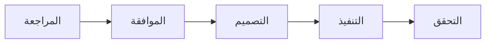

# الملخص التنفيذي: تنظيف مجلد Steering

**التاريخ:** 7 ديسمبر 2025  
**الحالة:** 🔄 في انتظار الموافقة

---

## المشكلة

مجلد `.kiro/steering` يعاني من **اكتظاظ وعشوائية**:

```
المشاكل المكتشفة:
├── 🔴 نسخة احتياطية كاملة (220KB)
├── 🟡 مجلد guides/ فارغ
├── 🟡 ملفات في أماكن خاطئة
└── 🟠 تكرار ملفات
```

---

## الحل المقترح

### الحذف 🗑️

- steering.backup/ (220KB)
- التكرارات من archive/

### النقل 📦

- 3 أدلة → guides/
- 2 ملف → reference/

### التحديث 📝

- config.json
- README.md
- CHANGELOG.md

---

## الفوائد

| المقياس       |    قبل |   بعد | التحسين  |
| :------------ | -----: | ----: | :------: |
| **المساحة**   |  470KB | 250KB | **-47%** |
| **الملفات**   |     47 |    42 |    -5    |
| **البنية**    | فوضوية | منظمة |    ✅    |
| **التكرارات** |      3 |     0 |    ✅    |

---

## الخطة



**المدة المتوقعة:** 2-3 ساعات

---

## القرار المطلوب

**هل توافق على المتطلبات المقترحة؟**

- ✅ نعم - المتابعة للتصميم والتنفيذ
- 🔄 تعديلات - اقتراح تغييرات
- ❌ لا - إلغاء الـ spec

---

**للتفاصيل الكاملة:** راجع requirements.md و ANALYSIS.md

**تم إعداده بواسطة:** فريق وكلاء تطوير مشروع بصير
