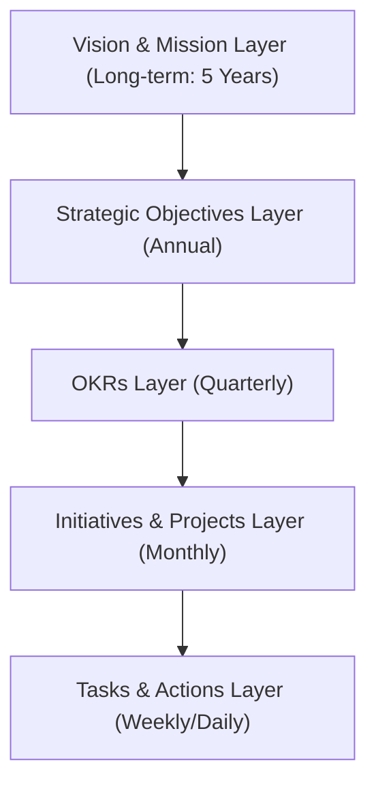

# Strategic Vision and Execution: Architectural Design

**Project:** Basir Accounting System  
**Date:** December 26, 2025  
**Author:** Basir Project Agentic Development Team  
**Version:** 1.1  
**Status:** ✅ Active - Includes Regional Expansion Components

---

## Overview

This document defines the strategic architectural design for the execution of the Basir Project's long-term vision. It encompasses the strategic framework, core components, data models, and the phased implementation roadmap.

### Objective

Transform abstract strategic requirements into an actionable, measurable, and trackable design.

### Approach

- Utilize the **OKR (Objectives and Key Results)** framework for goal definition.
- Establish a **Strategic Dashboard** for real-time progress tracking.
- Implement **Agile Methodology** for iterative execution.
- Conduct systematic reviews (Weekly, Monthly, Quarterly).

---

## Strategic Architecture

### 1. Strategic Layers



### 2. Core Strategic Components

#### Component 1: Market Intelligence System

**Purpose**: Continuous collection and analysis of market and competitor data.

- **Market Size Tracker**: Tracks TAM, SAM, and SOM metrics.
- **Competitor Monitor**: Monitors competitor shifts and functional updates.
- **Opportunity Scanner**: Detects emerging market voids and niches.
- **Trend Analyzer**: Analyzes regional and global financial tech trends.

**Data Requirements**:

- Market volume and valuation.
- Competitor profiles (SWOT).
- Identified market gaps.
- Priority opportunities.

**Update Cycle**: Quarterly.

#### Component 2: Customer Segmentation Engine

**Purpose**: Identification and behavioral tracking of target customer segments.

- **Segment Profiler**: Defines segment-specific profiles.
- **Persona Builder**: Develops high-fidelity customer personas.
- **Targeting Strategy**: Formulates tailored acquisition strategies.
- **Penetration Tracker**: Monitors the penetration rate of each segment.

**Data Requirements**:

- Segment volume and growth.
- Pain points and core requirements.
- Willingness-to-Pay (WTP) indices.
- Preferred acquisition channels.

**Update Cycle**: Monthly.

#### Component 3: Business Model Simulator

**Purpose**: Simulation and optimization of business and pricing models.

- **Pricing Calculator**: Computes optimal value-based pricing.
- **Revenue Forecaster**: Projects future recurring revenue.
- **Unit Economics Analyzer**: Analyzes LTV, CAC, and efficiency ratios.
- **Sensitivity Tester**: Tests the impact of assumption shifts.

**Data Requirements**:

- Tier-based pricing structures.
- Conversion rate benchmarks.
- Churn and retention rates.
- LTV and CAC metrics.

**Update Cycle**: Monthly.

#### Component 4: Growth Engine

**Purpose**: Orchestration and monitoring of growth strategies.

- **Channel Manager**: Manages acquisition channels (organic/paid).
- **Campaign Tracker**: Monitors marketing campaign performance.
- **Funnel Optimizer**: Optimizes conversion across the user journey.
- **Viral Loop Builder**: Designs and monitors referral and viral loops.

**Data Requirements**:

- New user acquisition metrics.
- Channel-specific CAC.
- Month-over-Month (MoM) growth rates.
- Referral and viral coefficients.

**Update Cycle**: Weekly.

#### Component 5: Product Roadmap Manager

**Purpose**: Lifecycle management of the product roadmap and features.

- **Feature Prioritizer**: Ranks features based on strategic value (RICE).
- **Release Planner**: Schedules development and deployment cycles.
- **Success Metrics Tracker**: Tracks post-launch feature performance.
- **Feedback Aggregator**: Synthesizes multi-channel user feedback.

**Data Requirements**:

- Strategic feature backlog.
- Priority and dependency mapping.
- Targeted release timelines.
- Feature adoption and utilization rates.

**Update Cycle**: Weekly.

#### Component 6: Financial Dashboard

**Purpose**: Tracking financial health, sustainability, and runway.

- **Revenue Tracker**: Monitors MRR and ARR growth.
- **Expense Monitor**: Tracks burn rate and operational costs.
- **Burn Rate Calculator**: Computes average monthly net cash outflow.
- **Runway Projector**: Forecasts survival duration based on cash reserves.

**Data Requirements**:

- Revenue by tier and region.
- Monthly operational expenditures.
- Current cash balance.
- Financial projections.

**Update Cycle**: Daily.

#### Component 7: Team & Resource Planner

**Purpose**: Strategic planning of human capital and organizational resources.

- **Hiring Pipeline**: Manages recruitment stages and throughput.
- **Skills Matrix**: Maps internal vs. required technical skills.
- **Capacity Planner**: Forecasts development and operational capacity.
- **Performance Tracker**: Tracks team performance against KPIs.

**Data Requirements**:

- Current organizational headcount.
- Targeted roles and job descriptions.
- Skills gaps and training requirements.
- Role-specific KPIs.

**Update Cycle**: Monthly.

#### Component 8: Metrics & KPI Dashboard

**Purpose**: Centralized visualization of all primary strategic benchmarks.

- **North Star Tracker**: Tracks the primary value metric.
- **OKR Monitor**: Real-time monitoring of objectives progress.
- **Health Indicators**: Tracks technical and operational vitality.
- **Alert System**: Automated notification for deviations.

**Data Requirements**:

- Primary value metric (e.g., Invoices generated).
- Active OKR progress scores.
- Critical system and business KPIs.
- Targets vs. Actuals.

**Update Cycle**: Daily.

#### Component 9: Risk Management System

**Purpose**: Systematic identification and mitigation of strategic risks.

- **Risk Identifier**: Detects market, financial, and technical risks.
- **Impact Assessor**: Evaluates probability and severity.
- **Mitigation Planner**: Formulates response and contingency plans.
- **Risk Monitor**: Tracks risk status and mitigation efficacy.

**Data Requirements**:

- Strategic risk register.
- Likelihood and Impact matrices.
- Mitigation and contingency logs.
- Current risk status.

**Update Cycle**: Monthly.

#### Component 10: Regional Localization Engine (Year 2+)

**Purpose**: Ensuring regional compliance and cultural alignment for Arab markets.

- **Tax System Adapter**: Adapts to regional tax frameworks (ZATCA, UAE VAT, etc.).
- **Currency Manager**: Manages multi-currency logic and exchange rates.
- **Cultural Localizer**: Synchronizes regional terminology and formatting.
- **Regional Template Engine**: Designs compliant invoice and report templates.

**Data Requirements**:

- Country-specific tax configurations.
- Live exchange rate feeds.
- Regional terminology dictionaries.
- Localized document templates.

**Update Cycle**: Triggered by market entry.

---

## Data Models

### 1. Market Data Model

```yaml
MarketData:
  id: string
  date: date
  tam: number # Total Addressable Market
  sam: number # Serviceable Available Market
  som: number # Serviceable Obtainable Market
  competitors:
    - name: string
      strengths: string[]
      weaknesses: string[]
      market_share: number
  gaps:
    - description: string
      size: number
  opportunities:
    - description: string
      size: number
      priority: enum[high, medium, low]
```

### 2. Customer Segment Model

```yaml
CustomerSegment:
  id: string
  name: string
  size: number
  needs: string[]
  pain_points: string[]
  willingness_to_pay: enum[low, medium, high]
  reach_strategy: string
  penetration_rate: number
  personas:
    - name: string
      demographics: object
      psychographics: object
      behaviors: string[]
      goals: string[]
```

### 3. Business Model

```yaml
BusinessModel:
  id: string
  model_type: enum[freemium, subscription, etc]
  tiers:
    - name: string
      price: number
      features: string[]
      target_segment: string
  assumptions:
    conversion_rate_to_premium: number
    conversion_rate_to_business: number
    churn_rate: number
  unit_economics:
    ltv: number
    cac: number
    ltv_cac_ratio: number
  revenue_forecast:
    - month: number
      users: number
      premium: number
      business: number
      mrr: number
      arr: number
```

### 4. Growth Metrics Model

```yaml
GrowthMetrics:
  id: string
  date: date
  users:
    total: number
    new: number
    active_daily: number
    active_monthly: number
  channels:
    - name: string
      users_acquired: number
      cac: number
      roi: number
  funnel:
    visitors: number
    signups: number
    activated: number
    retained: number
  viral:
    referral_rate: number
    viral_coefficient: number
```

---

## Implementation Roadmap

### Phase 1: Foundation (Month 1)

**Objective**: Establish the strategic execution foundation.

**Deliverables**:

1. Preliminary Strategic Dashboard.
2. Initial OKR Framework deployment.
3. Defined core Data Models.
4. Baseline tracking system implementation.

**Metrics**:

- Dashboard fully operational.
- Verified and approved OKRs.
- Documented data models.

### Phase 2: Intelligence Gathering (Month 2)

**Objective**: Deepen market and customer understanding.

**Deliverables**:

1. Comprehensive Market Analysis report.
2. Verified Customer Segments.
3. High-fidelity Persona profiles.
4. Competitive Intelligence report.

**Metrics**:

- Documented TAM/SAM/SOM.
- 4 primary segments validated.
- Top 5 competitors analyzed.

### Phase 3: Business Model Validation (Month 3)

**Objective**: Validate the commercial and pricing framework.

**Deliverables**:

1. Defined Business Model architecture.
2. Transparent Pricing Strategy.
3. Multi-year Financial Model.
4. Calculated Unit Economics (LTV/CAC).

**Metrics**:

- Board-approved business model.
- Value-based pricing established.
- Target LTV:CAC ratio > 3:1.

### Phase 4: Growth Acceleration (Months 4-6)

**Objective**: Implementation and scaling of growth strategies.

**Deliverables**:

1. Verified growth acquisition channels.
2. Active regional marketing campaigns.
3. Launch of the Referral Program.
4. Established user community.

**Metrics**:

- 5,000 Monthly Active Users (MAU).
- CAC benchmark < $10.
- Referral rate > 20%.

### Phase 5: Product Evolution (Months 7-9)

**Objective**: Data-driven product iteration and expansion.

**Deliverables**:

1. Launch of Premium features.
2. Enhanced on-device analytics.
3. Integration with external ecosystems.
4. Significant UX/UI optimizations.

**Metrics**:

- 500 Premium subscribers.
- NPS > 50.
- User retention > 30%.

### Phase 6: Scaling and Regional Domination (Months 10-12)

**Objective**: Aggressive scaling and geographic expansion.

**Deliverables**:

1. Active entry into GCC markets.
2. Launch of the Enterprise/Business tier.
3. Established strategic partnerships.
4. Organizational scaling (headcount growth).

**Metrics**:

- 30,000 Daily Active Users (DAU).
- 1,500 Premium subscribers.
- MRR > $15,000.

---

## Success Criteria and North Star Metrics

### North Star Metric: Monthly Invoices Generated

**Rationale**:

- Reflects the tangible value delivered by the core accounting engine.
- Directly correlates with user success and business activity.
- Scalable, measurable, and highly improvable.

**Targets**:

- Q1: 500 Invoices (Baseline).
- Q2: 50,000 Invoices (Growth).
- Q3: 200,000 Invoices (Expansion).
- Q4: 500,000 Invoices (Scale).

---

## Risk Management and Mitigation

### Primary Risks

#### Risk 1: Low Adoption Rate

- **Probability**: Medium | **Impact**: High | **Score**: 6/9
- **Mitigation**:
  - Aggressive incentivized referral program.
  - Optimized onboarding (< 5 mins to first invoice).
  - Targeted multi-channel marketing (social/content).
  - Strategic channel partnerships.

#### Risk 2: Intense Competition

- **Probability**: High | **Impact**: Medium | **Score**: 6/9
- **Mitigation**:
  - High-integrity feature differentiation.
  - Rapid weekly shipping cadence.
  - Deep regional compliance Moat (ZATCA Phase 2).
  - Community-driven growth and lock-in.

#### Risk 3: Technical Failure

- **Probability**: Low | **Impact**: High | **Score**: 3/9
- **Mitigation**:
  - Robust test coverage (80%+).
  - Real-time performance and crash monitoring.
  - Immutable data backup strategy.

#### Risk 4: Financial Sustainability

- **Probability**: Medium | **Impact**: Critical | **Score**: 8/9
- **Mitigation**:
  - Transparent Freemium-to-Paid conversion path.
  - Low-burn operational model (Efficient serverless).
  - Diverse revenue streams (Premium/Business/Enterprise).
  - 12+ month runway maintenance.

---

## Review and Iteration Protocols

### Weekly Operational Review

- **Participants**: Core Development Team.
- **Agenda**: Task progress audit, KPI status, blocker identification.
- **Duration**: 1 Hour.
- **Outcome**: Weekly progress report, prioritized task list for next cycle.

### Monthly Strategic Audit

- **Participants**: Leadership Team.
- **Agenda**: OKR movement, financial health assessment, risk review.
- **Duration**: 2 Hours.
- **Outcome**: Comprehensive monthly report, strategic pivot decisions.

### Quarterly Vision Review

- **Participants**: All Stakeholders.
- **Agenda**: Full quarter post-mortem, OKR planning for next horizon, Roadmap synchronization.
- **Duration**: Half Day.
- **Outcome**: Quarterly report, next-quarter OKRs, synchronized product roadmap.

---

**Prepared by:** Basir Project Agentic Development Team  
**Date:** December 26, 2025  
**Version:** 1.0  
**Status:** ✅ Active and Authenticated
