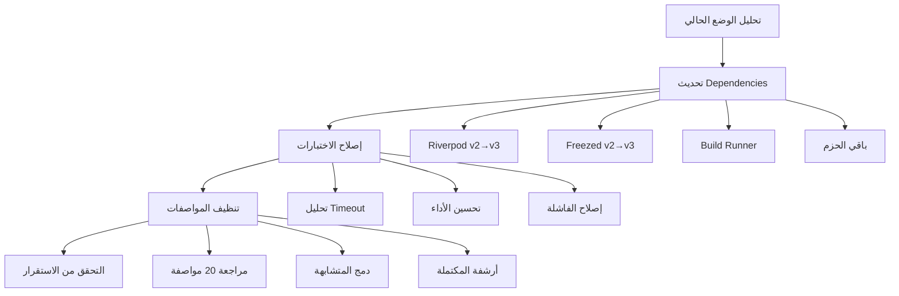
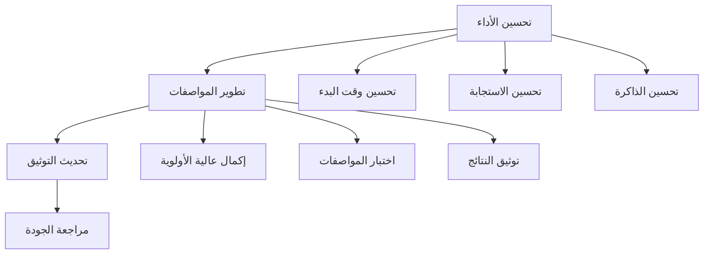
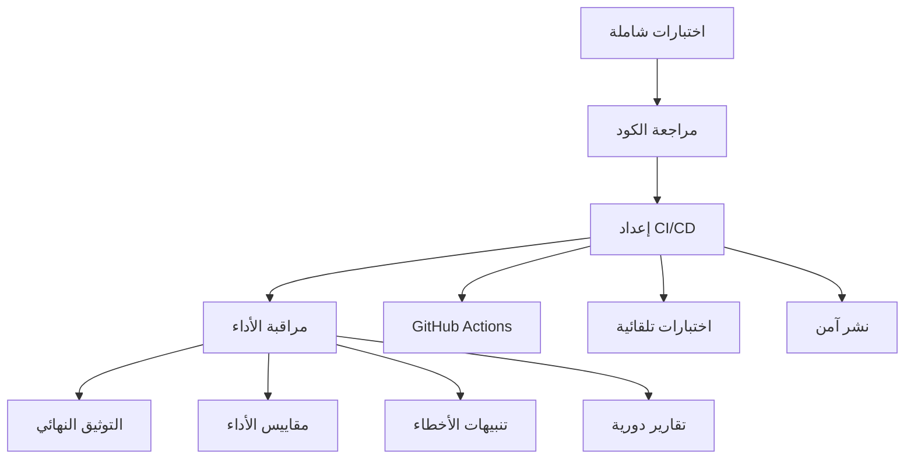

# تصميم خطة التحسين الشاملة - مشروع بصير MVP

## نظرة عامة

تهدف هذه الخطة إلى تحسين جميع جوانب مشروع بصير MVP من خلال نهج مرحلي منظم يضمن الاستقرار والجودة العالية. التصميم يتبع مبدأ PPP (Purity, Precision, Professionalism) ويركز على التحسين التدريجي بدون كسر الوظائف الحالية.

## الهيكل المعماري

### المرحلة 1: الاستقرار والأساسيات (الأسبوع 1-2)



### المرحلة 2: التحسين والتطوير (الأسبوع 3-4)



### المرحلة 3: الجودة والاستقرار (الأسبوع 5-6)



## المكونات والواجهات

### 1. نظام إدارة Dependencies

```dart
class DependencyManager {
  // تحليل الحزم الحالية
  Future<List<PackageInfo>> analyzeCurrentPackages();

  // تحديد التحديثات المطلوبة
  Future<List<UpdateInfo>> identifyUpdates();

  // تنفيذ التحديثات بأمان
  Future<UpdateResult> performSafeUpdate(PackageInfo package);

  // التحقق من التوافق
  Future<bool> verifyCompatibility();
}
```

### 2. نظام إدارة الاختبارات

```dart
class TestManager {
  // تحليل أداء الاختبارات
  Future<TestPerformanceReport> analyzeTestPerformance();

  // إصلاح الاختبارات الفاشلة
  Future<void> fixFailingTests();

  // تحسين سرعة التنفيذ
  Future<void> optimizeTestExecution();

  // قياس التغطية
  Future<CoverageReport> measureCoverage();
}
```

### 3. نظام إدارة المواصفات

```dart
class SpecificationManager {
  // مراجعة المواصفات النشطة
  Future<List<SpecInfo>> reviewActiveSpecs();

  // تصنيف حسب الأولوية
  Future<void> prioritizeSpecs();

  // دمج المتشابهة
  Future<void> mergeSimilarSpecs();

  // أرشفة المكتملة
  Future<void> archiveCompletedSpecs();
}
```

### 4. نظام مراقبة الأداء

```dart
class PerformanceMonitor {
  // قياس وقت البدء
  Future<Duration> measureStartupTime();

  // قياس استجابة الواجهة
  Future<Duration> measureUIResponseTime();

  // مراقبة استخدام الذاكرة
  Future<MemoryUsage> monitorMemoryUsage();

  // تسجيل الأخطاء
  Future<void> logErrors(ErrorInfo error);
}
```

## نماذج البيانات

### معلومات الحزمة

```dart
@freezed
class PackageInfo with _$PackageInfo {
  const factory PackageInfo({
    required String name,
    required String currentVersion,
    required String latestVersion,
    required bool hasBreakingChanges,
    required Priority updatePriority,
  }) = _PackageInfo;
}
```

### تقرير الأداء

```dart
@freezed
class PerformanceReport with _$PerformanceReport {
  const factory PerformanceReport({
    required Duration startupTime,
    required Duration averageResponseTime,
    required double memoryUsage,
    required int errorCount,
    required DateTime timestamp,
  }) = _PerformanceReport;
}
```

### معلومات المواصفة

```dart
@freezed
class SpecInfo with _$SpecInfo {
  const factory SpecInfo({
    required String name,
    required String path,
    required SpecStatus status,
    required Priority priority,
    required DateTime lastModified,
    required List<String> dependencies,
  }) = _SpecInfo;
}
```

## خصائص الصحة

_خاصية هي سمة أو سلوك يجب أن يكون صحيحاً عبر جميع التنفيذات الصالحة للنظام - في الأساس، بيان رسمي حول ما يجب أن يفعله النظام. الخصائص تعمل كجسر بين المواصفات القابلة للقراءة من قبل الإنسان وضمانات الصحة القابلة للتحقق آلياً._

### خاصية 1: استقرار التحديثات

_لأي_ حزمة يتم تحديثها، يجب أن تمر جميع الاختبارات الحالية بنجاح بعد التحديث
**يتحقق من: المتطلبات 1.2, 1.5**

### خاصية 2: أداء الاختبارات

_لأي_ مجموعة اختبارات، يجب أن تكتمل خلال 5 دقائق كحد أقصى
**يتحقق من: المتطلبات 2.1**

### خاصية 3: تنظيم المواصفات

_لأي_ وقت، يجب ألا يتجاوز عدد المواصفات النشطة 5 مواصفات
**يتحقق من: المتطلبات 3.4**

### خاصية 4: استجابة الواجهة

_لأي_ تفاعل مستخدم، يجب أن يستجيب النظام خلال 500ms
**يتحقق من: المتطلبات 4.2**

### خاصية 5: جودة الكود

_لأي_ كود يتم إضافته، يجب أن يمر flutter analyze بدون أخطاء أو تحذيرات
**يتحقق من: المتطلبات 5.1**

### خاصية 6: تغطية الاختبارات

_لأي_ ميزة جديدة، يجب أن تحقق تغطية اختبارات 80% كحد أدنى
**يتحقق من: المتطلبات 2.4**

### خاصية 7: توثيق API

_لأي_ واجهة برمجة عامة، يجب أن تحتوي على توثيق كامل وأمثلة
**يتحقق من: المتطلبات 6.3**

### خاصية 8: استقرار CI/CD

_لأي_ push إلى الفرع الرئيسي، يجب أن تنجح جميع فحوصات CI/CD
**يتحقق من: المتطلبات 7.1, 7.2**

## معالجة الأخطاء

### استراتيجية Rollback

```dart
class RollbackStrategy {
  // إنشاء نقطة استعادة
  Future<String> createRestorePoint();

  // التراجع عن التحديث
  Future<void> rollbackUpdate(String restorePointId);

  // التحقق من سلامة النظام
  Future<bool> verifySystemIntegrity();
}
```

### إدارة المخاطر

1. **نسخ احتياطية تلقائية** قبل كل تحديث رئيسي
2. **اختبار تدريجي** على بيئات مختلفة
3. **مراقبة مستمرة** للأداء والأخطاء
4. **خطط طوارئ** لكل سيناريو محتمل

## استراتيجية الاختبار

### اختبارات الوحدة

- اختبار كل مكون بشكل منفصل
- تغطية جميع الحالات الحدية
- استخدام mocks للتبعيات الخارجية

### اختبارات التكامل

- اختبار التفاعل بين المكونات
- التحقق من تدفق البيانات
- اختبار السيناريوهات الحقيقية

### اختبارات الأداء

- قياس أوقات الاستجابة
- مراقبة استخدام الذاكرة
- اختبار تحت الضغط

### اختبارات الخصائص

- التحقق من الخصائص العامة
- اختبار عبر مدخلات متنوعة
- ضمان الصحة الرياضية

**التكوين المطلوب:**

- الحد الأدنى 100 تكرار لكل اختبار خاصية
- كل اختبار خاصية يجب أن يشير إلى خاصية التصميم
- تنسيق العلامة: **الميزة: comprehensive-improvement-plan، الخاصية {رقم}: {نص الخاصية}**
