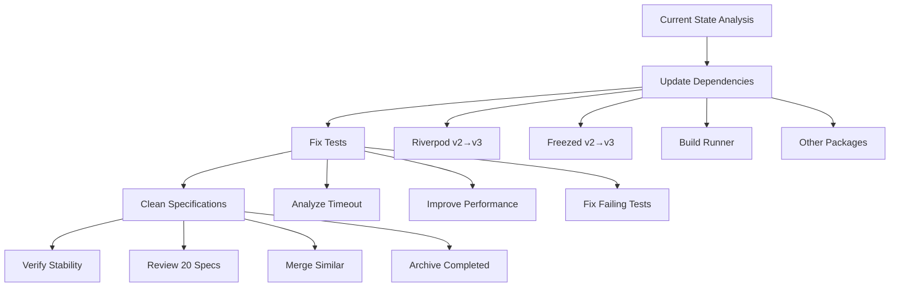
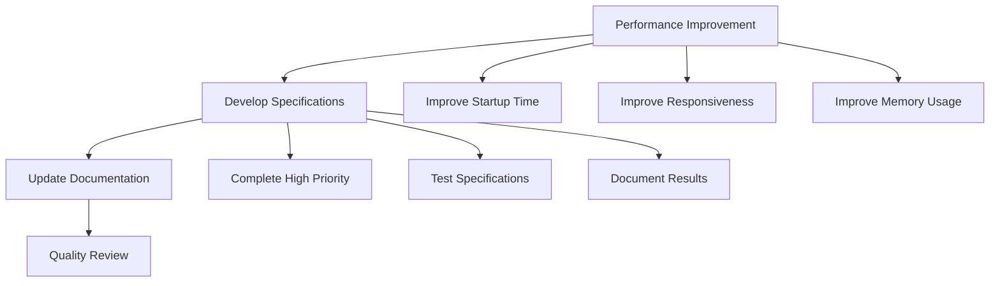
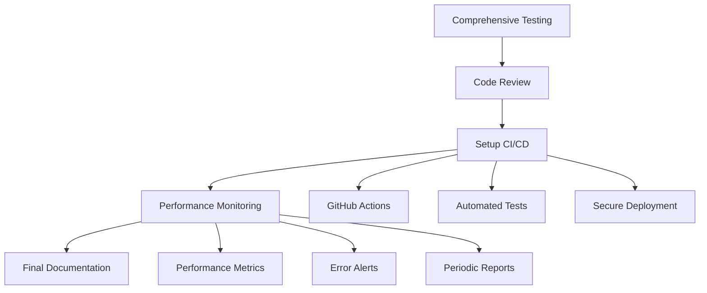

# Comprehensive Improvement Plan Design - Basir MVP Project

## Overview

This plan aims to improve all aspects of the Basir MVP project through a structured phased approach that ensures stability and high quality. The design follows PPP principles (Purity, Precision, Professionalism) and focuses on gradual improvement without breaking existing functionality.

## Architecture

### Phase 1: Stability and Fundamentals (Week 1-2)



### Phase 2: Enhancement and Development (Week 3-4)



### Phase 3: Quality and Stability (Week 5-6)



## Components and Interfaces

### 1. Dependency Management System

```dart
class DependencyManager {
  /// Analyze current packages
  Future<List<PackageInfo>> analyzeCurrentPackages();

  /// Identify required updates
  Future<List<UpdateInfo>> identifyUpdates();

  /// Perform safe updates
  Future<UpdateResult> performSafeUpdate(PackageInfo package);

  /// Verify compatibility
  Future<bool> verifyCompatibility();
}
```

### 2. Test Management System

```dart
class TestManager {
  /// Analyze test performance
  Future<TestPerformanceReport> analyzeTestPerformance();

  /// Fix failing tests
  Future<void> fixFailingTests();

  /// Optimize execution speed
  Future<void> optimizeTestExecution();

  /// Measure coverage
  Future<CoverageReport> measureCoverage();
}
```

### 3. Specification Management System

```dart
class SpecificationManager {
  /// Review active specifications
  Future<List<SpecInfo>> reviewActiveSpecs();

  /// Prioritize by importance
  Future<void> prioritizeSpecs();

  /// Merge similar specifications
  Future<void> mergeSimilarSpecs();

  /// Archive completed specifications
  Future<void> archiveCompletedSpecs();
}
```

### 4. Performance Monitoring System

```dart
class PerformanceMonitor {
  /// Measure startup time
  Future<Duration> measureStartupTime();

  /// Measure UI response time
  Future<Duration> measureUIResponseTime();

  /// Monitor memory usage
  Future<MemoryUsage> monitorMemoryUsage();

  /// Log errors
  Future<void> logErrors(ErrorInfo error);
}
```

## Data Models

### Package Information

```dart
@freezed
class PackageInfo with _$PackageInfo {
  const factory PackageInfo({
    required String name,
    required String currentVersion,
    required String latestVersion,
    required bool hasBreakingChanges,
    required Priority updatePriority,
  }) = _PackageInfo;
}
```

### Performance Report

```dart
@freezed
class PerformanceReport with _$PerformanceReport {
  const factory PerformanceReport({
    required Duration startupTime,
    required Duration averageResponseTime,
    required double memoryUsage,
    required int errorCount,
    required DateTime timestamp,
  }) = _PerformanceReport;
}
```

### Specification Information

```dart
@freezed
class SpecInfo with _$SpecInfo {
  const factory SpecInfo({
    required String name,
    required String path,
    required SpecStatus status,
    required Priority priority,
    required DateTime lastModified,
    required List<String> dependencies,
  }) = _SpecInfo;
}
```

## Correctness Properties

_A property is a characteristic or behavior that should hold true across all valid executions of a system-essentially, a formal statement about what the system should do. Properties serve as the bridge between human-readable specifications and machine-verifiable correctness guarantees._

### Property 1: Package Analysis Accuracy

_For any_ pubspec.yaml file, when analyzed for package updates, the system should correctly identify all packages that have newer versions available
**Validates: Requirements 1.1**

### Property 2: Update Stability

_For any_ package update, all existing tests should continue to pass after the update is completed
**Validates: Requirements 1.2, 1.5**

### Property 3: Code Generation Completeness

_For any_ code generation update, all required generated files should be properly created and contain valid content
**Validates: Requirements 1.3**

### Property 4: Build Performance Improvement

_For any_ build tool update, the build time should be equal to or better than the previous version
**Validates: Requirements 1.4**

### Property 5: Test Execution Time Constraint

_For any_ test suite execution, the total time should not exceed 5 minutes
**Validates: Requirements 2.1**

### Property 6: Error Message Clarity

_For any_ test failure, the error message should contain sufficient information to identify the cause
**Validates: Requirements 2.3**

### Property 7: Test Coverage Threshold

_For any_ test execution, the code coverage should meet or exceed 80%
**Validates: Requirements 2.4**

### Property 8: Specification Priority Classification

_For any_ set of active specifications, they should be correctly classified by priority according to defined criteria
**Validates: Requirements 3.1**

### Property 9: Duplicate Specification Handling

_For any_ set of specifications containing duplicates, the duplicates should be properly identified and handled
**Validates: Requirements 3.2**

### Property 10: Specification Organization

_For any_ specification management operation, the system should maintain no more than 5 active specifications
**Validates: Requirements 3.4**

### Property 11: Application Startup Performance

_For any_ application launch, the startup time should not exceed 3 seconds
**Validates: Requirements 4.1**

### Property 12: UI Response Time

_For any_ user interaction, the system should respond within 500ms
**Validates: Requirements 4.2**

### Property 13: Loading Indicator Display

_For any_ data loading operation, appropriate loading indicators should be displayed to the user
**Validates: Requirements 4.3**

### Property 14: Save Operation Performance

_For any_ data save operation, confirmation should be provided within 1 second
**Validates: Requirements 4.4**

### Property 15: Static Analysis Compliance

_For any_ code in the system, flutter analyze should report zero errors and zero warnings
**Validates: Requirements 5.1**

### Property 16: Backward Compatibility Preservation

_For any_ system change, existing functionality should continue to work as before
**Validates: Requirements 5.3**

### Property 17: CI/CD Pipeline Success

_For any_ version release, all CI/CD tests should pass successfully
**Validates: Requirements 5.4**

### Property 18: Documentation Placement

_For any_ new standard, it should be properly documented in the .kiro/steering directory
**Validates: Requirements 6.2**

### Property 19: API Documentation Completeness

_For any_ new feature, complete API documentation and usage examples should be provided
**Validates: Requirements 6.3**

### Property 20: Documentation Standards Compliance

_For any_ documentation update, it should maintain compatibility with current formatting and content standards
**Validates: Requirements 6.4**

### Property 21: Automated Test Execution

_For any_ code push to the main branch, all tests should be executed automatically
**Validates: Requirements 7.1**

### Property 22: Merge Prevention on Test Failure

_For any_ test failure in CI/CD, the merge should be blocked and appropriate alerts sent
**Validates: Requirements 7.2**

### Property 23: Multi-Platform Build Generation

_For any_ successful test completion, builds should be generated for all target platforms
**Validates: Requirements 7.3**

### Property 24: Secure Deployment

_For any_ completed build, artifacts should be deployed to the designated secure location
**Validates: Requirements 7.4**

### Property 25: Performance Data Collection

_For any_ user interaction, relevant performance data should be collected and stored
**Validates: Requirements 8.1**

### Property 26: Comprehensive Error Logging

_For any_ error occurrence, complete details should be logged including context and stack trace
**Validates: Requirements 8.2**

### Property 27: Report Generation Quality

_For any_ data analysis, clear and comprehensive reports should be generated
**Validates: Requirements 8.3**

### Property 28: Performance Issue Alerting

_For any_ performance issue detection, immediate alerts should be sent to the development team
**Validates: Requirements 8.4**

## Error Handling

### Rollback Strategy

```dart
class RollbackStrategy {
  /// Create restore point
  Future<String> createRestorePoint();

  /// Rollback update
  Future<void> rollbackUpdate(String restorePointId);

  /// Verify system integrity
  Future<bool> verifySystemIntegrity();
}
```

### Risk Management

1. **Automatic Backups** before every major update
2. **Gradual Testing** across different environments
3. **Continuous Monitoring** of performance and errors
4. **Emergency Plans** for every possible scenario

## Testing Strategy

### Unit Tests

- Test each component separately
- Cover all edge cases
- Use mocks for external dependencies
- Focus on specific examples and error conditions

### Integration Tests

- Test interaction between components
- Verify data flow
- Test real-world scenarios
- Validate end-to-end functionality

### Performance Tests

- Measure response times
- Monitor memory usage
- Test under load
- Validate performance requirements

### Property-Based Tests

- Verify universal properties
- Test across diverse inputs
- Ensure mathematical correctness
- Validate system invariants

**Required Configuration:**

- Minimum 100 iterations per property test
- Each property test must reference its design document property
- Tag format: **Feature: comprehensive-improvement-plan, Property {number}: {property_text}**

**Dual Testing Approach:**

- Unit tests verify specific examples, edge cases, and error conditions
- Property tests verify universal properties across all inputs
- Both are complementary and necessary for comprehensive coverage
