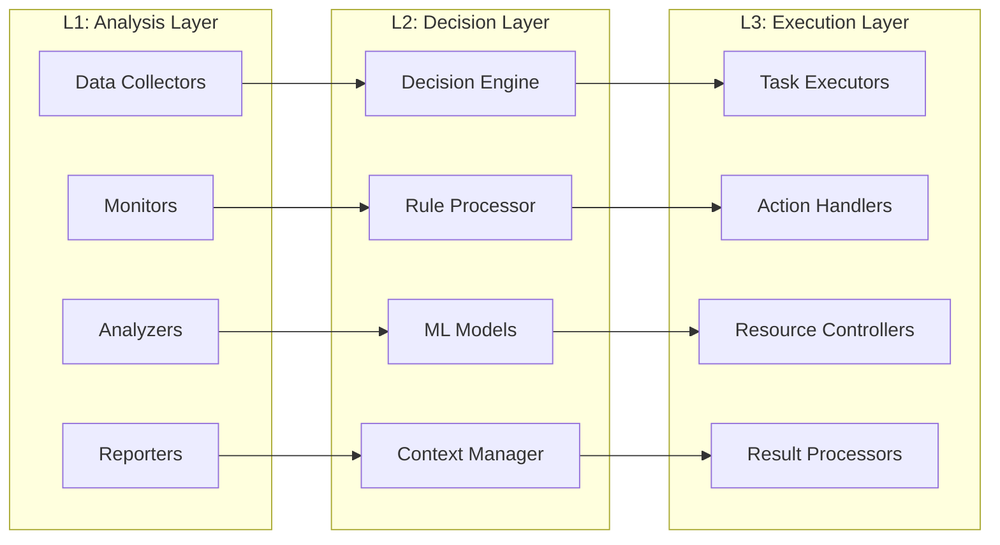

# Design Document - Intelligent Autonomous Workspace Transformation

**المشروع:** بصير MVP  
**التاريخ:** 10 ديسمبر 2025  
**المؤلف:** فريق وكلاء تطوير مشروع بصير  
**الحالة:** 🎯 **تصميم شامل للنظام الذكي**

---

## Overview

هذا التصميم يحدد المعمارية الشاملة لتحويل الـ workspace إلى نظام ذكي وآلي، مع طبقات وكلاء متقدمة ومكونات تشغيل آلية ونظام اتخاذ قرارات ذكي.

## Architecture

### High-Level System Architecture

```mermaid
graph TB
    A[Intelligent Autonomous Workspace] --> B[Discovery & Analysis Layer]
    A --> C[Agent Layers Architecture]
    A --> D[Autonomous Components]
    A --> E[Decision Engine]
    A --> F[Testing Framework]
    A --> G[Quality Metrics]
    A --> H[Learning System]

    B --> B1[Workspace Scanner]
    B --> B2[Dependency Analyzer]
    B --> B3[Issue Detector]
    B --> B4[Report Generator]

    C --> C1[L1: Analysis Layer]
    C --> C2[L2: Decision Layer]
    C --> C3[L3: Execution Layer]

    D --> D1[Auto Hooks]
    D --> D2[Smart Monitors]
    D --> D3[Self-Healing]
    D --> D4[Resource Manager]

    E --> E1[ML Engine]
    E --> E2[Rule Engine]
    E --> E3[Context Processor]
    E --> E4[Decision Logger]

    F --> F1[Unit Tests]
    F --> F2[Integration Tests]
    F --> F3[System Tests]
    F --> F4[Performance Tests]

    G --> G1[Metrics Collector]
    G --> G2[Analytics Engine]
    G --> G3[Dashboard]
    G --> G4[Alerting System]

    H --> H1[Pattern Recognition]
    H --> H2[Feedback Loop]
    H --> H3[Model Updates]
    H --> H4[Knowledge Base]
```



### Agent Layers Architecture (L1, L2, L3)



## Components and Interfaces

### 1. Discovery and Analysis System

#### 1.1 Workspace Scanner

```typescript
interface WorkspaceScanner {
  scanWorkspace(): Promise<WorkspaceSnapshot>;
  detectChanges(): Promise<ChangeSet>;
  analyzeStructure(): Promise<StructureAnalysis>;
  generateReport(): Promise<DiscoveryReport>;
}

interface WorkspaceSnapshot {
  timestamp: Date;
  structure: DirectoryTree;
  files: FileMetadata[];
  dependencies: DependencyGraph;
  configurations: ConfigurationMap;
  metrics: WorkspaceMetrics;
}
```

#### 1.2 Issue Detection Engine

```typescript
interface IssueDetector {
  detectIssues(snapshot: WorkspaceSnapshot): Promise<Issue[]>;
  categorizeIssues(issues: Issue[]): Promise<CategorizedIssues>;
  prioritizeIssues(issues: Issue[]): Promise<PrioritizedIssues>;
  suggestSolutions(issues: Issue[]): Promise<SolutionMap>;
}

interface Issue {
  id: string;
  type: IssueType;
  severity: Severity;
  description: string;
  location: string;
  impact: Impact;
  suggestedActions: Action[];
}
```

### 2. Agent Layers Implementation

#### 2.1 L1: Analysis Layer

```typescript
interface AnalysisLayer {
  collectData(): Promise<DataCollection>;
  monitorSystems(): Promise<MonitoringData>;
  analyzePatterns(): Promise<PatternAnalysis>;
  generateInsights(): Promise<Insights>;
}

interface DataCollector {
  collectMetrics(): Promise<Metrics>;
  collectLogs(): Promise<LogData>;
  collectPerformanceData(): Promise<PerformanceData>;
  collectUserBehavior(): Promise<BehaviorData>;
}
```

#### 2.2 L2: Decision Layer

```typescript
interface DecisionLayer {
  processAnalysis(analysis: AnalysisResult): Promise<DecisionContext>;
  makeDecisions(context: DecisionContext): Promise<Decision[]>;
  evaluateOptions(options: Option[]): Promise<EvaluatedOptions>;
  approveActions(actions: Action[]): Promise<ApprovedActions>;
}

interface DecisionEngine {
  evaluate(context: DecisionContext): Promise<Decision>;
  learn(outcome: Outcome): Promise<void>;
  updateModels(feedback: Feedback): Promise<void>;
  explainDecision(decision: Decision): Promise<Explanation>;
}
```

#### 2.3 L3: Execution Layer

```typescript
interface ExecutionLayer {
  executeActions(actions: ApprovedActions): Promise<ExecutionResults>;
  manageResources(
    requirements: ResourceRequirements
  ): Promise<ResourceAllocation>;
  handleErrors(errors: ExecutionError[]): Promise<ErrorResolution>;
  reportResults(results: ExecutionResults): Promise<ResultReport>;
}

interface TaskExecutor {
  execute(task: Task): Promise<TaskResult>;
  monitor(execution: ExecutionContext): Promise<ExecutionStatus>;
  rollback(execution: ExecutionContext): Promise<RollbackResult>;
  cleanup(execution: ExecutionContext): Promise<CleanupResult>;
}
```

### 3. Autonomous Components System

#### 3.1 Smart Hooks System

```typescript
interface SmartHook {
  id: string;
  name: string;
  type: HookType;
  triggers: Trigger[];
  conditions: Condition[];
  actions: Action[];
  learningEnabled: boolean;
  autonomyLevel: AutonomyLevel;
}

interface HookManager {
  registerHook(hook: SmartHook): Promise<void>;
  executeHook(hookId: string, context: HookContext): Promise<HookResult>;
  learnFromExecution(result: HookResult): Promise<void>;
  optimizeHooks(): Promise<OptimizationResult>;
}
```

#### 3.2 Self-Healing System

```typescript
interface SelfHealingSystem {
  detectProblems(): Promise<Problem[]>;
  diagnoseIssues(problems: Problem[]): Promise<Diagnosis[]>;
  attemptResolution(diagnosis: Diagnosis): Promise<ResolutionResult>;
  escalateIfNeeded(result: ResolutionResult): Promise<EscalationResult>;
}

interface HealingAction {
  id: string;
  type: HealingType;
  description: string;
  riskLevel: RiskLevel;
  successRate: number;
  execute(context: HealingContext): Promise<HealingResult>;
}
```

### 4. Intelligent Decision Engine

#### 4.1 Machine Learning Components

```typescript
interface MLEngine {
  trainModels(data: TrainingData): Promise<TrainedModels>;
  predict(input: PredictionInput): Promise<Prediction>;
  classify(input: ClassificationInput): Promise<Classification>;
  recommend(context: RecommendationContext): Promise<Recommendation[]>;
}

interface PatternRecognition {
  identifyPatterns(data: TimeSeriesData): Promise<Pattern[]>;
  detectAnomalies(data: MetricsData): Promise<Anomaly[]>;
  predictTrends(historical: HistoricalData): Promise<TrendPrediction>;
  clusterBehaviors(behaviors: BehaviorData[]): Promise<BehaviorCluster[]>;
}
```

#### 4.2 Rule Engine

```typescript
interface RuleEngine {
  evaluateRules(context: RuleContext): Promise<RuleResult[]>;
  addRule(rule: Rule): Promise<void>;
  updateRule(ruleId: string, updates: RuleUpdates): Promise<void>;
  optimizeRules(): Promise<OptimizationResult>;
}

interface Rule {
  id: string;
  name: string;
  conditions: Condition[];
  actions: Action[];
  priority: number;
  enabled: boolean;
  metadata: RuleMetadata;
}
```

### 5. Operational Testing Framework

#### 5.1 Test Automation System

```typescript
interface TestAutomation {
  generateTests(component: Component): Promise<Test[]>;
  executeTests(tests: Test[]): Promise<TestResults>;
  analyzeResults(results: TestResults): Promise<TestAnalysis>;
  reportCoverage(): Promise<CoverageReport>;
}

interface TestOrchestrator {
  scheduleTests(schedule: TestSchedule): Promise<void>;
  runContinuousTests(): Promise<ContinuousTestResults>;
  handleTestFailures(failures: TestFailure[]): Promise<FailureResolution>;
  optimizeTestSuite(): Promise<OptimizationResult>;
}
```

#### 5.2 Performance Testing

```typescript
interface PerformanceTester {
  loadTest(target: TestTarget): Promise<LoadTestResult>;
  stressTest(target: TestTarget): Promise<StressTestResult>;
  enduranceTest(target: TestTarget): Promise<EnduranceTestResult>;
  benchmarkPerformance(baseline: Baseline): Promise<BenchmarkResult>;
}
```

### 6. Quality Metrics and Monitoring

#### 6.1 Metrics Collection System

```typescript
interface MetricsCollector {
  collectSystemMetrics(): Promise<SystemMetrics>;
  collectApplicationMetrics(): Promise<ApplicationMetrics>;
  collectUserMetrics(): Promise<UserMetrics>;
  collectBusinessMetrics(): Promise<BusinessMetrics>;
}

interface MetricsProcessor {
  aggregateMetrics(metrics: RawMetrics[]): Promise<AggregatedMetrics>;
  calculateKPIs(metrics: AggregatedMetrics): Promise<KPIResults>;
  detectTrends(historical: HistoricalMetrics): Promise<TrendAnalysis>;
  generateAlerts(metrics: ProcessedMetrics): Promise<Alert[]>;
}
```

#### 6.2 Dashboard and Visualization

```typescript
interface Dashboard {
  createVisualization(data: MetricsData): Promise<Visualization>;
  updateRealTime(stream: MetricsStream): Promise<void>;
  generateReports(timeRange: TimeRange): Promise<Report[]>;
  customizeView(preferences: ViewPreferences): Promise<CustomView>;
}
```

## Data Models

### Core Data Structures

```typescript
// Workspace Model
interface Workspace {
  id: string;
  name: string;
  path: string;
  structure: WorkspaceStructure;
  configuration: WorkspaceConfig;
  metadata: WorkspaceMetadata;
  agents: Agent[];
  components: Component[];
  metrics: WorkspaceMetrics;
}

// Agent Model
interface Agent {
  id: string;
  layer: AgentLayer;
  type: AgentType;
  capabilities: Capability[];
  configuration: AgentConfig;
  state: AgentState;
  performance: AgentPerformance;
}

// Decision Model
interface Decision {
  id: string;
  timestamp: Date;
  context: DecisionContext;
  options: Option[];
  selectedOption: Option;
  reasoning: string;
  confidence: number;
  outcome: Outcome;
  feedback: Feedback[];
}

// Task Model
interface Task {
  id: string;
  type: TaskType;
  priority: Priority;
  dependencies: string[];
  requirements: Requirement[];
  constraints: Constraint[];
  execution: ExecutionPlan;
  status: TaskStatus;
  results: TaskResult[];
}
```

### Configuration Models

```typescript
// System Configuration
interface SystemConfig {
  agents: AgentConfig[];
  components: ComponentConfig[];
  rules: RuleConfig[];
  thresholds: ThresholdConfig[];
  security: SecurityConfig;
  monitoring: MonitoringConfig;
}

// Agent Configuration
interface AgentConfig {
  layer: AgentLayer;
  autonomyLevel: AutonomyLevel;
  learningEnabled: boolean;
  safetyLimits: SafetyLimits;
  escalationRules: EscalationRule[];
  performanceTargets: PerformanceTarget[];
}
```

## Error Handling and Recovery

### Error Classification

```typescript
enum ErrorSeverity {
  LOW = "low",
  MEDIUM = "medium",
  HIGH = "high",
  CRITICAL = "critical",
}

enum ErrorCategory {
  SYSTEM = "system",
  APPLICATION = "application",
  USER = "user",
  NETWORK = "network",
  SECURITY = "security",
}

interface ErrorHandler {
  handleError(error: SystemError): Promise<ErrorResolution>;
  escalateError(error: SystemError): Promise<EscalationResult>;
  recoverFromError(error: SystemError): Promise<RecoveryResult>;
  learnFromError(error: SystemError): Promise<LearningResult>;
}
```

### Recovery Strategies

```typescript
interface RecoveryStrategy {
  id: string;
  name: string;
  applicableErrors: ErrorType[];
  steps: RecoveryStep[];
  successRate: number;
  riskLevel: RiskLevel;
  execute(context: RecoveryContext): Promise<RecoveryResult>;
}

interface CircuitBreaker {
  state: CircuitState;
  failureThreshold: number;
  recoveryTimeout: number;
  execute<T>(operation: () => Promise<T>): Promise<T>;
  reset(): void;
}
```

## Security and Governance

### Security Framework

```typescript
interface SecurityManager {
  authenticateAgent(agent: Agent): Promise<AuthenticationResult>;
  authorizeAction(
    action: Action,
    context: SecurityContext
  ): Promise<AuthorizationResult>;
  auditActivity(activity: Activity): Promise<AuditResult>;
  enforcePolicy(policy: SecurityPolicy): Promise<EnforcementResult>;
}

interface GovernanceEngine {
  validateCompliance(action: Action): Promise<ComplianceResult>;
  enforceRules(rules: GovernanceRule[]): Promise<EnforcementResult>;
  generateAuditTrail(): Promise<AuditTrail>;
  reportViolations(violations: Violation[]): Promise<ViolationReport>;
}
```

### Access Control

```typescript
interface AccessControl {
  checkPermissions(
    subject: Subject,
    resource: Resource,
    action: Action
  ): Promise<boolean>;
  grantPermission(permission: Permission): Promise<void>;
  revokePermission(permission: Permission): Promise<void>;
  auditAccess(accessAttempt: AccessAttempt): Promise<void>;
}
```

## Performance and Scalability

### Performance Optimization

```typescript
interface PerformanceOptimizer {
  analyzePerformance(component: Component): Promise<PerformanceAnalysis>;
  identifyBottlenecks(analysis: PerformanceAnalysis): Promise<Bottleneck[]>;
  optimizeComponent(component: Component): Promise<OptimizationResult>;
  monitorPerformance(component: Component): Promise<PerformanceMonitor>;
}

interface ResourceManager {
  allocateResources(
    requirements: ResourceRequirements
  ): Promise<ResourceAllocation>;
  optimizeResourceUsage(): Promise<OptimizationResult>;
  scaleResources(demand: ResourceDemand): Promise<ScalingResult>;
  monitorResourceHealth(): Promise<ResourceHealth>;
}
```

### Scalability Design

```typescript
interface ScalabilityManager {
  assessScalabilityNeeds(
    growth: GrowthProjection
  ): Promise<ScalabilityAssessment>;
  planScaling(assessment: ScalabilityAssessment): Promise<ScalingPlan>;
  executeScaling(plan: ScalingPlan): Promise<ScalingResult>;
  monitorScaling(scaling: ScalingExecution): Promise<ScalingMonitor>;
}
```

## Testing Strategy

### Comprehensive Testing Approach

#### Unit Testing

- Test individual components and functions
- Mock dependencies and external services
- Achieve 90%+ code coverage
- Automated test generation for new components

#### Integration Testing

- Test component interactions and data flow
- Validate agent layer communication
- Test external system integrations
- End-to-end workflow validation

#### System Testing

- Test complete autonomous workflows
- Validate decision-making accuracy
- Test error handling and recovery
- Performance and load testing

#### Operational Testing

- Test autonomous operation scenarios
- Validate self-healing capabilities
- Test learning and adaptation
- Security and governance testing

---

**تم إعداده بواسطة:** فريق وكلاء تطوير مشروع بصير  
**التاريخ:** 10 ديسمبر 2025  
**الحالة:** ✅ تصميم شامل للنظام الذكي
