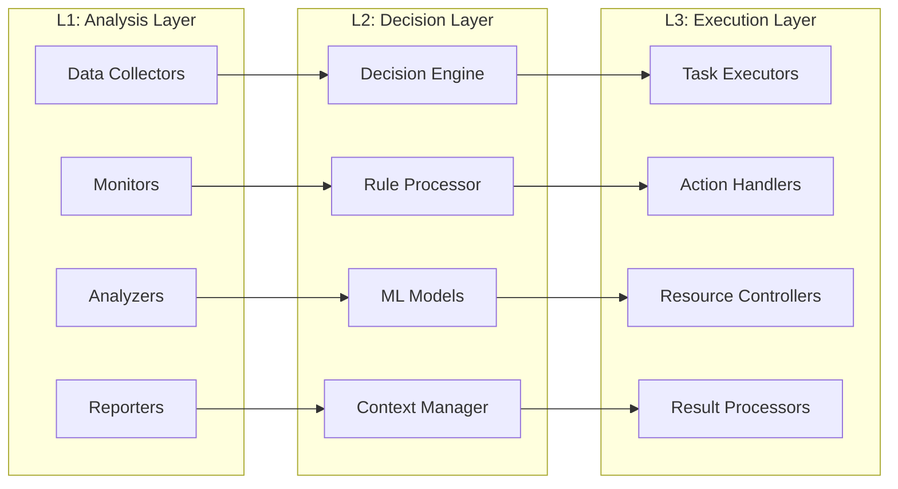
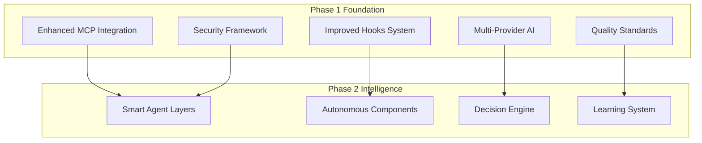

# Design Document - Intelligent Autonomous Workspace Transformation

**المشروع:** بصير MVP - مشروع التحويل الشامل (المرحلة الثانية)  
**التاريخ:** 11 ديسمبر 2025  
**المؤلف:** فريق وكلاء تطوير مشروع بصير  
**الحالة:** 🎯 **تصميم شامل للنظام الذكي**

---

## Overview

هذا التصميم يحدد المعمارية الشاملة لتحويل الـ workspace إلى نظام ذكي وآلي، مع طبقات وكلاء متقدمة ومكونات تشغيل آلية ونظام اتخاذ قرارات ذكي.

هذه المرحلة الثانية تبني على الأسس التقنية والمعيارية المحضرة في المرحلة الأولى لتحقيق التحويل الذكي الشامل.

## Architecture

### High-Level System Architecture

```mermaid
graph TB
    A[Intelligent Autonomous Workspace] --> B[Discovery & Analysis Layer]
    A --> C[Agent Layers Architecture]
    A --> D[Autonomous Components]
    A --> E[Decision Engine]
    A --> F[Testing Framework]
    A --> G[Quality Metrics]
    A --> H[Learning System]

    B --> B1[Workspace Scanner]
    B --> B2[Dependency Analyzer]
    B --> B3[Issue Detector]
    B --> B4[Report Generator]

    C --> C1[L1: Analysis Layer]
    C --> C2[L2: Decision Layer]
    C --> C3[L3: Execution Layer]

    D --> D1[Smart Hooks]
    D --> D2[Smart Monitors]
    D --> D3[Self-Healing]
    D --> D4[Resource Manager]

    E --> E1[ML Engine]
    E --> E2[Rule Engine]
    E --> E3[Context Processor]
    E --> E4[Decision Logger]

    F --> F1[Unit Tests]
    F --> F2[Integration Tests]
    F --> F3[System Tests]
    F --> F4[Performance Tests]

    G --> G1[Metrics Collector]
    G --> G2[Analytics Engine]
    G --> G3[Dashboard]
    G --> G4[Alerting System]

    H --> H1[Pattern Recognition]
    H --> H2[Feedback Loop]
    H --> H3[Model Updates]
    H --> H4[Knowledge Base]
```



### Agent Layers Architecture (L1, L2, L3)



### Integration with Phase 1 Infrastructure



## Components and Interfaces

### 1. Discovery and Analysis System

#### 1.1 Workspace Scanner

```typescript
interface WorkspaceScanner {
  scanWorkspace(): Promise<WorkspaceSnapshot>;
  detectChanges(): Promise<ChangeSet>;
  analyzeStructure(): Promise<StructureAnalysis>;
  generateReport(): Promise<DiscoveryReport>;
  integrateWithMCP(): Promise<MCPIntegration>;
}

interface WorkspaceSnapshot {
  timestamp: Date;
  structure: DirectoryTree;
  files: FileMetadata[];
  dependencies: DependencyGraph;
  configurations: ConfigurationMap;
  metrics: WorkspaceMetrics;
  mcpServers: MCPServerStatus[];
  aiProviders: AIProviderStatus[];
}
```

#### 1.2 Issue Detection Engine

```typescript
interface IssueDetector {
  detectIssues(snapshot: WorkspaceSnapshot): Promise<Issue[]>;
  categorizeIssues(issues: Issue[]): Promise<CategorizedIssues>;
  prioritizeIssues(issues: Issue[]): Promise<PrioritizedIssues>;
  suggestSolutions(issues: Issue[]): Promise<SolutionMap>;
  learnFromResolutions(resolutions: Resolution[]): Promise<void>;
}

interface Issue {
  id: string;
  type: IssueType;
  severity: Severity;
  description: string;
  location: string;
  impact: Impact;
  suggestedActions: Action[];
  confidence: number;
  learningData: LearningMetadata;
}
```

### 2. Agent Layers Implementation

#### 2.1 L1: Analysis Layer

```typescript
interface AnalysisLayer {
  collectData(): Promise<DataCollection>;
  monitorSystems(): Promise<MonitoringData>;
  analyzePatterns(): Promise<PatternAnalysis>;
  generateInsights(): Promise<Insights>;
  integrateWithPhase1(): Promise<Phase1Integration>;
}

interface DataCollector {
  collectMetrics(): Promise<Metrics>;
  collectLogs(): Promise<LogData>;
  collectPerformanceData(): Promise<PerformanceData>;
  collectUserBehavior(): Promise<BehaviorData>;
  collectMCPData(): Promise<MCPData>;
  collectAIProviderData(): Promise<AIProviderData>;
}
```

#### 2.2 L2: Decision Layer

```typescript
interface DecisionLayer {
  processAnalysis(analysis: AnalysisResult): Promise<DecisionContext>;
  makeDecisions(context: DecisionContext): Promise<Decision[]>;
  evaluateOptions(options: Option[]): Promise<EvaluatedOptions>;
  approveActions(actions: Action[]): Promise<ApprovedActions>;
  useMultiProviderAI(context: DecisionContext): Promise<AIDecision>;
}

interface DecisionEngine {
  evaluate(context: DecisionContext): Promise<Decision>;
  learn(outcome: Outcome): Promise<void>;
  updateModels(feedback: Feedback): Promise<void>;
  explainDecision(decision: Decision): Promise<Explanation>;
  selectBestAIProvider(task: Task): Promise<AIProvider>;
}
```

#### 2.3 L3: Execution Layer

```typescript
interface ExecutionLayer {
  executeActions(actions: ApprovedActions): Promise<ExecutionResults>;
  manageResources(
    requirements: ResourceRequirements
  ): Promise<ResourceAllocation>;
  handleErrors(errors: ExecutionError[]): Promise<ErrorResolution>;
  reportResults(results: ExecutionResults): Promise<ResultReport>;
  executeSmartHooks(context: HookContext): Promise<HookResults>;
}

interface TaskExecutor {
  execute(task: Task): Promise<TaskResult>;
  monitor(execution: ExecutionContext): Promise<ExecutionStatus>;
  rollback(execution: ExecutionContext): Promise<RollbackResult>;
  cleanup(execution: ExecutionContext): Promise<CleanupResult>;
  useMCPTools(tools: MCPTool[]): Promise<MCPResults>;
}
```

### 3. Autonomous Components System

#### 3.1 Smart Hooks System (Evolution from Phase 1)

```typescript
interface SmartHook extends Hook {
  id: string;
  name: string;
  type: HookType;
  triggers: Trigger[];
  conditions: Condition[];
  actions: Action[];
  learningEnabled: boolean;
  autonomyLevel: AutonomyLevel;
  aiProvider?: AIProvider;
  mcpIntegration?: MCPIntegration;
  adaptiveRules: AdaptiveRule[];
}

interface HookManager {
  registerHook(hook: SmartHook): Promise<void>;
  executeHook(hookId: string, context: HookContext): Promise<HookResult>;
  learnFromExecution(result: HookResult): Promise<void>;
  optimizeHooks(): Promise<OptimizationResult>;
  adaptHookBehavior(hook: SmartHook, feedback: Feedback): Promise<void>;
}
```

#### 3.2 Self-Healing System

```typescript
interface SelfHealingSystem {
  detectProblems(): Promise<Problem[]>;
  diagnoseIssues(problems: Problem[]): Promise<Diagnosis[]>;
  attemptResolution(diagnosis: Diagnosis): Promise<ResolutionResult>;
  escalateIfNeeded(result: ResolutionResult): Promise<EscalationResult>;
  learnFromHealing(healing: HealingResult): Promise<void>;
}

interface HealingAction {
  id: string;
  type: HealingType;
  description: string;
  riskLevel: RiskLevel;
  successRate: number;
  aiAssisted: boolean;
  mcpToolsUsed: MCPTool[];
  execute(context: HealingContext): Promise<HealingResult>;
}
```

### 4. Intelligent Decision Engine

#### 4.1 Machine Learning Components (Enhanced with Phase 1 AI)

```typescript
interface MLEngine {
  trainModels(data: TrainingData): Promise<TrainedModels>;
  predict(input: PredictionInput): Promise<Prediction>;
  classify(input: ClassificationInput): Promise<Classification>;
  recommend(context: RecommendationContext): Promise<Recommendation[]>;
  useMultiProviderAI(task: MLTask): Promise<MLResult>;
}

interface PatternRecognition {
  identifyPatterns(data: TimeSeriesData): Promise<Pattern[]>;
  detectAnomalies(data: MetricsData): Promise<Anomaly[]>;
  predictTrends(historical: HistoricalData): Promise<TrendPrediction>;
  clusterBehaviors(behaviors: BehaviorData[]): Promise<BehaviorCluster[]>;
  adaptToNewPatterns(patterns: Pattern[]): Promise<AdaptationResult>;
}
```

#### 4.2 Rule Engine (Enhanced)

```typescript
interface RuleEngine {
  evaluateRules(context: RuleContext): Promise<RuleResult[]>;
  addRule(rule: Rule): Promise<void>;
  updateRule(ruleId: string, updates: RuleUpdates): Promise<void>;
  optimizeRules(): Promise<OptimizationResult>;
  generateRulesFromAI(context: AIContext): Promise<GeneratedRule[]>;
}

interface Rule {
  id: string;
  name: string;
  conditions: Condition[];
  actions: Action[];
  priority: number;
  enabled: boolean;
  metadata: RuleMetadata;
  aiGenerated: boolean;
  learningEnabled: boolean;
}
```

## Data Models

### Core Data Structures (Enhanced)

```typescript
// Workspace Model (Enhanced)
interface Workspace {
  id: string;
  name: string;
  path: string;
  structure: WorkspaceStructure;
  configuration: WorkspaceConfig;
  metadata: WorkspaceMetadata;
  agents: Agent[];
  components: Component[];
  metrics: WorkspaceMetrics;
  phase1Integration: Phase1Integration;
  intelligenceLevel: IntelligenceLevel;
}

// Agent Model (Enhanced)
interface Agent {
  id: string;
  layer: AgentLayer;
  type: AgentType;
  capabilities: Capability[];
  configuration: AgentConfig;
  state: AgentState;
  performance: AgentPerformance;
  aiProviders: AIProvider[];
  mcpTools: MCPTool[];
  learningData: LearningData;
}

// Decision Model (Enhanced)
interface Decision {
  id: string;
  timestamp: Date;
  context: DecisionContext;
  options: Option[];
  selectedOption: Option;
  reasoning: string;
  confidence: number;
  outcome: Outcome;
  feedback: Feedback[];
  aiProvider: AIProvider;
  learningImpact: LearningImpact;
}
```

### Integration Models

```typescript
// Phase 1 Integration
interface Phase1Integration {
  mcpServers: MCPServerConfig[];
  aiProviders: AIProviderConfig[];
  enhancedHooks: EnhancedHookConfig[];
  qualityStandards: QualityStandardConfig[];
  securityFramework: SecurityFrameworkConfig[];
}

// Intelligence Level
interface IntelligenceLevel {
  autonomyLevel: number; // 0-100
  learningCapability: number; // 0-100
  decisionAccuracy: number; // 0-100
  adaptationSpeed: number; // 0-100
  overallIntelligence: number; // 0-100
}
```

## Error Handling and Recovery (Enhanced)

### Error Classification (Enhanced)

```typescript
enum ErrorSeverity {
  LOW = "low",
  MEDIUM = "medium",
  HIGH = "high",
  CRITICAL = "critical",
  SYSTEM_THREATENING = "system_threatening",
}

interface ErrorHandler {
  handleError(error: SystemError): Promise<ErrorResolution>;
  escalateError(error: SystemError): Promise<EscalationResult>;
  recoverFromError(error: SystemError): Promise<RecoveryResult>;
  learnFromError(error: SystemError): Promise<LearningResult>;
  useAIForDiagnosis(error: SystemError): Promise<AIDiagnosis>;
}
```

### Recovery Strategies (Enhanced)

```typescript
interface RecoveryStrategy {
  id: string;
  name: string;
  applicableErrors: ErrorType[];
  steps: RecoveryStep[];
  successRate: number;
  riskLevel: RiskLevel;
  aiAssisted: boolean;
  mcpToolsRequired: MCPTool[];
  execute(context: RecoveryContext): Promise<RecoveryResult>;
}
```

## Security and Governance (Enhanced)

### Security Framework (Building on Phase 1)

```typescript
interface SecurityManager {
  authenticateAgent(agent: Agent): Promise<AuthenticationResult>;
  authorizeAction(
    action: Action,
    context: SecurityContext
  ): Promise<AuthorizationResult>;
  auditActivity(activity: Activity): Promise<AuditResult>;
  enforcePolicy(policy: SecurityPolicy): Promise<EnforcementResult>;
  monitorAIUsage(aiUsage: AIUsage): Promise<AISecurityResult>;
}

interface GovernanceEngine {
  validateCompliance(action: Action): Promise<ComplianceResult>;
  enforceRules(rules: GovernanceRule[]): Promise<EnforcementResult>;
  generateAuditTrail(): Promise<AuditTrail>;
  reportViolations(violations: Violation[]): Promise<ViolationReport>;
  ensureAIEthics(aiDecision: AIDecision): Promise<EthicsResult>;
}
```

## Performance and Scalability (Enhanced)

### Performance Optimization (Enhanced)

```typescript
interface PerformanceOptimizer {
  analyzePerformance(component: Component): Promise<PerformanceAnalysis>;
  identifyBottlenecks(analysis: PerformanceAnalysis): Promise<Bottleneck[]>;
  optimizeComponent(component: Component): Promise<OptimizationResult>;
  monitorPerformance(component: Component): Promise<PerformanceMonitor>;
  optimizeAIUsage(aiUsage: AIUsage): Promise<AIOptimizationResult>;
}

interface ResourceManager {
  allocateResources(
    requirements: ResourceRequirements
  ): Promise<ResourceAllocation>;
  optimizeResourceUsage(): Promise<OptimizationResult>;
  scaleResources(demand: ResourceDemand): Promise<ScalingResult>;
  monitorResourceHealth(): Promise<ResourceHealth>;
  manageAIResources(aiDemand: AIDemand): Promise<AIResourceResult>;
}
```

## Testing Strategy (Enhanced)

### Comprehensive Testing Approach

#### Unit Testing (Enhanced)

- Test individual components and functions
- Mock dependencies and external services
- Achieve 90%+ code coverage
- Automated test generation for new components
- Test AI provider integrations
- Test MCP tool integrations

#### Integration Testing (Enhanced)

- Test component interactions and data flow
- Validate agent layer communication
- Test external system integrations
- End-to-end workflow validation
- Test Phase 1 and Phase 2 integration
- Test multi-provider AI workflows

#### System Testing (Enhanced)

- Test complete autonomous workflows
- Validate decision-making accuracy
- Test error handling and recovery
- Performance and load testing
- Test learning and adaptation
- Test intelligence evolution

#### Operational Testing (Enhanced)

- Test autonomous operation scenarios
- Validate self-healing capabilities
- Test learning and adaptation
- Security and governance testing
- Test Phase 1 foundation stability
- Test intelligent system evolution

## Integration Strategy with Phase 1

### Technical Integration Points

1. **MCP Integration Enhancement → Intelligent Tools**

   - Use enhanced MCP servers for intelligent automation
   - Integrate MCP tools with agent decision-making
   - Enable autonomous MCP server management

2. **Multi-Provider AI → Decision Engines**

   - Use optimized AI prompts in decision engines
   - Enable intelligent AI provider selection
   - Integrate AI capabilities across all agent layers

3. **Enhanced Hooks → Smart Hooks**

   - Evolve classified hooks into learning-enabled smart hooks
   - Add AI-powered hook optimization
   - Enable autonomous hook adaptation

4. **Quality Standards → Intelligent Quality**

   - Use EARS methodology for intelligent system requirements
   - Apply approval gates to autonomous decisions
   - Maintain quality through intelligent monitoring

5. **Security Framework → Autonomous Security**
   - Extend security automation to intelligent systems
   - Enable autonomous security decision-making
   - Maintain security through intelligent governance

### Migration Strategy

1. **Phase 1 Validation**: Ensure 95/100+ Kiro compliance
2. **Foundation Assessment**: Verify all Phase 1 components are stable
3. **Gradual Intelligence**: Incrementally add intelligence to existing systems
4. **Learning Integration**: Enable learning from Phase 1 improvements
5. **Full Autonomy**: Achieve complete autonomous operation

---

**تم إعداده بواسطة:** فريق وكلاء تطوير مشروع بصير  
**التاريخ:** 11 ديسمبر 2025  
**الحالة:** ✅ تصميم شامل للنظام الذكي
