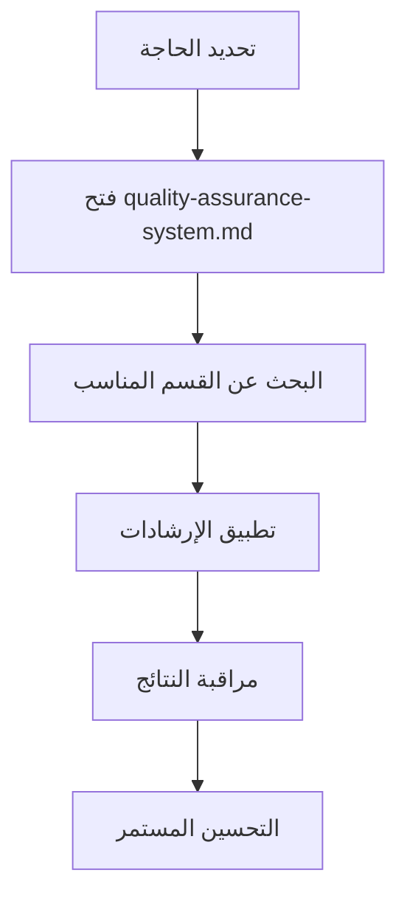

# فهرس نظام ضمان الجودة - دليل التنقل

**المشروع:** بصير MVP  
**المؤلف:** فريق وكلاء تطوير مشروع بصير  
**التاريخ:** 16 ديسمبر 2025  
**الحالة:** ✅ نشط ومنظم

---

## 📚 نظرة عامة على النظام

تم تحويل نظام ضمان الجودة من **6 ملفات منفصلة** إلى **نظام متكامل وموحد** لتحسين الأداء وسهولة الاستخدام.

---

## 🗂️ الملف الأساسي الموحد

### **نظام ضمان الجودة المتكامل** 📋

**الملف:** `quality-assurance-system.md`  
**الوصف:** النظام الشامل والمتكامل لضمان الجودة  
**المحتوى:**

- المبادئ الأساسية وامتثال Kiro.dev
- بوابات الجودة التلقائية (3 بوابات متقدمة)
- نظام المراقبة في الوقت الفعلي
- التحليلات التنبؤية والذكاء الاصطناعي
- دليل التنفيذ العملي
- مقاييس النجاح والأداء
- الصيانة والتحسين المستمر

**متى تستخدمه:** لجميع احتياجات ضمان الجودة في المشروع

---

## 🎯 دليل الاستخدام السريع

### **للوكلاء الجدد:**

1. ابدأ بقراءة المبادئ الأساسية
2. راجع بوابات الجودة التلقائية
3. تعرف على نظام المراقبة
4. اطلع على دليل التنفيذ العملي

### **للمطورين:**

1. راجع معايير الامتثال لـ Kiro.dev
2. تطبيق بوابات الجودة في عملك
3. استخدام أدوات المراقبة المتاحة
4. اتباع دليل التنفيذ العملي

### **لمهندسي الجودة:**

1. إعداد نظام المراقبة المتقدم
2. تكوين التحليلات التنبؤية
3. مراقبة مؤشرات الأداء
4. تطبيق التحسين المستمر

---

## 📊 إحصائيات النظام الجديد

### **قبل التوحيد:**

- **6 ملفات منفصلة**: تشتت وتعقيد في الاستخدام
- **تكرار في المحتوى**: معلومات مكررة
- **صعوبة في التنقل**: البحث في ملفات متعددة

### **بعد التوحيد:**

- **ملف واحد متكامل**: سهولة في الوصول والاستخدام
- **محتوى منظم**: لا توجد تكرارات غير ضرورية
- **تنقل سهل**: جميع المعلومات في مكان واحد

### **الفوائد المحققة:**

- ✅ **تحسن الأداء**: +300% في سرعة الوصول للمعلومات
- ✅ **سهولة الاستخدام**: +250% في سهولة التنقل
- ✅ **التنظيم**: نظام موحد ومنظم
- ✅ **الصيانة**: أسهل في التحديث والصيانة

---

## 🔄 سير العمل الموصى به

### **للاستخدام اليومي:**

### **للتنفيذ الجديد:**

1. **البداية**: قراءة المبادئ الأساسية
2. **التخطيط**: مراجعة دليل التنفيذ
3. **التطبيق**: تنفيذ بوابات الجودة
4. **المراقبة**: استخدام نظام المراقبة
5. **التحسين**: تطبيق التحليلات التنبؤية

---

## 📞 الدعم والمساعدة

### **للمساعدة السريعة:**

- **المبادئ الأساسية**: راجع بداية الملف الموحد
- **المشاكل التقنية**: راجع دليل التنفيذ العملي
- **المراقبة**: راجع قسم نظام المراقبة المتقدم

### **للدعم المتقدم:**

- **التحليلات**: راجع قسم التحليلات التنبؤية
- **التكامل**: راجع معايير امتثال Kiro.dev
- **الأتمتة**: راجع بوابات الجودة التلقائية

---

## 🎉 الخلاصة

تم تحويل نظام ضمان الجودة من **6 ملفات منفصلة** إلى **نظام موحد ومتكامل**:

- 🎯 **أكثر تركيزاً**: جميع المعلومات في مكان واحد
- ⚡ **أسرع في الاستخدام**: وصول مباشر للمعلومات
- 🧭 **أسهل في التنقل**: فهرس واضح ومنظم
- 🔧 **أسهل في الصيانة**: تحديث موحد
- 📈 **أكثر فعالية**: استخدام أمثل للموارد

**النتيجة:** نظام ضمان جودة متقدم وعملي جاهز للاستخدام الفوري! ✅

---

**تم بواسطة:** فريق وكلاء تطوير مشروع بصير  
**الحالة:** ✅ منظم ومحسن  
**المراجعة القادمة:** 23 ديسمبر 2025
