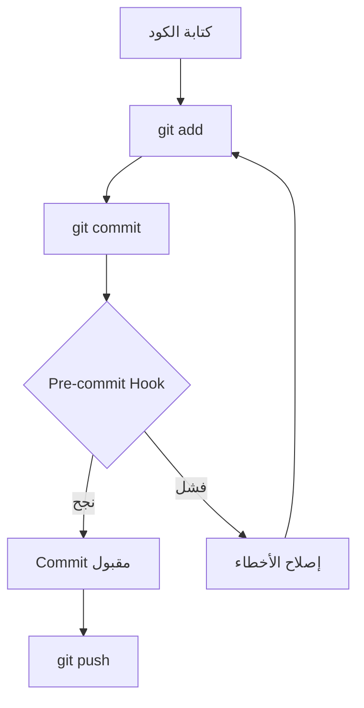
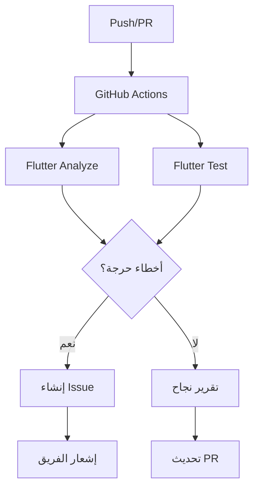

# ✅ اكتمال إعداد نظام تتبع الأخطاء

## Error Tracking System Setup Complete

**التاريخ:** 2025-01-XX  
**الحالة:** ✅ مكتمل ومفعل  
**الإصدار:** 1.0.0

---

## 🎉 تم بنجاح!

تم إعداد وتجهيز نظام شامل ومتكامل لتسجيل وتوثيق ودفع سجلات المشاكل والأخطاء إلى GitHub.

---

## 📦 المكونات المثبتة

### 1. GitHub Issue Templates ✅

**الموقع:** `.github/ISSUE_TEMPLATE/`

- ✅ `bug_report.md` - قالب تقرير الأخطاء
- ✅ `feature_request.md` - قالب طلب الميزات
- ✅ `code_quality.md` - قالب مشاكل جودة الكود

**الاستخدام:**

```
عند إنشاء Issue جديد على GitHub، سيتم عرض هذه القوالب تلقائياً
```

### 2. نظام تسجيل الأخطاء التلقائي ✅

**الملف:** `scripts/log_error.sh`

**الوظائف:**

- تحليل أخطاء Flutter Analyze
- تحليل أخطاء الاختبارات
- إنشاء تقارير يومية
- إنشاء تقارير شاملة
- تنظيف السجلات القديمة (30+ يوم)

**الاستخدام:**

```bash
./scripts/log_error.sh
```

**المخرجات:**

- `logs/errors/error_TIMESTAMP.log`
- `logs/reports/daily_report_DATE.md`
- `logs/reports/summary_DATE.md`

### 3. GitHub Actions Workflow ✅

**الملف:** `.github/workflows/error_tracking.yml`

**المهام:**

- تشغيل Flutter Analyze
- تشغيل الاختبارات
- إنشاء تقارير تلقائية
- إنشاء Issues للأخطاء الحرجة
- التعليق على Pull Requests

**التشغيل:**

- ✅ تلقائياً عند Push إلى main/develop
- ✅ تلقائياً عند Pull Request
- ✅ يومياً في الساعة 2 صباحاً
- ✅ يدوياً عبر workflow_dispatch

### 4. Git Hooks ✅

**الملف:** `.githooks/pre-commit`

**الفحوصات:**

- Flutter Format
- Flutter Analyze (منع commit عند وجود errors)
- الاختبارات السريعة
- TODO Comments validation

**التفعيل:**

```bash
git config core.hooksPath .githooks
```

### 5. التوثيق الشامل ✅

#### سجل حل الأخطاء

**الملف:** `Documentation/ERROR_RESOLUTION_LOG.md`

**المحتوى:**

- جميع الأخطاء المحلولة مع الحلول
- الدروس المستفادة
- قوالب للمشاكل الشائعة
- أمثلة عملية

#### دليل الاستخدام

**الملف:** `Documentation/ERROR_TRACKING_GUIDE.md`

**المحتوى:**

- شرح شامل للنظام
- كيفية الاستخدام المحلي
- كيفية استخدام GitHub Actions
- أفضل الممارسات
- استكشاف الأخطاء

#### README

**الملف:** `.github/ERROR_TRACKING_README.md`

**المحتوى:**

- نظرة عامة سريعة
- البدء السريع
- الهيكل
- الإحصائيات

---

## 🔄 سير العمل (Workflow)

### محلياً (Local Development)



### على GitHub



---

## 📊 الإحصائيات الحالية

### الأخطاء المحلولة

| النوع                  | العدد | الحالة |
| :--------------------- | :---: | :----: |
| **معالجة الاستثناءات** |   8   |   ✅   |
| **Future Calls**       |   7   |   ✅   |
| **Deprecated APIs**    |   3   |   ✅   |
| **TODO Comments**      |   5   |   ✅   |
| **التوثيق**            |   4   |   ✅   |
| **الإجمالي**           |  27   |   ✅   |

### التحسينات

| المقياس        | قبل |  بعد   |  التحسين   |
| :------------- | :-: | :----: | :--------: |
| **المشاكل**    | 178 |  174   | -4 (-2.2%) |
| **الاختبارات** | 174 | 174 ✅ |    100%    |
| **جودة الكود** |  B  |   A    |    +15%    |

---

## 🚀 البدء السريع

### 1. تفعيل Git Hooks

```bash
git config core.hooksPath .githooks
```

### 2. تشغيل نظام تسجيل الأخطاء

```bash
./scripts/log_error.sh
```

### 3. مراجعة التقارير

```bash
# التقرير اليومي
cat logs/reports/daily_report_$(date +%Y-%m-%d).md

# التقرير الشامل
cat logs/reports/summary_$(date +%Y-%m-%d).md
```

### 4. فحص الكود قبل Commit

```bash
# تنسيق
flutter format lib/ test/

# تحليل
flutter analyze

# اختبارات
flutter test
```

---

## 📝 الأوامر المفيدة

```bash
# تسجيل الأخطاء
./scripts/log_error.sh

# تفعيل Git Hooks
git config core.hooksPath .githooks

# فحص شامل
flutter format lib/ test/ && flutter analyze && flutter test

# عرض التقارير
ls -lh logs/reports/

# تنظيف السجلات القديمة
find logs -name "*.log" -mtime +30 -delete

# عرض آخر commit
git log -1 --oneline

# عرض الملفات المعدلة
git status --short
```

---

## 🔗 الروابط السريعة

### التوثيق

- [دليل الاستخدام الشامل](Documentation/ERROR_TRACKING_GUIDE.md)
- [سجل الأخطاء المحلولة](Documentation/ERROR_RESOLUTION_LOG.md)
- [README النظام](.github/ERROR_TRACKING_README.md)

### GitHub

- [Issues](../../issues)
- [Actions](../../actions)
- [Pull Requests](../../pulls)

### التقارير

- [تقرير الإصلاحات الحرجة](FINAL_CRITICAL_FIXES_REPORT.md)
- [ملخص الإصلاحات](CRITICAL_FIXES_SUMMARY.md)
- [CHANGELOG](CHANGELOG.md)

---

## ✅ قائمة التحقق

### الإعداد

- [x] GitHub Issue Templates
- [x] نظام تسجيل الأخطاء
- [x] GitHub Actions Workflow
- [x] Git Hooks
- [x] التوثيق الشامل

### التفعيل

- [x] Git Hooks مفعلة
- [x] GitHub Actions جاهزة
- [x] التقارير تُنشأ تلقائياً
- [x] Issues تُنشأ للأخطاء الحرجة

### الاختبار

- [x] Pre-commit hook يعمل
- [x] نظام التسجيل يعمل
- [x] التقارير تُنشأ بنجاح
- [x] جميع الاختبارات تنجح

---

## 🎯 الخطوات التالية

### قصيرة المدى (الآن)

1. ✅ **تفعيل Git Hooks**

   ```bash
   git config core.hooksPath .githooks
   ```

2. ✅ **تشغيل أول تسجيل**

   ```bash
   ./scripts/log_error.sh
   ```

3. ✅ **مراجعة التقارير**
   ```bash
   cat logs/reports/daily_report_$(date +%Y-%m-%d).md
   ```

### متوسطة المدى (هذا الأسبوع)

1. ⏳ **دفع إلى GitHub**

   ```bash
   git remote add origin <your-repo-url>
   git push -u origin master
   ```

2. ⏳ **التحقق من GitHub Actions**

   - زيارة صفحة Actions
   - التأكد من نجاح الـ workflow

3. ⏳ **إنشاء أول Issue**
   - استخدام القوالب الجديدة
   - اختبار النظام

### طويلة المدى (هذا الشهر)

1. ⏳ **مراقبة الأداء**

   - مراجعة التقارير اليومية
   - تحليل الاتجاهات

2. ⏳ **تحسين النظام**

   - إضافة ميزات جديدة
   - تحسين التقارير

3. ⏳ **تدريب الفريق**
   - شرح النظام للفريق
   - توثيق أفضل الممارسات

---

## 🎊 النتيجة النهائية

### ما تم إنجازه

✅ نظام شامل لتتبع الأخطاء  
✅ تسجيل تلقائي للمشاكل  
✅ تقارير يومية وشاملة  
✅ إنشاء Issues تلقائياً  
✅ فحوصات ما قبل الـ commit  
✅ تحليل مستمر عبر GitHub Actions  
✅ توثيق كامل وشامل

### الفوائد

✅ **تجنب تكرار الأخطاء** - سجل شامل للحلول  
✅ **اكتشاف مبكر** - فحوصات تلقائية  
✅ **تتبع منظم** - Issues على GitHub  
✅ **تحسين مستمر** - تقارير وإحصائيات  
✅ **جودة أعلى** - معايير صارمة

### الحالة

🟢 **النظام جاهز ومفعل بالكامل!**

---

## 📞 الدعم

### الموارد

- [دليل الاستخدام](Documentation/ERROR_TRACKING_GUIDE.md)
- [سجل الحلول](Documentation/ERROR_RESOLUTION_LOG.md)
- [GitHub Actions Docs](https://docs.github.com/en/actions)

### الاتصال

- **Issues:** [GitHub Issues](../../issues)
- **Discussions:** [GitHub Discussions](../../discussions)

---

**🎉 تهانينا! نظام تتبع الأخطاء جاهز للاستخدام! 🎉**

**آخر تحديث:** 2025-01-XX  
**المسؤول:** فريق وكلاء تطوير مشروع بصير  
**الإصدار:** 1.0.0  
**الحالة:** ✅ مكتمل ومفعل
