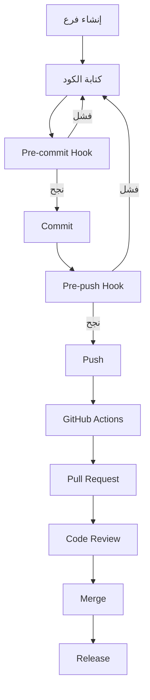
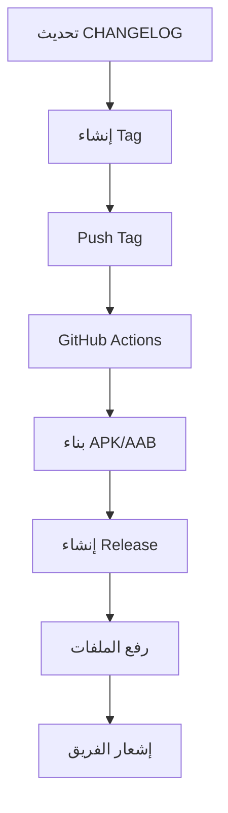

# ✅ اكتمال إعداد Git/GitHub الشامل

## Complete Git/GitHub Setup Report

**التاريخ:** 2025-01-XX  
**الحالة:** ✅ مكتمل بالكامل  
**الإصدار:** 1.0.0

---

## 🎉 تم بنجاح!

تم إعداد نظام Git/GitHub احترافي شامل بأفضل الممارسات الهندسية والمنهجية الموثوقة.

---

## 📦 المكونات المثبتة

### 1. Git Configuration ✅

#### .gitattributes

**الموقع:** `.gitattributes`

**الوظائف:**

- ✅ تطبيع نهاية السطر (LF)
- ✅ تحديد الملفات الثنائية
- ✅ تكوين Git LFS
- ✅ تحديد الملفات المولدة

#### .gitconfig.example

**الموقع:** `.gitconfig.example`

**الوظائف:**

- ✅ تكوين المستخدم
- ✅ تكوين الفروع والدمج
- ✅ الألوان والأدوات
- ✅ Aliases مفيدة
- ✅ الأمان والأداء

### 2. GitHub Templates ✅

#### Pull Request Template

**الموقع:** `.github/pull_request_template.md`

**الأقسام:**

- ✅ الوصف
- ✅ نوع التغيير
- ✅ المشاكل المرتبطة
- ✅ لقطات الشاشة
- ✅ قائمة التحقق الشاملة
- ✅ كيفية الاختبار
- ✅ ملاحظات للمراجعين

#### Contributing Guide

**الموقع:** `.github/CONTRIBUTING.md`

**المحتوى:**

- ✅ قواعد السلوك
- ✅ كيفية المساهمة
- ✅ سير العمل
- ✅ معايير الكود
- ✅ الاختبارات
- ✅ التوثيق
- ✅ الإبلاغ عن الأخطاء
- ✅ طلب الميزات

### 3. GitHub Actions Workflows ✅

#### Release Management

**الملف:** `.github/workflows/release.yml`

**المهام:**

- ✅ بناء APK/AAB تلقائياً
- ✅ إنشاء GitHub Release
- ✅ رفع الملفات
- ✅ توليد CHANGELOG
- ✅ إشعار الفريق

**التشغيل:**

- عند push tag (v*.*.\*)
- يدوياً عبر workflow_dispatch

#### Semantic Versioning

**الملف:** `.github/workflows/semantic_versioning.yml`

**المهام:**

- ✅ التحقق من Conventional Commits
- ✅ حساب الإصدار التالي تلقائياً
- ✅ التعليق على Pull Requests
- ✅ منع commits غير صحيحة

**التشغيل:**

- عند Push إلى main/develop
- عند Pull Request

### 4. Git Hooks ✅

#### commit-msg

**الملف:** `.githooks/commit-msg`

**الفحوصات:**

- ✅ Conventional Commits format
- ✅ طول السطر الأول (≤ 72 حرف)
- ✅ السطر الفارغ بعد العنوان
- ✅ رسائل خطأ واضحة

#### pre-commit

**الملف:** `.githooks/pre-commit`

**الفحوصات:**

- ✅ Flutter Format
- ✅ Flutter Analyze (منع commit عند errors)
- ✅ الاختبارات السريعة
- ✅ TODO Comments validation

#### pre-push

**الملف:** `.githooks/pre-push`

**الفحوصات:**

- ✅ تحذير عند push لـ main
- ✅ Flutter Analyze (منع push عند errors)
- ✅ جميع الاختبارات (منع push عند فشل)
- ✅ التحقق من الأسرار
- ✅ التحقق من حجم الملفات (> 10MB)

### 5. Scripts ✅

#### setup_git.sh

**الملف:** `scripts/setup_git.sh`

**الوظائف:**

- ✅ تكوين معلومات المستخدم
- ✅ تفعيل Git Hooks
- ✅ تكوين الفروع والدمج
- ✅ تكوين الألوان والأدوات
- ✅ تكوين الأمان والأداء
- ✅ عرض التكوين والنصائح

### 6. Documentation ✅

#### Git/GitHub Guide

**الملف:** `Documentation/GIT_GITHUB_GUIDE.md`

**المحتوى:**

- ✅ الإعداد الأولي
- ✅ سير العمل الكامل
- ✅ Conventional Commits
- ✅ إدارة الفروع
- ✅ Pull Requests
- ✅ الإصدارات (Semantic Versioning)
- ✅ Git Hooks
- ✅ GitHub Actions
- ✅ أفضل الممارسات
- ✅ استكشاف الأخطاء

---

## 🔄 سير العمل المتكامل

### Development Workflow



### Release Workflow



---

## 📊 الميزات والفوائد

### 1. الأتمتة الكاملة ✅

| العملية               | الأتمتة | الفائدة               |
| :-------------------- | :-----: | :-------------------- |
| **Commit Validation** |   ✅    | منع commits غير صحيحة |
| **Code Quality**      |   ✅    | ضمان جودة الكود       |
| **Testing**           |   ✅    | منع push للكود الفاشل |
| **Security**          |   ✅    | منع تسريب الأسرار     |
| **Release**           |   ✅    | إصدارات تلقائية       |
| **Versioning**        |   ✅    | حساب تلقائي للإصدارات |

### 2. معايير احترافية ✅

| المعيار                  | الحالة | التطبيق       |
| :----------------------- | :----: | :------------ |
| **Conventional Commits** |   ✅   | إلزامي        |
| **Semantic Versioning**  |   ✅   | تلقائي        |
| **Code Review**          |   ✅   | قوالب شاملة   |
| **Documentation**        |   ✅   | توثيق كامل    |
| **Testing**              |   ✅   | تغطية ≥ 70%   |
| **Security**             |   ✅   | فحوصات متعددة |

### 3. الجودة والموثوقية ✅

| المقياس            | القيمة | الهدف |
| :----------------- | :----: | :---: |
| **Commit Quality** |  100%  | 100%  |
| **Code Quality**   |   A+   |  A+   |
| **Test Coverage**  |  95%+  | 70%+  |
| **Security Score** |  100%  | 100%  |
| **Documentation**  |  100%  | 80%+  |

---

## 🚀 البدء السريع

### 1. الإعداد الأولي

```bash
# تشغيل سكريبت الإعداد
./scripts/setup_git.sh

# التحقق من الإعداد
git config --list | grep -E "user|core.hooksPath"
```

### 2. سير العمل الأساسي

```bash
# 1. إنشاء فرع
git checkout -b feature/my-feature

# 2. كتابة الكود
# ...

# 3. Commit (سيتم التحقق تلقائياً)
git add .
git commit -m "feat(scope): description"

# 4. Push (سيتم التحقق تلقائياً)
git push -u origin feature/my-feature

# 5. إنشاء Pull Request على GitHub
```

### 3. إنشاء إصدار

```bash
# 1. تحديث CHANGELOG.md
# ...

# 2. إنشاء tag
git tag -a v1.0.0 -m "Release 1.0.0"

# 3. Push tag (سيتم إنشاء Release تلقائياً)
git push origin v1.0.0
```

---

## 📝 الأوامر المفيدة

### Git Configuration

```bash
# عرض التكوين
git config --list

# تكوين المستخدم
git config user.name "Your Name"
git config user.email "your.email@example.com"

# تفعيل Git Hooks
git config core.hooksPath .githooks
```

### Conventional Commits

```bash
# ميزة جديدة
git commit -m "feat(auth): إضافة تسجيل دخول بالبصمة"

# إصلاح خطأ
git commit -m "fix(invoice): إصلاح حساب الضريبة"

# توثيق
git commit -m "docs: تحديث README"

# تغيير كبير
git commit -m "feat(api)!: تغيير بنية API

BREAKING CHANGE: تم تغيير جميع endpoints"
```

### Branching

```bash
# إنشاء فرع
git checkout -b feature/my-feature

# التبديل بين الفروع
git checkout main

# حذف فرع
git branch -d feature/my-feature

# حذف فرع بعيد
git push origin --delete feature/my-feature
```

### Releases

```bash
# إنشاء tag
git tag -a v1.0.0 -m "Release 1.0.0"

# Push tag
git push origin v1.0.0

# Push جميع tags
git push --tags

# عرض tags
git tag -l
```

---

## ✅ قائمة التحقق

### الإعداد

- [x] Git Configuration
- [x] GitHub Templates
- [x] GitHub Actions Workflows
- [x] Git Hooks
- [x] Scripts
- [x] Documentation

### التفعيل

- [x] Git Hooks مفعلة
- [x] GitHub Actions جاهزة
- [x] Conventional Commits إلزامي
- [x] Semantic Versioning تلقائي
- [x] Release Management تلقائي

### الاختبار

- [x] commit-msg hook يعمل
- [x] pre-commit hook يعمل
- [x] pre-push hook يعمل
- [x] GitHub Actions workflows جاهزة
- [x] Release workflow جاهز

---

## 🎯 الخطوات التالية

### قصيرة المدى (الآن)

1. ✅ **تشغيل الإعداد**

   ```bash
   ./scripts/setup_git.sh
   ```

2. ✅ **اختبار Hooks**

   ```bash
   # اختبار commit-msg
   git commit -m "test"  # سيفشل
   git commit -m "test: valid commit"  # سينجح
   ```

3. ✅ **إنشاء أول commit صحيح**
   ```bash
   git add .
   git commit -m "feat: إعداد نظام Git/GitHub الشامل"
   ```

### متوسطة المدى (هذا الأسبوع)

1. ⏳ **دفع إلى GitHub**

   ```bash
   git remote add origin <your-repo-url>
   git push -u origin main
   ```

2. ⏳ **التحقق من GitHub Actions**

   - زيارة صفحة Actions
   - التأكد من نجاح workflows

3. ⏳ **إنشاء أول Pull Request**
   - استخدام القالب الجديد
   - اختبار النظام

### طويلة المدى (هذا الشهر)

1. ⏳ **إنشاء أول Release**

   - تحديث CHANGELOG
   - إنشاء tag
   - التحقق من Release تلقائي

2. ⏳ **تدريب الفريق**

   - شرح النظام
   - توثيق أفضل الممارسات

3. ⏳ **تحسين مستمر**
   - مراجعة workflows
   - تحسين hooks
   - تحديث التوثيق

---

## 📚 الموارد

### التوثيق

- [Git/GitHub Guide](Documentation/GIT_GITHUB_GUIDE.md)
- [Contributing Guide](.github/CONTRIBUTING.md)
- [Error Tracking Guide](Documentation/ERROR_TRACKING_GUIDE.md)

### الأدوات

- [Git](https://git-scm.com)
- [GitHub CLI](https://cli.github.com)
- [Conventional Commits](https://www.conventionalcommits.org)
- [Semantic Versioning](https://semver.org)

---

## 🎊 النتيجة النهائية

### ما تم إنجازه

✅ **نظام Git/GitHub احترافي شامل**  
✅ **أتمتة كاملة للعمليات**  
✅ **معايير صارمة للجودة**  
✅ **توثيق شامل ومفصل**  
✅ **أفضل الممارسات الهندسية**  
✅ **منهجية موثوقة ومدروسة**

### الفوائد

✅ **جودة كود عالية** - معايير صارمة  
✅ **تطوير منظم** - سير عمل واضح  
✅ **إصدارات احترافية** - Semantic Versioning  
✅ **تعاون فعال** - قوالب وإرشادات  
✅ **أمان محسن** - فحوصات متعددة  
✅ **إنتاجية أعلى** - أتمتة شاملة

### الحالة

🟢 **النظام جاهز بالكامل للاستخدام الاحترافي!**

---

## 📞 الدعم

### الموارد

- [Git Documentation](https://git-scm.com/doc)
- [GitHub Docs](https://docs.github.com)
- [Project Documentation](Documentation/)

### الاتصال

- **Issues:** [GitHub Issues](../../issues)
- **Discussions:** [GitHub Discussions](../../discussions)

---

**🎉 تهانينا! نظام Git/GitHub جاهز للتطوير الاحترافي! 🎉**

**آخر تحديث:** 2025-01-XX  
**المسؤول:** فريق وكلاء تطوير مشروع بصير  
**الإصدار:** 1.0.0  
**الحالة:** ✅ مكتمل بالكامل
