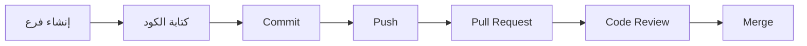

# دليل Git/GitHub الشامل

## Complete Git/GitHub Guide

دليل احترافي شامل لاستخدام Git و GitHub في مشروع بصير MVP.

---

## 📋 جدول المحتويات

1. [الإعداد الأولي](#الإعداد-الأولي)
2. [سير العمل](#سير-العمل)
3. [Conventional Commits](#conventional-commits)
4. [إدارة الفروع](#إدارة-الفروع)
5. [Pull Requests](#pull-requests)
6. [الإصدارات](#الإصدارات)
7. [Git Hooks](#git-hooks)
8. [GitHub Actions](#github-actions)
9. [أفضل الممارسات](#أفضل-الممارسات)
10. [استكشاف الأخطاء](#استكشاف-الأخطاء)

---

## الإعداد الأولي

### 1. تشغيل سكريبت الإعداد

```bash
./scripts/setup_git.sh
```

هذا السكريبت يقوم بـ:

- ✅ تكوين معلومات المستخدم
- ✅ تفعيل Git Hooks
- ✅ تكوين الفروع والدمج
- ✅ تكوين الألوان والأدوات
- ✅ تكوين الأمان والأداء

### 2. التحقق من الإعداد

```bash
# عرض التكوين
git config --list

# التحقق من Git Hooks
ls -la .githooks/

# التحقق من الفرع الحالي
git branch --show-current
```

---

## سير العمل

### سير العمل الأساسي



### الخطوات التفصيلية

#### 1. إنشاء فرع جديد

```bash
# للميزات الجديدة
git checkout -b feature/feature-name

# لإصلاح الأخطاء
git checkout -b fix/bug-name

# للتوثيق
git checkout -b docs/doc-name

# لإعادة الهيكلة
git checkout -b refactor/refactor-name
```

#### 2. كتابة الكود

```bash
# تعديل الملفات
# ...

# التحقق من التغييرات
git status

# عرض التغييرات
git diff
```

#### 3. Staging

```bash
# إضافة ملف محدد
git add path/to/file.dart

# إضافة جميع الملفات المعدلة
git add .

# إضافة تفاعلية
git add -p
```

#### 4. Commit

```bash
# Commit مع رسالة
git commit -m "feat: إضافة ميزة جديدة"

# Commit مع رسالة مفصلة
git commit -m "feat: إضافة ميزة جديدة" -m "وصف تفصيلي للميزة"

# تعديل آخر commit
git commit --amend
```

#### 5. Push

```bash
# Push للفرع الحالي
git push

# Push لأول مرة
git push -u origin feature/feature-name

# Force push (استخدم بحذر!)
git push --force-with-lease
```

---

## Conventional Commits

### الصيغة

```
type(scope): description

[optional body]

[optional footer]
```

### الأنواع (Types)

| النوع        | الوصف       | مثال                                   |
| :----------- | :---------- | :------------------------------------- |
| **feat**     | ميزة جديدة  | `feat(auth): إضافة تسجيل دخول بالبصمة` |
| **fix**      | إصلاح خطأ   | `fix(invoice): إصلاح حساب الضريبة`     |
| **docs**     | توثيق       | `docs: تحديث README`                   |
| **style**    | تنسيق       | `style: تنسيق الكود`                   |
| **refactor** | إعادة هيكلة | `refactor(auth): تحسين بنية الكود`     |
| **perf**     | تحسين أداء  | `perf(dashboard): تحسين سرعة التحميل`  |
| **test**     | اختبارات    | `test(customer): إضافة اختبارات`       |
| **chore**    | مهام صيانة  | `chore: تحديث التبعيات`                |
| **build**    | نظام البناء | `build: تحديث gradle`                  |
| **ci**       | CI/CD       | `ci: إضافة workflow جديد`              |
| **revert**   | تراجع       | `revert: التراجع عن commit abc123`     |

### النطاق (Scope)

النطاق اختياري ويحدد الجزء المتأثر:

- `auth` - المصادقة
- `customer` - إدارة العملاء
- `invoice` - إدارة الفواتير
- `dashboard` - لوحة التحكم
- `settings` - الإعدادات
- `pdf` - خدمة PDF
- `ui` - الواجهة
- `api` - API

### Breaking Changes

للتغييرات الكبيرة، أضف `!` بعد النوع:

```bash
git commit -m "feat!: تغيير واجهة API

BREAKING CHANGE: تم تغيير بنية الاستجابة"
```

### أمثلة كاملة

```bash
# ميزة بسيطة
git commit -m "feat(auth): إضافة تسجيل دخول بالبصمة"

# إصلاح مع وصف
git commit -m "fix(invoice): إصلاح حساب الضريبة

كان الحساب يتجاهل الخصومات"

# تغيير كبير
git commit -m "feat(api)!: تغيير بنية API

BREAKING CHANGE: تم تغيير جميع endpoints
من /api/v1 إلى /api/v2"

# إغلاق Issue
git commit -m "fix(customer): إصلاح حذف العميل

Closes #123"
```

---

## إدارة الفروع

### استراتيجية الفروع

```
main (الإنتاج)
  ↑
develop (التطوير)
  ↑
feature/* (الميزات)
fix/* (الإصلاحات)
```

### الفروع الرئيسية

#### main/master

- الكود الإنتاجي
- دائماً مستقر
- يتم الدمج فقط من develop
- كل merge = إصدار جديد

#### develop

- الكود قيد التطوير
- يحتوي على آخر التغييرات
- يتم الدمج من feature/fix branches

### فروع الميزات

```bash
# إنشاء فرع ميزة
git checkout -b feature/user-profile

# العمل على الميزة
# ...

# دمج آخر تحديثات من develop
git checkout develop
git pull
git checkout feature/user-profile
git merge develop

# Push
git push -u origin feature/user-profile
```

### فروع الإصلاحات

```bash
# إنشاء فرع إصلاح
git checkout -b fix/login-error

# العمل على الإصلاح
# ...

# Push
git push -u origin fix/login-error
```

### حذف الفروع

```bash
# حذف فرع محلي
git branch -d feature/user-profile

# حذف فرع بعيد
git push origin --delete feature/user-profile

# حذف جميع الفروع المدمجة
git branch --merged | grep -v "\*" | xargs -n 1 git branch -d
```

---

## Pull Requests

### إنشاء Pull Request

1. **Push الفرع**

   ```bash
   git push -u origin feature/my-feature
   ```

2. **على GitHub**
   - اذهب إلى Repository
   - انقر "Pull requests"
   - انقر "New pull request"
   - اختر الفرع
   - املأ القالب

### قالب Pull Request

يتم ملء القالب تلقائياً من `.github/pull_request_template.md`:

- ✅ الوصف
- ✅ نوع التغيير
- ✅ المشاكل المرتبطة
- ✅ لقطات الشاشة
- ✅ قائمة التحقق
- ✅ كيفية الاختبار

### مراجعة الكود

#### للمطور

```bash
# تحديث الفرع بناءً على التعليقات
git add .
git commit -m "fix: معالجة تعليقات المراجعة"
git push
```

#### للمراجع

- ✅ مراجعة الكود
- ✅ اختبار التغييرات
- ✅ التعليق على الكود
- ✅ الموافقة أو طلب تغييرات

### الدمج

```bash
# بعد الموافقة، على GitHub:
# 1. Squash and merge (للميزات الصغيرة)
# 2. Merge commit (للميزات الكبيرة)
# 3. Rebase and merge (للحفاظ على تاريخ نظيف)
```

---

## الإصدارات

### Semantic Versioning

```
MAJOR.MINOR.PATCH

مثال: 1.2.3
```

- **MAJOR**: تغييرات كبيرة (breaking changes)
- **MINOR**: ميزات جديدة (backward compatible)
- **PATCH**: إصلاحات (bug fixes)

### إنشاء إصدار

#### 1. تحديث CHANGELOG.md

```markdown
## [1.2.0] - 2025-01-XX

### Added

- ميزة جديدة

### Fixed

- إصلاح خطأ

### Changed

- تحسين
```

#### 2. إنشاء Tag

```bash
# إنشاء tag
git tag -a v1.2.0 -m "Release 1.2.0"

# Push tag
git push origin v1.2.0

# Push جميع tags
git push --tags
```

#### 3. GitHub Release

سيتم إنشاء Release تلقائياً عبر GitHub Actions عند push tag.

### عرض الإصدارات

```bash
# عرض جميع tags
git tag

# عرض آخر tag
git describe --tags --abbrev=0

# عرض تفاصيل tag
git show v1.2.0
```

---

## Git Hooks

### الـ Hooks المتوفرة

#### pre-commit

يتم تشغيله قبل كل commit:

- ✅ Flutter Format
- ✅ Flutter Analyze
- ✅ الاختبارات السريعة
- ✅ TODO Comments validation

#### commit-msg

يتحقق من رسالة الـ commit:

- ✅ Conventional Commits format
- ✅ طول السطر الأول
- ✅ السطر الفارغ

#### pre-push

يتم تشغيله قبل كل push:

- ✅ Flutter Analyze (منع push عند errors)
- ✅ جميع الاختبارات
- ✅ التحقق من الأسرار
- ✅ حجم الملفات

### تفعيل/تعطيل Hooks

```bash
# تفعيل
git config core.hooksPath .githooks

# تعطيل مؤقت
git commit --no-verify

# تعطيل دائم
git config core.hooksPath ""
```

---

## GitHub Actions

### الـ Workflows المتوفرة

#### 1. Error Tracking

- **المسار:** `.github/workflows/error_tracking.yml`
- **التشغيل:** Push, PR, يومياً
- **المهام:**
  - Flutter Analyze
  - Flutter Test
  - إنشاء تقارير
  - إنشاء Issues

#### 2. Release Management

- **المسار:** `.github/workflows/release.yml`
- **التشغيل:** عند push tag
- **المهام:**
  - بناء APK/AAB
  - إنشاء Release
  - رفع الملفات

#### 3. Semantic Versioning

- **المسار:** `.github/workflows/semantic_versioning.yml`
- **التشغيل:** Push, PR
- **المهام:**
  - التحقق من Conventional Commits
  - حساب الإصدار التالي
  - التعليق على PR

### عرض النتائج

```bash
# على GitHub:
# Repository → Actions → اختر Workflow → اختر Run
```

---

## أفضل الممارسات

### 1. Commits

✅ **جيد:**

```bash
git commit -m "feat(auth): إضافة تسجيل دخول بالبصمة"
```

❌ **سيء:**

```bash
git commit -m "update"
```

### 2. الفروع

✅ **جيد:**

```bash
git checkout -b feature/biometric-auth
```

❌ **سيء:**

```bash
git checkout -b test
```

### 3. Pull Requests

✅ **جيد:**

- وصف واضح
- لقطات شاشة
- اختبارات
- مراجعة الكود

❌ **سيء:**

- بدون وصف
- تغييرات كثيرة
- بدون اختبارات

### 4. الدمج

✅ **جيد:**

```bash
# دمج من develop قبل PR
git merge develop
```

❌ **سيء:**

```bash
# دمج مباشرة بدون تحديث
```

---

## استكشاف الأخطاء

### المشكلة: Commit مرفوض

```bash
# السبب: رسالة commit غير صحيحة
# الحل: استخدم Conventional Commits
git commit --amend -m "feat: رسالة صحيحة"
```

### المشكلة: Push مرفوض

```bash
# السبب: يوجد أخطاء في الكود
# الحل: أصلح الأخطاء
flutter analyze
flutter test
```

### المشكلة: Merge Conflict

```bash
# 1. تحديث الفرع
git fetch origin
git merge origin/develop

# 2. حل التعارضات يدوياً
# 3. إضافة الملفات
git add .

# 4. إكمال الدمج
git commit
```

### المشكلة: تراجع عن Commit

```bash
# تراجع عن آخر commit (يحتفظ بالتغييرات)
git reset --soft HEAD~1

# تراجع عن آخر commit (يحذف التغييرات)
git reset --hard HEAD~1

# تراجع عن commit محدد
git revert <commit-hash>
```

---

## الأوامر السريعة

```bash
# الإعداد
./scripts/setup_git.sh

# سير العمل الأساسي
git checkout -b feature/my-feature
git add .
git commit -m "feat: إضافة ميزة"
git push -u origin feature/my-feature

# التحديث
git fetch origin
git merge origin/develop

# التنظيف
git branch -d feature/my-feature
git push origin --delete feature/my-feature

# الإصدارات
git tag -a v1.0.0 -m "Release 1.0.0"
git push --tags

# المساعدة
git help <command>
```

---

## الموارد

### التوثيق

- [Git Documentation](https://git-scm.com/doc)
- [GitHub Docs](https://docs.github.com)
- [Conventional Commits](https://www.conventionalcommits.org)
- [Semantic Versioning](https://semver.org)

### الأدوات

- [GitHub CLI](https://cli.github.com)
- [Git GUI Clients](https://git-scm.com/downloads/guis)

---

**آخر تحديث:** 2025-01-XX  
**الإصدار:** 1.0.0
