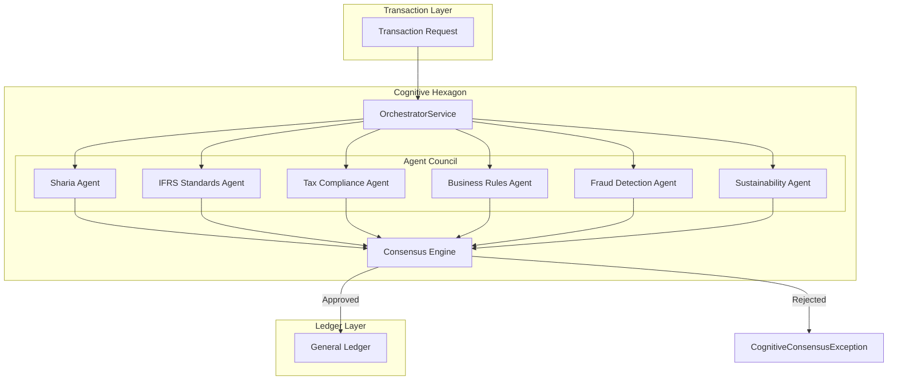
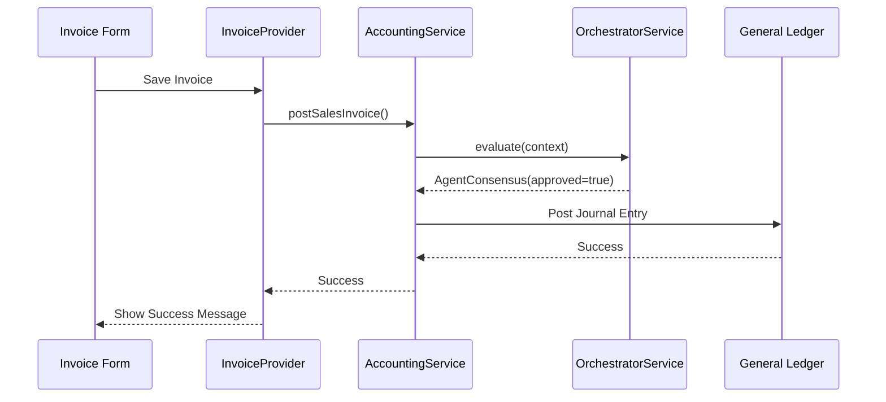
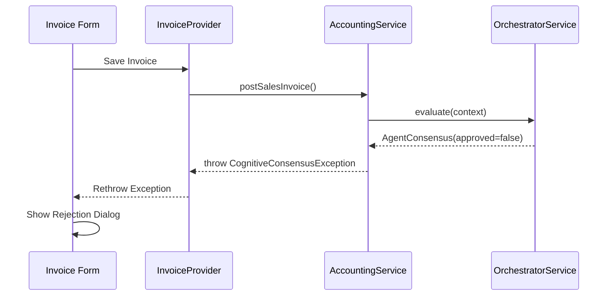

# Cognitive Hexagon Architecture

## Overview

The **Cognitive Hexagon** is an advanced multi-agent consensus architecture that governs all financial transactions in the Basir Accounting System. It acts as an intelligent gatekeeper, ensuring every transaction complies with multiple regulatory, ethical, and business standards before being committed to the ledger.



---

## Core Components

### 1. OrchestratorService

**File**: [orchestrator_service.dart](file:///home/m/Projects/basir_accounting_system/lib/features/accounting/application/orchestrator_service.dart)

The orchestrator is the central coordinator that:

- Receives transaction contexts from the accounting layer
- Dispatches validation requests to all registered agents
- Collects agent verdicts and calculates consensus
- Returns an `AgentConsensus` object with the final decision

```dart
@riverpod
class OrchestratorService extends _$OrchestratorService {
  Future<AgentConsensus> evaluate(AccountingContext context) async {
    final agents = [
      ref.read(standardsEngineServiceProvider.notifier),
      // ... other agents
    ];

    final results = await Future.wait(
      agents.map((a) => a.evaluate(context)),
    );

    return AgentConsensus(
      agentResults: results,
      isApproved: results.every((r) => r.isAllowed),
    );
  }
}
```

### 2. Agent Interface

Each agent implements the `AccountingAgent` interface:

```dart
abstract class AccountingAgent {
  Future<AgentResult> evaluate(AccountingContext context);
}

class AgentResult {
  final String agentId;
  final bool isAllowed;
  final String rationale;
}
```

### 3. AgentConsensus

The consensus object aggregates all agent verdicts:

```dart
class AgentConsensus {
  final List<AgentResult> agentResults;
  final bool isApproved;

  List<AgentResult> get rejections =>
    agentResults.where((r) => !r.isAllowed).toList();
}
```

---

## Transaction Flow

### Successful Transaction



### Rejected Transaction



---

## Exception Handling

### CognitiveConsensusException

**File**: [cognitive_exceptions.dart](file:///home/m/Projects/basir_accounting_system/lib/features/accounting/domain/exceptions/cognitive_exceptions.dart)

When the consensus fails, a `CognitiveConsensusException` is thrown containing the full consensus report:

```dart
class CognitiveConsensusException implements Exception {
  final AgentConsensus consensus;

  CognitiveConsensusException(this.consensus);

  @override
  String toString() => 'Transaction REJECTED by Cognitive Hexagon';
}
```

### UI Handling Pattern

All UI screens that trigger transactions must implement the rejection dialog:

```dart
try {
  await accountingService.postSalesInvoice(invoice);
} on CognitiveConsensusException catch (e) {
  await _showCognitiveRejectionDialog(context, e);
} on Exception catch (e) {
  // Generic error handling
}
```

---

## Implemented Agents

| Agent ID                | Responsibility                | Status     |
| ----------------------- | ----------------------------- | ---------- |
| `standards-engine`      | IFRS 18 compliance validation | ✅ Active  |
| `sharia-agent`          | Islamic finance compliance    | 🔜 Planned |
| `tax-engine`            | VAT/ZATCA compliance          | 🔜 Planned |
| `fraud-detector`        | Anomaly detection             | 🔜 Planned |
| `sustainability-expert` | ESG compliance                | 🔜 Planned |

---

## Integration Points

The Cognitive Hexagon is integrated at these entry points:

| Screen                   | Method              | Exception Handling |
| ------------------------ | ------------------- | ------------------ |
| `InvoiceFormScreen`      | `_saveInvoiceAsync` | ✅                 |
| `JournalEntryFormScreen` | `_saveEntry`        | ✅                 |
| `JournalEntriesScreen`   | `_handlePost`       | ✅                 |
| `SimulationService`      | `seedRealisticData` | ⚠️ Dev-only        |

---

## Design Principles

1. **Unanimous Consensus**: All agents must approve for a transaction to proceed
2. **Transparent Rejection**: Users see exactly which agent rejected and why
3. **Non-Blocking Architecture**: Agents evaluate in parallel for performance
4. **Extensible Design**: New agents can be added without modifying existing code
5. **Audit Trail**: All consensus decisions are logged for forensic analysis

---

## Future Enhancements

- [ ] Configurable consensus threshold (majority vs. unanimous)
- [ ] Agent priority weighting
- [ ] Real-time agent health monitoring
- [ ] ML-based fraud detection agent
- [ ] Regulatory update subscription service

---

_Last Updated: 2026-01-11_
_Architecture Version: 1.0_
