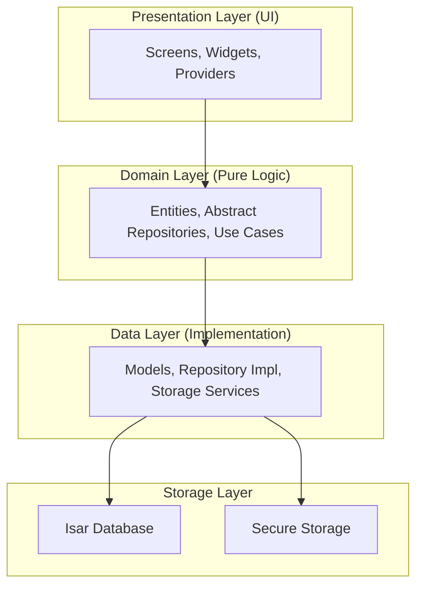

# Technical Architecture: Basir Accounting System

## Introduction

The Basir Accounting System utilizes **Clean Architecture** to ensure strict separation of concerns, scalability, and high testability. The application is logically partitioned into three primary architectural layers:

1.  **Presentation Layer**
2.  **Domain Layer**
3.  **Data Layer**

## Architectural Layers

### 1. Presentation Layer (UI & State)

Contains all user interface components and state management logic. Each feature is encapsulated in a dedicated directory containing:

- **Screens**: Primary page-level widgets.
- **Widgets**: Atomic, reusable UI components.
- **Providers**: Riverpod state management and dependency injection.

**Critical Artifacts:**

- `setup_screen.dart`: Initial system initialization.
- `login_screen.dart`: Local authentication layer.
- `dashboard_screen.dart`: Primary financial overview.
- `customers_screen.dart`: Customer relationship management.
- `invoices_screen.dart`: Ledger transaction management.
- `settings_screen.dart`: Technical and business configuration.

### 2. Domain Layer (Pure Business Logic)

The core of the system, containing business rules and abstract definitions. This layer is independent of any external framework or database.

- **Entities**: Pure Dart objects representing business models (e.g., `Customer`, `Invoice`).
- **Repositories (Abstract)**: Interface definitions (contracts) for data operations.
- **Use Cases**: Specific business orchestration logic.

**Critical Artifacts:**

- `customer.dart`: Customer business entity.
- `invoice.dart`: Invoice business entity.
- `customer_repository.dart`: Abstract customer data contract.
- `invoice_repository.dart`: Abstract invoice data contract.

### 3. Data Layer (Implementation & Persistence)

Handles the physical data operations and external integrations.

- **Models**: Data transfer objects (DTOs) and database schemas (e.g., Isar Collections).
- **Repositories (Implementation)**: Concrete implementation of Domain Layer contracts.
- **Services**: Low-level drivers (storage, network, security).

**Critical Artifacts:**

- `customer_model.dart`: Isar schema for customers.
- `invoice_model.dart`: Isar schema for invoices.
- `customer_repository_impl.dart`: Isar implementation of the customer repository.
- `invoice_repository_impl.dart`: Isar implementation of the invoice repository.

---

## Data Flow Orchestration



## Directory Structure

```text
lib/
├── core/
│   ├── constants.dart              # Global constants and message indices.
│   ├── providers.dart              # Global Riverpod providers.
│   └── router.dart                 # GoRouter navigation engine.
├── features/
│   ├── auth/                       # Authentication and security.
│   ├── customers/                  # Customer management module.
│   ├── invoices/                   # Invoice/Ledger management module.
│   ├── dashboard/                  # Analytical overview module.
│   └── settings/                   # System configuration module.
├── services/                       # Cross-cutting support services.
└── main.dart                       # Primary system entry point.
```

---

## State Management Standard

The system utilizes **Flutter Riverpod** for state orchestration:

- **Providers**: For service discovery and data access.
- **StateNotifier**: For managing mutable UI state with predictable transitions.
- **FutureProvider**: For asynchronous IO and data fetching.

## Persistence Strategy

### Isar Database

- Primary storage for transactional data (Customers, Invoices).
- Selected for high-performance indexing and complex query support.

### Flutter Secure Storage

- Encrypted storage for sensitive credentials (Master Password).
- Persistence for critical business and technical settings.

---

## Engineering Best Practices

1.  **Strict Layer Decoupling**: Upward dependencies are strictly prohibited. Communication between layers occurs through abstract interfaces.
2.  **Robust Error Handling**: Every IO operational node must implement `try-catch` logic with standardized error propagation.
3.  **Atomic UI Design**: UI must be decomposed into atomic, reusable widgets; `build` methods are limited to 50 lines for clarity.
4.  **Performance Optimization**: Extensive use of `const` widgets and selective rebuild patterns to maximize frame rates.

---

**Prepared by:** Basir Project Agentic Development Team  
**Architecture Version:** 1.0  
**Status:** ✅ Active and Validated
