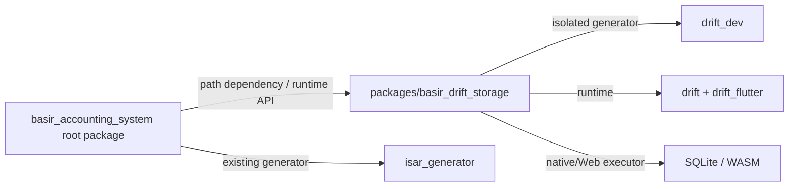

# تصميم حزمة `basir_drift_storage` الداخلية

## الهدف

تفصل الحزمة الداخلية مولد Drift وتبعياته عن root package الذي يثبت `isar_generator 3.1.0+1`. يحل كل package تبعياته ويشغل `build_runner` الخاص به، بينما يعتمد التطبيق على API وقت التشغيل فقط.



## حدود المسؤولية

| النطاق | المسؤولية | ممنوع عليه |
|---|---|---|
| `packages/basir_drift_storage` | `BasirDatabase`، tables، DAOs، migrations، executors، DTOs محايدة، واختبارات Drift | استيراد `features/*` أو Riverpod أو Supabase أو كيان التطبيق `BarcodeConfig` |
| root `lib/features/*/data/repositories` | مكيّفات domain إلى DTOs، feature flags، واختيار implementation النشط | تعريف tables أو استيراد `drift_dev` أو تشغيل SQL مباشر |
| root `lib/core/sync` | orchestration وSupabase/contracts | تشغيل المزامنة من هذا الـSpike أو تجاوز RLS |

## واجهة الحزمة العامة

تُصدّر الحزمة `BasirDatabase` و`BarcodeConfigRecord` وDAO/مستودع تخزين محايد. يترجم `DriftBarcodeConfigRepository` داخل root بين `BarcodeConfig` و`BarcodeConfigRecord`. لذلك لا تنشأ دورة تبعيات، وتبقى إعادة استخدام الحزمة في CLI أو اختبار منفصل ممكنة.

## التبعيات

| المكان | التبعيات |
|---|---|
| root dependencies | `basir_drift_storage: path: packages/basir_drift_storage` فقط |
| root dev_dependencies | لا `drift_dev` ولا `drift` لأغراض التوليد |
| package dependencies | `flutter`, `drift`, `drift_flutter` |
| package dev_dependencies | `build_runner`, `drift_dev`, `flutter_test` |

تستخدم الحزمة Drift `2.32.x` و`drift_flutter 0.3.x` و`drift_dev 2.32.x`؛ تدعم هذه المجموعة Dart 3.5+ ولا تدخل في resolver الخاص بـIsar في root package.

## التشغيل والتوليد

```bash
cd packages/basir_drift_storage
flutter pub get
dart run build_runner build --delete-conflicting-outputs
flutter test
```

يبقى توليد Isar في جذر المشروع كما هو. أي تعديل مخطط جديد يجري أولا داخل الحزمة مع snapshots migrations، ثم يضاف adapter صغير إلى root في PR مستقل.

## Web

تحتفظ الحزمة بمنطق `DriftWebOptions` فقط. تبقى أصول `sqlite3.wasm` و`drift_worker.dart.js` في تطبيق Flutter المضيف (`web/`) وتثبت من release يطابق نسخة Drift المقفلة. لا يضيف هذا الـSpike هذه الأصول قبل نجاح lockfile والتوليد.
