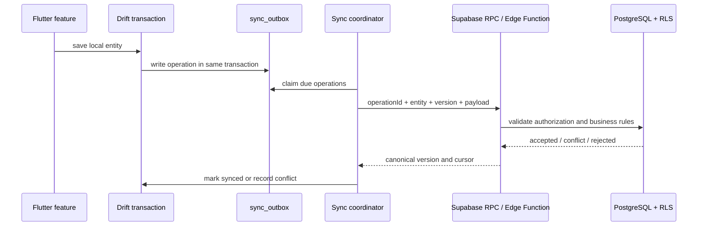

# خطة ترحيل البيانات والمزامنة: Drift إلى Supabase

**الحالة:** خطة تنفيذ؛ لا تفعل جدول `sync_outbox` ولا تبدل `SyncService` في هذا الـSpike.

## 1. فجوة الحالة الحالية

تنفذ `SyncService` الحالية مزامنة مباشرة بين Isar وSupabase لتسعة أنواع، وتعتمد Last-Write-Wins حسب `updatedAt`. هذا مناسب مبدئيًا لبيانات مرجعية محدودة، لكنه غير كافٍ بمفرده لقيود منشورة أو عمليات يجب أن تكون idempotent وقابلة للتدقيق. الانتقال إلى Drift يجب ألا ينسخ المنطق العام القائم كما هو.

## 2. نموذج المزامنة المستهدف

| جدول Drift | الغرض | الحقول الدنيا |
|---|---|---|
| `sync_outbox` | عملية محلية لم تؤكد سحابيًا | `id`, `entity_type`, `entity_id`, `operation`, `payload_json`, `attempt_count`, `next_attempt_at`, `last_error` |
| `sync_cursor` | موضع pull لكل شركة/نوع | `business_id`, `entity_type`, `cursor_timestamp`, `cursor_id` |
| `sync_conflict` | تضارب لا يحل تلقائيًا | `operation_id`, `entity_id`, `local_payload`, `remote_payload`, `reason`, `created_at`, `resolved_at` |
| `migration_manifest` | أثر ترحيل Isar إلى Drift | `feature`, `source_version`, `batch`, `row_count`, `hash`, `status`, `started_at`, `completed_at` |

## 3. عقد العملية السحابية

كل عملية outbox ترسل `operation_id` ثابتًا عبر retries، و`entity_type`، و`entity_id`، و`expected_remote_version` إن وجدت، وpayload مضبوطًا. يحتفظ PostgreSQL بسجل عمليات مقبول ذي فهرس فريد على `operation_id`؛ الإعادة تعيد النتيجة المخزنة بدل إنشاء تعديل جديد.

يستدعي العميل دالة RPC أو Edge Function مخصصة بحسب الفئة، وليس `upsert` عامًا للكيانات المحاسبية. تدوال قاعدة البيانات مناسبة للعمليات كثيفة البيانات، بينما Edge Functions مناسبة للتدفقات الشبكية/الخارجية [2]. يجب أن تبقى RLS مفعلة على كل جدول مكشوف، وأن يقتصر التنفيذ على role مصرح به [1].

## 4. سياسة التعارض

| فئة البيانات | السياسة | سبب القرار |
|---|---|---|
| إعدادات مستخدم/باركود | LWW مع تسجيل مصدر التغيير | الخطر منخفض وقابل للمراجعة |
| عملاء وموردون وبيانات مرجعية | version check ثم conflict ظاهر عند التعارض | يمنع فقد تعديلين صامتًا |
| حسابات وخطط حسابات | تغيير مضبوط بحسب `remote_version` وموافقة دور محاسبي | أثرها عابر للتقارير والقيود |
| فاتورة مسودة | version check وواجهة حل تضارب | لا يفترض أن آخر جهاز هو الصحيح |
| قيد منشور/سند مرحل | غير قابل للتعديل؛ تصحيح بقيد عكسي أو دالة محاسبية | يحافظ على أثر التدقيق والقيد المزدوج |

## 5. ترتيب ترحيل البيانات من Isar

1. ينشئ التطبيق backup واضحًا لقاعدة Isar قبل أي محاولة، ولا يحذف المصدر.
2. تستخرج أداة داخلية نسخة JSON بإصدار schema وhash لكل batch؛ لا تصدر أسرارًا من secure storage.
3. تتحقق الأداة من UUIDs، التواريخ، enums، uniqueness، والمبالغ قبل أي إدخال Drift.
4. تستورد batch واحدًا داخل transaction Drift، ثم تتحقق من row count وhash ومجاميع مالية عند الحاجة.
5. تسجل `migration_manifest` بالنجاح فقط؛ يعاد تشغيل batch فاشل بأمان باستخدام key/manifest.
6. يبدأ dual-read المقارن ثم dual-write فقط للميزات منخفضة المخاطر.
7. لا يبدل provider ولا يوقف Isar قبل مرور مراقبة إنتاجية وقرار قبول منفصل لكل feature.

## 6. خطة تنفيذ المزامنة

| المرحلة | المخرج | شرط البدء | شرط الخروج |
|---|---|---|---|
| S0 | جداول outbox/cursor/conflict ومجرد interfaces | قاعدة Drift generated ومختبرة | لا تأثير في التطبيق |
| S1 | `BarcodeConfig` local-only + manifest | اختبار adapter | تكافؤ Isar/Drift في عينة |
| S2 | pull-only للبيانات المرجعية | RLS/indexes/RPC مراجعة | cursor قابل للاستئناف |
| S3 | push idempotent للإعدادات | اختبار الشبكة وإعادة المحاولة | لا duplication في retry |
| S4 | dual-write للحسابات والسنوات | معاملات version/role | totals وقيود تكافؤ ناجحة |
| S5 | posting RPC للقيود والسندات | مراجعة محاسبية وأمنية | append-only/audit trail مثبت |

## 7. متطلبات Supabase قبل S2

- تفعيل RLS لكل جدول مكشوف وإنشاء policies صريحة للـ`authenticated` role؛ لا يكفي publishable key وحده [1].
- إنشاء فهارس على `business_id`, `server_updated_at`, `remote_version` وأي أعمدة تستعملها policies.
- حجب دوال القيد والعكس افتراضيًا ثم منح التنفيذ لدور محدد فقط؛ توصي وثائق Supabase بتقييد privileges للدوال [2].
- منع service-role من تطبيق Flutter نهائيًا.
- ترقيم استجابات pull مع `(server_updated_at, id)` بدل timestamp منفرد لتفادي فقد سجلات متساوية الزمن.

## المراجع

[1]: https://supabase.com/docs/guides/auth/row-level-security — Row Level Security
[2]: https://supabase.com/docs/guides/database/functions — Database functions and security
[3]: https://supabase.com/docs/reference/javascript/rpc — RPC and Data API privileges
