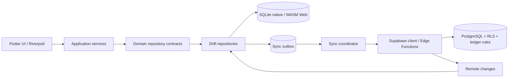

# التصميم المستهدف: Drift + SQLite/WASM + Supabase

**الحالة:** قرار هندسي للـSpike المحلي، لا تغيير إنتاجي حتى الآن.
**قاعدة البداية:** `04a00e2f56d711098008098c3147e71b20cc5e79` من PR #52 Draft.
**المبدأ:** Drift هو مخزن العمل المحلي offline-first؛ Supabase/PostgreSQL هو مصدر الحقيقة المشترك ومحرّك الصلاحيات والمزامنة. لا تحل قاعدة محلية محل قواعد القيد المزدوج أو Row Level Security في الخادم.

## 1. البنية المستهدفة

تمنع هذه البنية وصول الشاشات مباشرة إلى ORM أو Supabase. تبقى العقود في `domain/repositories` ثابتة ما أمكن، بينما تنفذ طبقة data القراءة والكتابة المحلية والمزامنة لاحقًا.

## 2. تنظيم المجلدات المقترح

| المسار | المسؤولية |
|---|---|
| `lib/core/persistence/drift/basir_database.dart` | `@DriftDatabase` والجداول المشتركة و`MigrationStrategy` |
| `lib/core/persistence/drift/connection/` | إنشاء `QueryExecutor` متعدد المنصات؛ لا تستورد `dart:io` في الكود المشترك |
| `lib/core/persistence/drift/tables/` | تعريفات tables ومفاتيح وفهارس وقواعد SQLite |
| `lib/core/persistence/drift/daos/` | استعلامات SQL/Drift فقط، بلا منطق واجهة أو شبكة |
| `lib/core/sync/` | outbox، checkpoints، تعارضات، retry وتسجيل الأحداث |
| `lib/features/*/data/drift/` | مكيّفات Drift التي تنفذ عقود domain الحالية |
| `test/drift/` و`drift_schemas/` | snapshots، اختبارات migrations، واختبارات التكافؤ |

## 3. العقد بين المحلي والسحابي

| المكوّن | المسؤولية المحلية | المسؤولية السحابية |
|---|---|---|
| المعرفات | `UUID` نصي يولَّد قبل الحفظ | قبول المعرف نفسه ومنع التعارض بقاعدة فريدة |
| المال | `amount_minor INTEGER` مع `currency_code` | `BIGINT` + `NUMERIC` للعرض فقط، وقيود تحقق |
| القيد اليومي | منع السطور السالبة وحفظ transaction متزن | منع نشر قيد غير متزن، وقفل/ترحيل مركزي |
| المزامنة | outbox غير قابل للفقد + retry idempotent | RPC/Edge Function idempotent وRLS وسجل تدقيق |
| الحذف | `deleted_at` أو tombstone للمزامنة | احتفاظ وسجل تدقيق، لا حذف مادي للقيود المنشورة |

## 4. قواعد المخطط غير القابلة للتفاوض

1. لا يستخدم أي مبلغ مالي `double`؛ يستخدم `int amountMinor` محليًا و`BIGINT` في PostgreSQL.
2. كل جدول قابل للمزامنة يحتوي `id`, `business_id`, `created_at`, `updated_at`, `deleted_at`, `remote_version`, و`sync_state` وفق الحاجة.
3. كل جدول يقدم قيود `PRIMARY KEY` و`FOREIGN KEY` و`UNIQUE` وindexes المتطابقة مع الاستعلامات؛ تفعّل `PRAGMA foreign_keys = ON` عند الفتح.
4. لا يتحول القيد إلى `posted` قبل transaction تحسب توازن المدين والدائن؛ ويعاد التحقق داخل PostgreSQL.
5. لا يصل أي مفتاح service-role إلى Flutter. تستدعي المزامنة Edge Functions أو RPC محمية بـRLS.
6. لا تستخدم WAL كافتراض على Web؛ لا تفترض أن مخزن المتصفح يدعم نفس خصائص الملف المحلي.

## 5. الاتصال متعدد المنصات

سيستخدم الـSpike `drift_flutter` للمنصات المحلية و`DriftWebOptions` للـWeb. تحفظ `sqlite3.wasm` و`drift_worker.dart.js` من نفس إصدار Drift المقفل في `web/`. في بدء Web، يسجل التطبيق `chosenImplementation` و`missingFeatures` ويمنع وضع بيانات محاسبية حرجة إذا حصل على `unsafeIndexedDb` أو `inMemory`.

لا تفعّل COOP/COEP في الإنتاج ضمن هذا الـSpike؛ تضاف بعد اختبار Google Sign-In وتدفقات النوافذ المنبثقة. يجب أن يقدم النشر `sqlite3.wasm` بوسيط `application/wasm`.

## 6. ترتيب الترحيل الفعلي

| الموجة | النطاق | نمط التشغيل | بوابة الخروج |
|---|---|---|---|
| 0 | بنية Drift فقط | لا مسار تطبيق يستعملها | توليد + تحليل + بناء Web |
| 1 | `barcode_config` و`business_settings` | dual-read مقارن، Isar مصدر التشغيل | تكافؤ بيانات ومراقبة أخطاء |
| 2 | الحسابات والسنوات المالية | dual-write مع outbox | قيود uniqueness ومجاميع أرصدة متطابقة |
| 3 | العملاء والموردون والمخزون والفواتير | نقل عمودي حسب feature | ترحيل قابل للاستئناف لكل feature |
| 4 | القيود، السطور، السندات، التقارير | Drift مصدر التشغيل بعد تكافؤ صارم | اختبارات القيد المزدوج والتدقيق ناجحة |
| 5 | إزالة Isar | بعد إصدار مستقر ومراقبة ونسخ احتياطي | موافقة بشرية منفصلة وخطة restore مجربة |

## 7. استراتيجية البيانات والعودة

تنتج أداة ترحيل ذات إصدار JSON أو batches محددة: `extract -> validate -> import transaction -> verify -> mark migration`. تحفظ نتيجة كل batch، hash/row counts ومجاميع مالية قبل وبعد. لا تحذف ملف Isar أو بياناته خلال مدة الدعم. عند الفشل، تعود feature flag إلى adapter Isar وتحتفظ بقاعدة Drift للتشخيص؛ لا يحدث أي rollback مادي للبيانات.

## 8. بوابات القبول

| البوابة | شرط النجاح |
|---|---|
| توليد | `build_runner` نظيف، وملفات Drift generated متتبعة كما تقرر السياسة |
| التحليل والاختبارات | لا أخطاء analyzer، واختبارات وحدات وmigrations وتكافؤ ناجحة |
| Android/iOS/Desktop | فتح قاعدة، علاقات، transaction وملف قاعدة فعلي |
| Web | `flutter build web` ناجح، WASM/worker موجودان، وفحص مخزن المتصفح موثق |
| البيانات | row counts وhashes ومجاميع كل حساب متطابقة في migration عينة |
| المزامنة | retries idempotent ولا duplication، RLS وserver validation مثبتان |
| التراجع | feature flag مثبت ومسار العودة واختبار الاستعادة ناجحان |

## المراجع

[1]: https://drift.simonbinder.eu/platforms/ — Drift supported platforms
[2]: https://drift.simonbinder.eu/platforms/web/ — Drift Web/WASM requirements
[3]: https://drift.simonbinder.eu/migrations/ — Drift migration tooling
[4]: https://supabase.com/docs/guides/database/overview — Supabase PostgreSQL foundation
[5]: https://supabase.com/docs/guides/auth/row-level-security — Supabase Row Level Security
