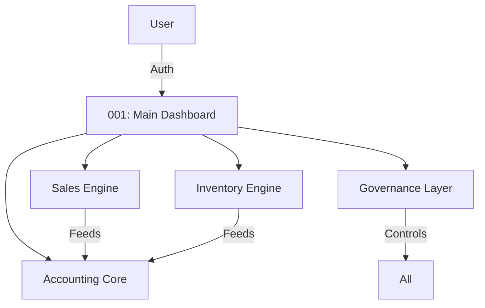

# Functional Architecture Specification

**Version:** 1.0 (Diamond Standard)
**Basis:** Deep Analysis of Legacy Visuals (001-099)
**Scope:** Functional Decomposition & Critical Path Analysis

---

## 1. Architectural Overview

The system is composed of five distinct yet tightly integrated engines.
Each engine corresponds to a specific "Cognitive Domain" within the screenshots.

### 1.1 High-Level Topology

---

## 2. Core Engines Analysis

### 2.1 The Sales & Revenue Engine

**Purpose:** High-velocity transaction processing.
**Evidence:**

- **Invoicing**: Screens 003, 004, 006 (Rich detail, column options).
- **Workflow**: Quotes -> Orders -> Invoices (Screen 015).
- **Pricing**: Complex strategies (Screen 021, 035, 050).
- **Output**: Advanced Printing (041, 044, 096).

**Engineering Inference:**
The Sales Engine is decoupled from the GL (General Ledger) until "Posting". It supports Drafts (015) and Editability (006), implying a tailored state machine (`Draft` -> `Posted` -> `Void`).

### 2.2 The Inventory & Material Engine

**Purpose:** Physical goods tracking and valuation.
**Evidence:**

- **Item Master**: Screens 009, 047, 074 (Deep metadata, categorization).
- **Control**: Adjustments (023), Barcodes (024, 098).
- **Units**: Multi-UOM support (049, 091).

**Engineering Inference:**
The system supports a relational Inventory model independent of the GL. Valuation (FIFO/Avg) happens at the "Costing Layer" (Screen 057).

### 2.3 The Accounting Core (The Sentinel)

**Purpose:** The immutable record of truth.
**Evidence:**

- **Structure**: Chart of Accounts (077).
- **Input**: Journal Entries (063, 067), Opening Balances (068).
- **Control**: Cash Reconciliation (069, 070).
- **Reporting**: Trial Balance (implicit), Balance Sheet (057), Profit/Loss (054).

**Engineering Inference:**
This is the heart of the system. It receives "Events" from Sales/Inventory and transmutes them into "Journal Entries". The "Repair" screen (069) suggests a self-healing capability for ledger integrity.

### 2.4 The Governance & Configuration Layer

**Purpose:** System definition and constraints.
**Evidence:**

- **Identity**: Branding (037, 095).
- **Security**: Users & Permissions (092, 093), Backups (027, 033).
- **Compliance**: Tax/E-Invoice (034, 097).
- **Licensing**: Activation & Fingerprinting (099).

**Engineering Inference:**
A highly configurable "Meta-Data" layer. The system is designed to be white-labeled or adapted to various business identities without code changes.

---

## 3. Data Flow Dynamics

1.  **Input**: User creates an Invoice (003).
2.  **Process**: Pricing Logic (021) calculates totals. Tax Logic (097) applies VAT.
3.  **Impact 1 (Inventory)**: Stock is decremented (074).
4.  **Impact 2 (Ledger)**: AR Debited, Sales Credited, Tax Credited (063).
5.  **Output**: Document printed (044) and Metrics updated (016).

---

_This architecture serves as the blueprint for the Rust Service Implementation._
