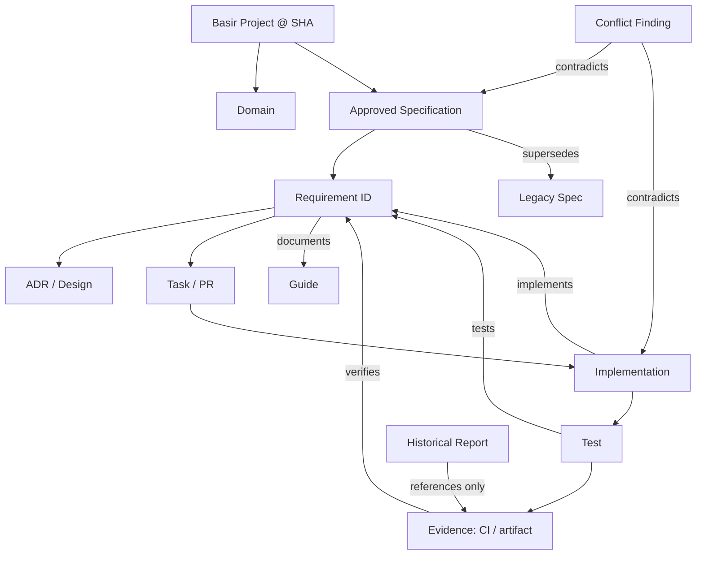

# تقرير نزاهة المعرفة والتوثيق — BKIP v1.0

> **المشروع:** Basir Accounting
> **لقطة التدقيق:** `31773a151031747a522595567844c9709d2f0e8e` بتاريخ 2026-08-13
> **نطاق الجرد:** 1,256 أصلًا توثيقيًا متعقّبًا في Git، مع تحليل منفصل لـ1,159 ملفًا نصيًا/توثيقيًا لصالح ادعاءات الحالة والتكرار.
> **طبيعة النتيجة:** تدقيق أدلة، لا شهادة امتثال أو جاهزية إنتاج.

## 1. الملخص التنفيذي

منظومة معرفة Basir غنية جدًا في **الكمّ** لكنها لا تزال منخفضة النضج من حيث **السلطة والتتبّع**. توجد مواصفة رئيسة تُعلن نفسها مصدر الحقيقة الوحيد، وخرائط تنفيذ أحدث، وتقارير حالة تاريخية، وREADME تسويقي يعلن اكتمالًا واسعًا. إلا أن هذه الطبقات لا تُدار بعقد سلطة واحد ولا تتشارك معرّفات متطلبات واختبارات وأدلة تنفيذ. لذلك لا يجوز حاليًا اعتبار أي ادعاء عام مثل «جاهز للإنتاج» أو «متوافق مع ZATCA Phase 2» حكمًا قابلًا للتحقق على مستوى النظام. [1] [2] [3]

المشكلة المركزية ليست نقص الشرح؛ بل **تنافس مصادر الحقيقة**. فالـREADME يعلن اكتمال الوحدات والامتثال والجودة، بينما خارطة التنفيذ المعتمدة في 13 أغسطس 2026 تصف مرحلة أساس مكتملة فقط، وتضع المراحل الجوهرية للفواتير والمخزون والحسابات والتقارير والإدارة لاحقة. كما أن تدفقات ZATCA في التنفيذ تحمل دلالة صريحة على المحاكاة، لا ربط إنتاجي مثبت. [2] [4] [5]

> **الحكم النهائي:** حقيقة المستودع عند SHA المحدد — الكود، اختبارات محددة، الترحيلات، الإعداد، وسجل CI — هي المصدر الأعلى للحقائق التنفيذية. أما المواصفة الرئيسة النشطة فهي مصدر النية الهندسية **بعد** أن تُجزّأ إلى متطلبات ذات معرّفات وتربط بأدلة. لا توجد حاليًا وثيقة واحدة تجمع النية والتنفيذ والاختبار والحالة من دون تعارض.

| المحور | التقييم | النتيجة المختصرة |
|---|---:|---|
| الدقة | 4/10 | توجد حقائق صحيحة عن Flutter/Rust/Isar وقواعد دفتر الأستاذ، لكن ادعاءات كاملة واسعة غير مدعومة أو متقادمة. |
| الاتساق | 3/10 | تتعارض حالة الإنتاج وZATCA والبنية الخلفية ورموز الواجهة وحالة المهام بين وثائق نشطة وتاريخية. |
| الاكتمال | 6/10 | تغطية المجالات واسعة، لكن تغيب عقود الحوكمة وADR وسجل أدلة موحد وقاموس بيانات تشغيلي. |
| التتبّع | 2/10 | معرّفات مثل `FR-ACC-*` موجودة في الكود، لكنها ليست معرّفة في المواصفة ولا مرتبطة باختبارات بصورة منهجية. |
| الحداثة | 3/10 | تاريخ الكود وخارطة 2026-08 أحدث بكثير من عدة تقارير «نهائية» من 2025/2026-01. |
| القابلية للاختبار | 4/10 | بعض الضوابط تملك اختبارات، لكن متطلبات الامتثال والأمن وادعاءات الاكتمال لا تملك أدلة قبول موحدة. |
| قابلية الاكتشاف | 4/10 | كثرة الأدلة والتقارير تعيق العثور على المرجع الحاكم، رغم وجود فهارس متفرقة. |
| القابلية للصيانة | 3/10 | توجد نسخ متطابقة وتقارير نهائية متعددة بلا سياسة إحلال أو أرشفة نافذة. |
| وضوح السلطة | 2/10 | «Single source of truth» معلن في أكثر من مكان، لكن لا توجد هرمية مُطبّقة أو بوابة مراجعة. |
| سلامة المعمارية التوثيقية | 4/10 | الهيكل يحتوي طبقات مفيدة، إلا أنه يخلط المواصفات والخطط والتقارير والحالة في مساحات متجاورة. |
| **مجموع نظام التوثيق** | **35/100** | **مخزون معرفة قوي، ونظام سلطة وتتبّع يحتاج إعادة تأسيس منضبطة.** |

## 2. منهج التدقيق وحدوده

استُخدم `git ls-files` للجرد بدل شجرة العمل وحدها؛ لذلك يغطي الجرد الأصول المعقّبة في المستودع. جرى فحص المواصفة الرئيسة كاملة، والوثائق الجذرية ذات السلطة الظاهرية، وخارطة التنفيذ الأحدث، ومصادر Dart/Rust المختارة، والترحيلات، وملفات الاختبار، وآخر نتائج CI. لا يعني عدم ظهور دليل في البحث إثبات عدم وجود السلوك في كل موضع؛ يصنّف ذلك **غير متحقق** ما لم يكن الادعاء محددًا وتم البحث عن موضعه التنفيذي المباشر. [6]

تعذّر تنفيذ Flutter وCargo داخل بيئة التدقيق لعدم توفرهما فيها؛ لذا لا يحل هذا التقرير محل تنفيذ اختبارات نظيفة على النسخة المقصودة. استُخدمت نتائج CI الحديثة كدليل خارجي مساعد: مرّ Flutter CI، لكن Quality Gates وDocumentation Check وEnhanced CI فشلت على SHA قريب حديث، مع فشل بوابات الاختبار/التوثيق/الجودة ضمن بعض سير العمل. هذا ينفي صلاحية ادعاء نجاح شامل غير مؤرخ، ولا يثبت عيبًا وظيفيًا بعينه من دون قراءة سجل المهمة الفاشلة. [7]

## 3. جرد الوثائق والطوبولوجيا

يسجل `DOCUMENT_CENSUS.csv` لكل أصل: المعرّف والمسار والعنوان والنوع والموقع والحجم والحالة المرشحة وآخر تعديل في Git والمجال والمواصفة المرتبطة المرشحة ومستوى السلطة. لا يستنتج هذا الجرد ربط الكود أو الاختبار من اسم الملف؛ تُترك تلك الخانة صراحةً لمصفوفة التتبّع، منعًا لارتباطات وهمية. [6]

| طبقة موجودة | الملاحظة | الوظيفة الصحيحة المقترحة | الخطر الحالي |
|---|---|---|---|
| `.kiro/specs/active/` | تضم المواصفة الرئيسة وموضوعات UI/اختبارات نشطة. | نية ومتطلبات قيد التنفيذ فقط. | مسمّاة «نشطة» رغم وجود ادعاءات اكتمال غير محكومة بالأدلة. |
| `.kiro/specs/completed/` | تضم حزم requirements/design/tasks. | سجل قرار/تسليم مكتمل مع دليل قبول. | لا توجد قاعدة ظاهرة تلزم رابط نتائج القبول قبل النقل. |
| `.kiro/specs/archived/` | 235 ملف Markdown تقريبًا. | تاريخ غير حاكم قابل للبحث. | بعض النسخ التاريخية تشبه وثائق الحالة الحية. |
| `.kiro/specs/planning/` | تخطيط متنوع. | خطط غير ملزمة حتى اعتمادها. | يتداخل مع الوثائق الاستراتيجية وخطط المهام في `docs/`. |
| `.kiro/docs/` و`docs/` | أدلة وتقارير وقوالب وحالة واستراتيجية. | توثيق تشغيلي، مع فصل واضح بين الحاكم والتاريخي. | تضخم التقارير وفهارس متعددة وادعاءات حالة متنافسة. |
| الجذر | README وARCHITECTURE وTECHNICAL_SPEC وSECURITY. | بوابة اكتشاف قصيرة ومحدّثة. | README يحمل وعود نطاق/امتثال/اختبار أوسع من الأدلة المؤرخة. |

## 4. هرمية السلطة ومصدر الحقيقة

| المستوى | الأصل الحاكم | قاعدة الاستعمال |
|---:|---|---|
| 0 | واقع المستودع عند SHA: كود، ترحيلات، إعداد، اختبارات، سجلات CI | يحسم **ما يعمل أو ما يثبت تنفيذه**. عند التعارض يُسجل فرق ولا يُعاد تفسير الكود على أنه نية. |
| 1 | متطلبات معتمدة، ذات معرّف وإصدار ومالك ومعيار قبول | تحسم **ما ينبغي بناؤه**. لا تصبح حاكمة قبل ربطها بمسار قرار/موافقة. |
| 2 | تصميم/ADR ومخططات عقود البيانات والأمن والتكامل | تحسم **كيف يُبنى** عندما لا تتعارض مع المستوى 1 أو 0. |
| 3 | خطة التنفيذ والمهام | تحسم **ترتيب العمل**، ولا تثبت الاكتمال. |
| 4 | أدلة التطوير والمراجع والقوالب | تشرح وتسهّل، ولا تُنشئ التزامًا جديدًا. |
| 5 | تقارير الحالة والجلسات والإنجاز والتدقيق والأرشيف | أدلة مؤرخة قابلة للطعن، ولا تُستخدم مصدرًا للحالة الحالية. |

**القرار الصريح عند التعارض:** إذا تعارض README أو Master Specification أو Active Spec مع الكود/الاختبار/الإعداد على SHA محدد، فالأخير هو الحقيقة عن السلوك الحالي. وإذا تعارضت النية المطلوبة مع ذلك السلوك، تحرر فجوة أو تغيير مطلوب؛ لا يُحوّل الادعاء النصي تلقائيًا إلى حقيقة تنفيذية. المواصفة الرئيسة تصبح المصدر الحاكم للنية فقط بعد الإصلاحات المقترحة أدناه.

## 5. تدقيق المواصفة الرئيسة

| وثيقة | الحكم | الأدلة/الفجوة | الإجراء |
|---|---|---|---|
| `00_SPECIFICATION_MANIFESTO` | **جزئي** | يعلن ACID وhash chain وIFRS/ZATCA وSharia كحقائق أو مبادئ، لكن لا يحمل معرّفات قبول أو حدود دعم. | تحويل المبادئ إلى `NFR-*` قابلة للقياس، وفصل الرؤية عن المتطلبات المنفذة. |
| `01_FUNCTIONAL_ARCHITECTURE` | **جزئي ومتضارب** | أسماء خدمات وميزات موجودة بدرجات متفاوتة، لكن جدول «Complete» واسع؛ لا يوجد `ForensicService` بالاسم في المصدر، كما أن المسار الحالي للواجهة ما زال خارطة مراحل. | استبدال حالة كل ميزة برابط اختبار/PR/دليل، وإبقاء المحاكاة ظاهرة. |
| `02_ACCOUNTING_ENGINE` | **أفضل وثيقة نطاقية، لكنها غير مكتملة التتبّع** | التوازن والقفل والعكس حاضرة في `AccountingService`؛ نموذج السطر لا يفرض صراحةً حد سطرين أو منع المدين والدائن معًا. | إنشاء سجل invariants مرقّم واختبارات خاصية لكل قاعدة. |
| `03_DATA_SCHEMA` | **منجرف جزئيًا** | `JournalEntryModel` الفعلي يضيف حقولًا ويجعل `sourceDocument` و`sourceId` إلزاميين ويخزن Decimal كسلاسل؛ النص يصف مزيج Isar/PostgreSQL مبسطًا. | فصل مخطط Isar عن عقد PostgreSQL، وتوليد قاموس بيانات من النماذج/الترحيلات. |
| `04_UI_DESIGN_SYSTEM` | **متضارب** | يشير إلى ملفات tokens غير المطابقة ويحدد Teal `#009688`؛ التنفيذ يعرّف `AppColors.primary = #0056B3`، وخارطة التنفيذ الأحدث تقترح `#0F6E7D`. | اختيار مصدر تصميم واحد وتوليد صفحة مرجعية منه. |
| `05_SECURITY_GOVERNANCE` | **جزئي/غير متحقق** | توجد secure storage وPermissionGuard وAuditService، لكن مواصفة bcrypt cost 12 لا تتطابق مع اختبار مصادقة يذكر SHA-256، ولا يوجد دليل على Manager PIN/rate limiting. | تحديد نموذج مصادقة واحد، وسجل ضوابط/اختبارات أمنية، وحذف بنود «مكتمل» بلا دليل. |
| `06_COMPLIANCE_ENGINES` | **جزئي؛ لا يصلح لإعلان امتثال** | توجد VAT/ZATCA/Zakat/IFRS في المصدر والاختبارات؛ خدمة ZATCA تعلن محاكاة وcrypto يحتوي mock signer، ولا يوجد GOSI في المصدر. | وسم كل متطلب: simulated/implemented/verified؛ إنشاء حزمة أدلة تنظيمية منفصلة. |
| `07_INTEGRATION_PROTOCOLS` | **جزئي** | sync fields وخدمات backup/import/export موجودة؛ لم يظهر تنفيذ `/api/v1` أو عميل REST المقترح، وGoogle Drive ما زال يحتاج دليلاً تشغيليًا. | نقل endpoints إلى API contract مخطط، وعدم عرضه كتنفيذ. |
| `08_FORENSIC_ATLAS_INDEX` | **غير متحقق ومضخم** | يحصي 91 شاشة مكتملة و92% إجمالًا، دون ربط مستقر لمسارات شاشة/اختبار/PR أو معيار قبول. | تحويله إلى سجل features مرقّم، واختبار كل شاشة/تدفق قبل «Complete». |

## 6. مصفوفة التتبّع ومتطلبات الجودة

المصفوفة التفصيلية في [`REQUIREMENTS_TRACEABILITY_MATRIX.md`](REQUIREMENTS_TRACEABILITY_MATRIX.md). الخلاصة أن معرّفات `FR-ACC-*` تظهر في الكود، بينما لا تظهر في مواصفات BKIP التي ينبغي أن تعرّفها؛ أي أن السلسلة تبدأ أحيانًا من الكود بدل المتطلب. هذا انقطاع مباشر في: `SPECIFICATION → REQUIREMENT → DESIGN → TASK → CODE → TEST → EVIDENCE`. [8]

| المتطلب/القاعدة | الحالة | سبب الحكم |
|---|---|---|
| توازن القيد عند الترحيل | IMPLEMENTED | `JournalEntry.isBalanced` وفحص صريح قبل النشر واختبارات توازن. |
| رفض فترة مغلقة أو مقفلة | IMPLEMENTED | `FinancialYearService.canPostToDate` مستدعى قبل الترحيل واختبارات تكامل للفترة المغلقة. |
| عكس قيد مرحّل | PARTIAL | ينشئ التطبيق قيدًا معاكسًا، لكن لا يظهر من المسار المراجع تحديث حالة الأصل إلى voided أو منع عكس مكرر في هذه الطبقة. |
| حد أدنى سطرين ومنع debit+credit معًا | UNVERIFIED / GAP | النص يطلبه، لكن كيان `JournalEntryLine` و`isBalanced` وحدهما لا يفرضان الشرطين. |
| hash chain إلزامية لكل قيد | PARTIAL | حقولا hash/previousHash اختياريان، وتوجد خدمة/اختبارات جنائية منفصلة؛ الربط الإلزامي بكل عملية نشر غير مثبت. |
| ZATCA إنتاجي/إرسال قريب من الزمن الحقيقي | PARTIAL — SIMULATION | مسار محاكاة موثق صراحةً؛ لا دليل تكامل اعتماد إنتاجي. |
| GOSI | MISSING | المواصفة نفسها تسميه مستقبلًا ولم يظهر مصدر GOSI. |
| API `/api/v1` | MISSING | لا يوجد دليل عميل/endpoint تنفيذي في المصدر المفحوص. |
| RBAC مصفوفة نصية | PARTIAL | guard وpermissions موجودان، لكن المصطلحات والأدوار والمصفوفة لا تملك تحقق قبول شامل. |

## 7. تدقيق Spec ↔ Code

| الادعاء | واقع التنفيذ المرصود | الحالة | المخاطرة |
|---|---|---|---|
| «Flutter + Rust + Isar» | جذور `lib/` و`rust/` و`JournalEntryModel @collection` موجودة. | VERIFIED (النطاق التقني فقط) | منخفضة. |
| «القيود متوازنة» | فحص `isBalanced` في خدمة المحاسبة قبل `addJournalEntry`. | VERIFIED | يلزم اختبار مسار repository/transaction كذلك. |
| «مخزن Isar/PostgreSQL» | نماذج Isar وترحيلات Rust/PostgreSQL كلاهما موجودان، لكن العقد بينهما غير موثق كمرجع واحد. | PARTIAL | انحراف/تعارض مخطط أو مزامنة. |
| «النظام التصميمي teal/glass» | GlassCard موجود، لكن التوكنات والألوان والمسارات تخالف المواصفة. | CONTRADICTED | تذبذب بصري ونمو واجهات غير موحد. |
| «bcrypt cost 12» | توجد إشارة bcrypt واحدة، بينما اختبار محلي يذكر SHA-256؛ لا يكفي ذلك لتقرير طريقة إنتاجية آمنة. | CONTRADICTED / UNVERIFIED | خطر مصادقة وتوثيق أمني مضلل. |
| «ZATCA Phase 2» | XML/UBL/QR وZATCA Rust موجودة، لكن onboarding/reporting محاكيان وموقّع mock ظاهر في المصدر. | PARTIAL | خطر قانوني/تسويقي إن وصف بالامتثال. |
| «Google Drive encrypted cloud backup» | يوجد CloudBackupService وشاشات مرتبطة، لكن لا توجد أدلة قبول/استعادة أو عقد OAuth/تشفير تشغيلية في العينة. | UNVERIFIED | خطر فقد بيانات أو توقعات مستخدم غير دقيقة. |

## 8. تعارض الوثائق وانجرافها

| المعرف | الشدة | الادعاء المتعارض | الواقع/التعارض | التوصية |
|---|---|---|---|---|
| BKIP-001 | حرج | README يعلن كل الوحدات الأساسية وZATCA والجاهزية للإنتاج. | خارطة 2026-08 تصف إنجاز 0.1–0.4 فقط وتؤجل تدفقات محاسبية/تقارير/إدارة إلى مراحل 1–5. | إعادة كتابة README كـ«حالة موثقة بتاريخ»، مع رابط خارطة التنفيذ وحالة كل مجال. |
| BKIP-002 | حرج | امتثال ZATCA يُعرض بعلامة ✅ وبوصف متكامل. | مواصفة التكامل ومسار التطبيق يصفان المحاكاة؛ لا توجد حزمة أدلة اعتماد إنتاجي. | استبدال العبارة بـ«قدرات محاكاة ZATCA قيد التحقق»، إلى أن تتوافر أدلة. |
| BKIP-003 | عالٍ | مواصفة UI توصي Teal `#009688`، وخارطة التنفيذ `#0F6E7D`. | الكود يعرّف primary `#0056B3`. | ADR تصميم واحد، وتحديث الكود/المواصفة من مصدر tokens موحد. |
| BKIP-004 | عالٍ | وثيقة الأمن تطلب bcrypt cost 12. | اختبار المصادقة المحلي يذكر SHA-256؛ لا يوجد تقرير سياسة كلمات مرور حاكم. | توحيد التصميم والتنفيذ، ثم اختبار ترقية/تخزين كلمات المرور. |
| BKIP-005 | عالٍ | `FINAL_STATUS` يعلن 8 وكلاء و4 نماذج MLOps ومجلدات متعددة نشطة 100%. | هيكل HEAD لا يظهر جذور `agents` أو`mlops` أو`analytics` المذكورة في الوثيقة، والوثيقة مؤرخة 2025-12. | نقلها إلى archive مع بيان أنها تقرير جلسة تاريخي، لا حالة حالية. |
| BKIP-006 | متوسط | وثائق حالة متعددة تعلن أعداد اختبارات وتغطية مختلفة (822+، 886+، 1189/1192). | تختلف اللقطات والزمن ولا يوجد سجل قياسات حاكم مرفق بالـSHA. | الاعتماد على artifact CI مؤرخ لكل ادعاء، ومنع الأعداد الثابتة في README. |
| BKIP-007 | متوسط | `03_DATA_SCHEMA` يصف أنواعًا وحقولًا وعقد بيانات موحدًا. | Isar يحول Decimal إلى String ويحتفظ بحقوق وحقول إضافية، وترحيلات PostgreSQL لها بنية مستقلة. | قاموس بيانات source-generated وعقود تحويل صريحة. |

## 9. التكرار وقيمة الوثائق

أنتج الفحص خمسة مجموعات تكرار محتوى مطبّع متطابق و17 تصادمًا في العناوين. هذه **مرشحات للمراجعة** لا أوامر حذف. تشمل النسخ المتطابقة `FINAL_STATUS` و`BLUEPRINT_STATUS` تحت مسارين، وتقارير/سجلات جودة متطابقة. [9]

| الأصل/المجموعة | التصنيف | الإجراء |
|---|---|---|
| `.kiro/FINAL_STATUS.md` و`.kiro/docs/reports/FINAL_STATUS.md` | تكرار خطير لحالة تبدو حية | احتفظ بنسخة مؤرشفة واحدة، وحوّل الأخرى إلى redirect أو احذف بعد إصلاح الروابط والموافقة. |
| `.kiro/BLUEPRINT_STATUS.md` ونسخته في التقارير | تكرار مرجعي/تاريخي | دمج مع مسار تاريخ واحد ورابط إحالة. |
| تقارير `logs/reports` المتطابقة | تكرار مخرجات آلي | الاحتفاظ باسم snapshot واحد وسياسة احتفاظ زمنية. |
| ملفات حالة الاعتمادات المتطابقة في `docs/archive` والجذر | أرشيف مفيد مكرر | الإبقاء في الأرشيف وإزالة النسخة الجذرية بعد توثيق الأصل. |
| تصادمات العنوان | غير محسوم | قارن السلطة والتاريخ والنطاق قبل أي نقل. |

## 10. تدقيق الحالة، النشط/المكتمل/المؤرشف، وتطور النسخ

توجد 19 وثيقة Markdown تقريبًا تحت active، و11 تحت completed، و17 تحت planning، و235 تحت archived في مساحة المواصفات. المكان وحده لا يثبت الوضع. الوثائق التاريخية ذات صفة «final»، «100%»، و«production ready» تحتاج إعادة تصنيف إلى **Historical Claim** ما لم يتصل بها SHA ونتيجة قبول قابلة لإعادة التشغيل.

| المجموعة | الحكم | التصنيف المقترح |
|---|---|---|
| `basir_master_specification` | نية مفيدة لكن تحتوي فرضيات/حالات واسعة غير مربوطة بالأدلة. | ACTIVE — NEEDS REBASE، لا MASTER SOURCE حتى إصلاح التتبّع. |
| `ui-ux-improvements` | مجموعة ضخمة «معتمدة وجاهزة للتنفيذ» بينما خارطة تنفيذ أحدث تنفذ جزءًا من الأساس. | ACTIVE أو PLANNING حسب كل requirement، مع إزالة الادعاء العام. |
| `widget-tests-phase3` | ملف requirements منفرد. | PLANNING/ACTIVE؛ يحتاج design/tasks/evidence أو أرشفة القرار. |
| `accounting-standards-framework` تحت completed | غني بالتحليل والمهام، ولا تظهر من الاسم أدلة قبول موحدة. | COMPLETED — REVERIFY قبل استخدامه سلطة. |
| `i18n-localization-system` تحت completed | منطقي تاريخيًا، لكن يحتاج نتيجة CI/تغطية مرتبطة بالـSHA. | COMPLETED — EVIDENCE REQUIRED. |
| `.kiro/FINAL_STATUS` و`BLUEPRINT_STATUS` | تقريرا ديسمبر 2025 مع ادعاءات بنية غير ظاهرة على HEAD. | ARCHIVE. |
| خارطة التنفيذ العربية 2026-08 | أحدث تنظيم تشغيلي واضح ومؤرخ. | ACTIVE PLAN، لا مصدر حقيقة للسلوك دون نتائج CI/PR. |

## 11. تدقيق المجالات الخاصة

### 11.1 المحاسبة

المواصفة المحاسبية تسجل قواعد مهمة: التوازن، الإقفال، العكس، العملة، والتسلسل الجنائي. التحقق الفعلي أقوى في التوازن وقفل الفترة وعكس القيد، لكنه لا يثبت كل invariants المعلنة. أخطر فجوة هي أن الشرط «سطران على الأقل ولا مدين ودائن معًا» موجود نصًا ولا يظهر كتحقق نطاقي إلزامي في نموذج السطر المراجع. يجب ألا يعتمد محرك مالي على أن التوازن وحده كافٍ؛ إذ يمكن لقيد صفري أو سطر واحد بمدين/دائن متساويين أن يكون متوازنًا حسابيًا لكنه غير صحيح نطاقيًا. [10] [11]

### 11.2 الأمن

الوثائق تخلط بين الوضع الحالي والمستقبلي: JWT مستقبلية، rate limiting مستقبلية لكنها موضوعة بعلامة مكتملة، وbcrypt محدد بينما يوجد دليل اختبار محلي على SHA-256. توجد بوابات CI ومراجع CodeQL وDependabot ومسح أسرار، لكن أحدث مجموعة سير عمل تتضمن إخفاقات في بوابات أمن/جودة ضمن بعض runs. النتيجة **لا تسمح** بتقدير مستوى أمان أو امتثال معياري؛ المطلوب سجل ضوابط يربط كل ضبط بتكوين واختبار ونتيجة CI. [7] [12]

### 11.3 ZATCA والامتثال

المحرك يملك عناصر ذات قيمة: VAT، XML/UBL، QR، hash، واختبارات ZATCA. لكنه يحمل أيضًا دلالات تنفيذية صريحة على simulation/mock. لا توجد في الأدلة المراجعة شهادات، بيئات، نتائج اختبار توافق رسمي، أو إثبات اتصال إنتاجي؛ لذلك التصنيف الصحيح هو **PARTIAL — SIMULATION VERIFIED / PRODUCTION COMPLIANCE UNVERIFIED**. يمنع البروتوكول استعمال لفظ «Compliant» حتى يتوفر ذلك الدليل. [5] [13]

### 11.4 البنية

الوثيقة الجذرية تصف Flutter/Rust/FFI/Isar بصورة عامة صحيحة، لكن تبسيطها لا يلتقط التطور الأحدث للمزامنة/دفتر الأستاذ ولا تضبط عقود التخزين المتعدد. تعود وثيقة حالة استراتيجية إلى Go backend مخطط، في حين يوجد مسار Rust/Migrations/SQLx في المستودع. هذه ليست مشكلة في اختيار التقنية وحده؛ بل مشكلة في غياب ADR يقرر التوجه الحاكم وتاريخ سريانه. [3] [14]

## 12. المصطلحات والمعرفة المفقودة

تم إنشاء قاموس أولي في [`TERMINOLOGY_GLOSSARY.md`](TERMINOLOGY_GLOSSARY.md). من دون اسم قانوني واحد للمستند المحاسبي، ولفعل الترحيل والعكس والإلغاء، ستظل الخصائص والاختبارات والواجهات معرضة للانجراف.

| المعرفة الناقصة | لماذا هي ضرورية الآن |
|---|---|
| سجل invariants محاسبية مرقّم | يحول القواعد من جداول وصفية إلى اختبارات قبول. |
| ADR للبنية/قاعدة البيانات/المزامنة | يحسم Isar مقابل PostgreSQL وRust/Go ودرجة سلطة كل مسار. |
| قاموس بيانات حاكم ومولد | يمنع تعارض حقل/نوع/قيد بين Isar وRust وMarkdown. |
| نموذج تهديد وضوابط أمنية | يربط المصادقة والتخزين والأسرار وCI بالأدلة. |
| ملف أدلة ZATCA | يفصل المحاكاة عن الاعتماد والتشغيل الإنتاجي. |
| API/Integration contracts | يحول endpoint والخدمات المستقبلية إلى versioned schemas قابلة للاختبار. |
| استراتيجية اختبار وأدلة قبول | توحد ما يعنيه «passed»، التغطية، والإصدار والشاشة المكتملة. |
| سجل ADR وقرار أرشفة | يمنع تعدد «الحقيقة» بعد كل تغيير. |

## 13. الرسم المعرفي المقترح



العقد التي لا تملك رابطًا إلى التي تليها تسجل **GAP**. يمنع دمج متطلب جديد أو إعلان اكتمال من دون `REQ → CODE → TEST → EVIDENCE`.

## 14. بنية التوثيق الموصى بها

لا توصى عملية نقل واسعة قبل اعتماد خطة الهجرة. البنية التالية تتوافق مع ما يحتاجه Basir، ولا تفرض تقسيمات فارغة:

```text
docs/
├── 00-governance/          # authority, lifecycle, ADR index, terminology
├── 01-product/             # vision, approved requirements, roadmap
├── 02-domain/              # accounting invariants, workflows, data glossary
├── 03-architecture/        # current architecture, ADRs, FFI/sync boundaries
├── 04-data/                # Isar schema, PostgreSQL schema, migrations, mappings
├── 05-security/            # threat model, controls, security evidence
├── 06-compliance/          # ZATCA/VAT evidence and scope, not marketing claims
├── 07-integrations/        # API/versioned contracts, backup/sync/import/export
├── 08-ux/                  # canonical design tokens and accessibility contracts
├── 09-testing/             # testing strategy, acceptance evidence, CI policy
├── 10-operations/          # deploy, backup/recovery, observability/runbooks
├── audits/                 # dated audit snapshots such as this one
└── archive/                # immutable historical reports and superseded specs
```

## 15. خطة الهجرة والأولويات

تفصيل كل أثر في [`DOCUMENT_MIGRATION_PLAN.md`](DOCUMENT_MIGRATION_PLAN.md). لا يحذف التقرير أي وثيقة، ولا ينفذ نقلًا صامتًا. ترتيب التنفيذ هو: تثبيت السلطة، إزالة ادعاءات الحالة غير المثبتة، إصلاح المواصفة الرئيسة وقاموس البيانات، بناء التتبّع، ثم نقل/أرشفة التقارير المتكررة.

| الأولوية | خلال | المخرج القابل للتحقق |
|---|---|---|
| P0 | 0–3 أيام | اعتماد هرمية السلطة، وسم README/ZATCA/الحالة، منع كلمة compliant من دون evidence. |
| P1 | 1–2 أسبوع | `REQ-*` وinvariants محاسبية وADR مخطط البيانات/الأمن/المزامنة، وربطها بالاختبارات. |
| P2 | 2–4 أسابيع | نقل التقارير التاريخية وتوحيد فهرس الوثائق وإزالة التكرارات بعد مراجعة الروابط. |
| P3 | مستمر | بوابة CI تفحص روابط REQ وADR والأدلة وتحديث المستندات المرتبطة بالـPR. |

## 16. الإجابات الحاسمة

| السؤال | الإجابة |
|---|---|
| ما مصدر الحقيقة؟ | واقع المستودع المقيّد بـSHA للسلوك، ومجموعة متطلبات معتمدة ذات IDs للنية. |
| هل توجد مصادر حقيقة متعددة؟ | نعم: README، Master Spec، خارطة التنفيذ، وثائق حالة Kiro، وتقارير متعددة؛ وهي غير محكومة بهرمية تنفيذية. |
| أكبر تناقض معرفي؟ | إعلان اكتمال/جاهزية/ZATCA في README وAtlas مقابل خارطة عمل مراحل ومحاكاة ZATCA وعدم اكتمال أدلة CI. |
| أكبر دين توثيقي؟ | غياب التتبّع الإلزامي من requirement إلى code/test/evidence، لا مجرد كثرة الملفات. |
| أكثر Spec يحتاج مراجعة؟ | `08_FORENSIC_ATLAS_INDEX.md` لحجم ادعاء اكتمال الشاشات دون أدلة؛ ثم `06_COMPLIANCE_ENGINES.md` لحساسية الامتثال. |
| ما الذي لم يعد يعكس الكود؟ | `FINAL_STATUS`، وثيقة حالة التنفيذ القديمة، قيم UI tokens، ووصف bcrypt/ZATCA الإنتاجي. |
| ما المكرر؟ | خمس مجموعات محتوى متطابق مثبتة في الملحق، وأبرزها FINAL_STATUS وBLUEPRINT_STATUS تحت مسارين. |
| ما الذي يدمج؟ | الحالة النهائية/blueprint المتكررة، تقارير الجودة الناتجة، وملخصات الحالة التي تخدم نفس اللقطة. |
| ما الذي يؤرشف؟ | تقارير 2025/2026-01 التي تدعي حالة نهائية/100% بعد وسمها تاريخية، لا بعد حذفها. |
| ما الناقص؟ | ADRs، invariants، data dictionary، threat model، compliance evidence، API contracts، testing evidence index. |
| ما الهيكل النهائي؟ | البنية في القسم 14، مع فصل واضح بين الحاكم والتشغيلي والتاريخي. |
| ما ترتيب التنظيم؟ | السلطة → تصحيح الادعاءات → التتبّع → data/security/compliance contracts → الأرشفة/الدمج. |
| ما الذي لا يحذف؟ | مخرجات الأدلة، الترحيلات، التقارير التنظيمية، وسجلات القرارات ما دامت الروابط غير مرممة. |
| ما الذي يمكن حذفه بأمان؟ | لا شيء فورًا. بعد مراجعة المراجع والموافقة، يمكن إزالة النسخ المتطابقة الثانوية والمخرجات الآلية الخارجة عن سياسة الاحتفاظ. |
| كيف يمنع الانجراف؟ | metadata إلزامية، IDs، ADR، مراجعة PR، اختبار docs-as-code، أدلة CI مؤرخة، وسياسة إحلال/أرشفة. |

## 17. المراجع الداخلية

[1]: ../../../README.md "README الحالي"
[2]: ../../../docs/Strategic/خطة_تنفيذ_بصير.md "خارطة التنفيذ 2026-08-13"
[3]: ../../../ARCHITECTURE.md "البنية المعمارية الجذرية"
[4]: ../../../.kiro/specs/active/basir_master_specification/01_FUNCTIONAL_ARCHITECTURE.md "المواصفة الوظيفية"
[5]: ../../../.kiro/specs/active/basir_master_specification/06_COMPLIANCE_ENGINES.md "مواصفة الامتثال"
[6]: DOCUMENT_CENSUS.md "جرد الوثائق"
[7]: appendices/CI_EVIDENCE.md "دليل نتائج CI"
[8]: REQUIREMENTS_TRACEABILITY_MATRIX.md "مصفوفة التتبّع"
[9]: STATUS_AND_DUPLICATION_EVIDENCE.md "سجل ادعاءات الحالة والتكرارات"
[10]: ../../../.kiro/specs/active/basir_master_specification/02_ACCOUNTING_ENGINE.md "مواصفة المحرك المحاسبي"
[11]: ../../../lib/features/accounting/application/accounting_service.dart "خدمة المحاسبة"
[12]: ../../../.kiro/specs/active/basir_master_specification/05_SECURITY_GOVERNANCE.md "مواصفة الأمن"
[13]: ../../../lib/features/zatca/application/zatca_simulation_service.dart "خدمة محاكاة ZATCA"
[14]: ../../../docs/Strategic/Phase_5_Development/02_Implementation_Status.md "حالة تنفيذ استراتيجية تاريخية"

---

**المؤلف:** Manus AI
**الحالة:** تقرير تدقيق مؤرخ؛ لا ينشئ شهادة إنتاج أو امتثال.
