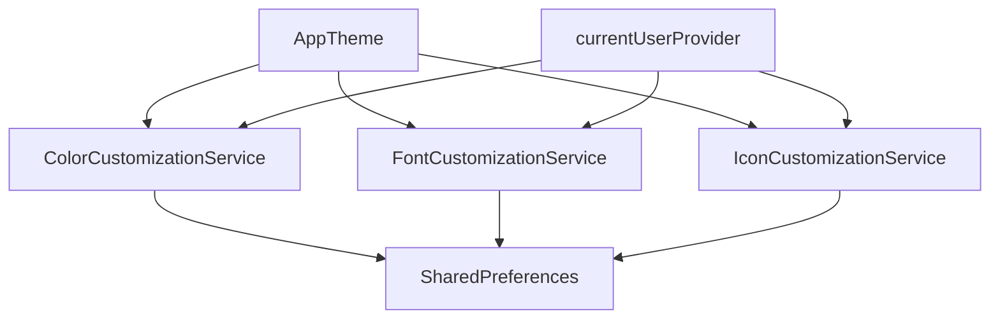

# نظام التخصيص - Customization System

دليل المطور الشامل لنظام تخصيص المظهر في تطبيق بصير.

## نظرة عامة

يتيح نظام التخصيص للمستخدمين تعديل:

- **الألوان**: اللون الأساسي للتطبيق
- **الخطوط**: نوع الخط وحجم النص
- **الأيقونات**: حزمة الأيقونات (Material/Cupertino)

## البنية المعمارية



---

## 1. تخصيص الألوان - Color Customization

### الملف

`lib/core/theme/services/color_customization_service.dart`

### Provider

```dart
final colorCustomizationProvider =
    AsyncNotifierProvider<ColorCustomizationService, Color?>(
  ColorCustomizationService.new,
);
```

### الاستخدام

```dart
// قراءة اللون الحالي
final customColor = ref.watch(colorCustomizationProvider).valueOrNull;

// تعيين لون جديد
ref.read(colorCustomizationProvider.notifier).setPrimaryColor(Colors.blue);

// إعادة التعيين للافتراضي
ref.read(colorCustomizationProvider.notifier).resetToDefault();
```

### API

| Method                   | Description             |
| ------------------------ | ----------------------- |
| `setPrimaryColor(Color)` | تعيين لون أساسي جديد    |
| `resetToDefault()`       | إعادة التعيين للافتراضي |
| `isValidContrast(Color)` | التحقق من تباين اللون   |

---

## 2. تخصيص الخطوط - Font Customization

### الملف

`lib/core/theme/services/font_customization_service.dart`

### Provider

```dart
final fontCustomizationProvider =
    AsyncNotifierProvider<FontCustomizationService, FontCustomizationState>(
  FontCustomizationService.new,
);
```

### الحالة - FontCustomizationState

```dart
class FontCustomizationState {
  final String fontFamily;      // عائلة الخط
  final double textScaleFactor; // معامل تكبير النص (0.8 - 1.4)
}
```

### الاستخدام

```dart
// قراءة الحالة
final fontState = ref.watch(fontCustomizationProvider).valueOrNull;
final fontFamily = fontState?.fontFamily ?? FontFamilies.arabic;

// تغيير الخط
ref.read(fontCustomizationProvider.notifier).setFontFamily('Cairo');

// تغيير الحجم
ref.read(fontCustomizationProvider.notifier).setTextScale(1.2);
```

### الخطوط المدعومة

- `FontFamilies.arabic` (افتراضي)
- `Roboto`
- `Cairo`
- `Tajawal`

---

## 3. تخصيص الأيقونات - Icon Customization

### الملف

`lib/core/theme/services/icon_customization_service.dart`

### Providers

```dart
// الخدمة الرئيسية
final iconCustomizationProvider =
    AsyncNotifierProvider<IconCustomizationService, IconCustomizationState>(
  IconCustomizationService.new,
);

// مزود مباشر للأيقونات
final appIconsProvider = Provider<AppIconsData>((ref) {
  final state = ref.watch(iconCustomizationProvider).valueOrNull;
  return state?.icons ?? const MaterialAppIcons();
});
```

### حزم الأيقونات - IconPack

```dart
enum IconPack {
  material,   // Material Design Icons
  cupertino,  // iOS-style Icons
}
```

### الاستخدام

```dart
// قراءة الأيقونات
final icons = ref.watch(appIconsProvider);
Icon(icons.home);
Icon(icons.settings);

// تغيير الحزمة
ref.read(iconCustomizationProvider.notifier).setIconPack(IconPack.cupertino);
```

---

## دعم تعدد المستخدمين

يتم حفظ إعدادات كل مستخدم بشكل منفصل باستخدام `ThemeStorageUtils`:

```dart
class ThemeStorageUtils {
  static String getUserSpecificKey(String baseKey, String? username) {
    if (username == null || username.isEmpty) {
      return baseKey;
    }
    return '${username}_$baseKey';
  }
}
```

### آلية العمل

1. عند تسجيل الدخول، يتم تحميل إعدادات المستخدم
2. عند تغيير المستخدم (`currentUserProvider`)، يتم إعادة بناء جميع الخدمات
3. يحتفظ كل مستخدم بإعداداته الخاصة

---

## التكامل مع AppTheme

```dart
// في main.dart أو MaterialApp
MaterialApp(
  theme: AppTheme.lightTheme.copyWith(
    colorScheme: ColorScheme.fromSeed(
      seedColor: customColor ?? AppColors.primary,
    ),
    textTheme: GoogleFonts.getTextTheme(fontFamily),
  ),
  builder: (context, child) => MediaQuery(
    data: MediaQuery.of(context).copyWith(
      textScaler: TextScaler.linear(textScaleFactor),
    ),
    child: child!,
  ),
);
```

---

## الملفات ذات الصلة

| File                                                                                                                            | Description     |
| ------------------------------------------------------------------------------------------------------------------------------- | --------------- |
| [color_customization_service.dart](file:///home/m/Projects/Basser_MVP/lib/core/theme/services/color_customization_service.dart) | خدمة الألوان    |
| [font_customization_service.dart](file:///home/m/Projects/Basser_MVP/lib/core/theme/services/font_customization_service.dart)   | خدمة الخطوط     |
| [icon_customization_service.dart](file:///home/m/Projects/Basser_MVP/lib/core/theme/services/icon_customization_service.dart)   | خدمة الأيقونات  |
| [theme_storage_utils.dart](file:///home/m/Projects/Basser_MVP/lib/core/theme/services/theme_storage_utils.dart)                 | أدوات التخزين   |
| [app_icons.dart](file:///home/m/Projects/Basser_MVP/lib/core/theme/tokens/app_icons.dart)                                       | تعريف الأيقونات |
